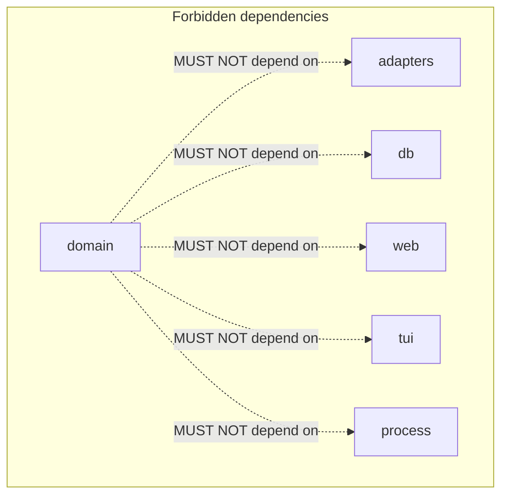
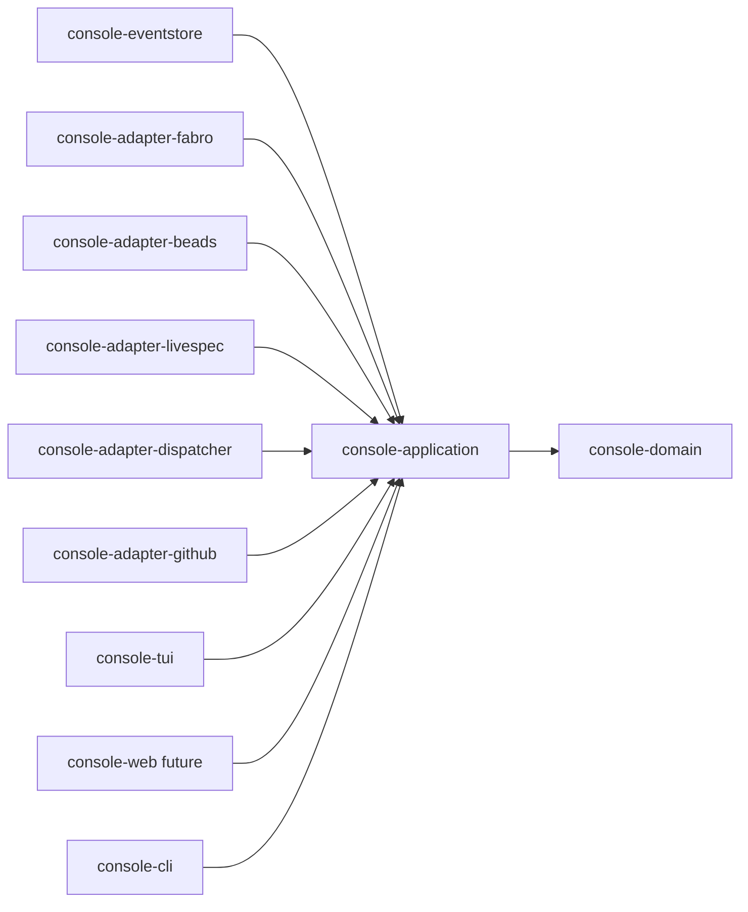
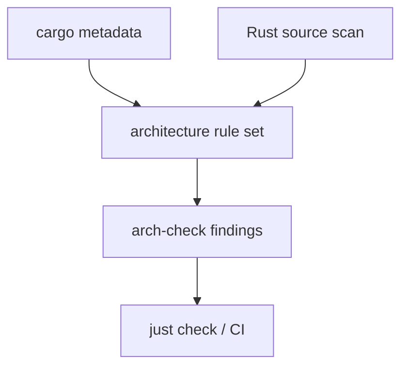
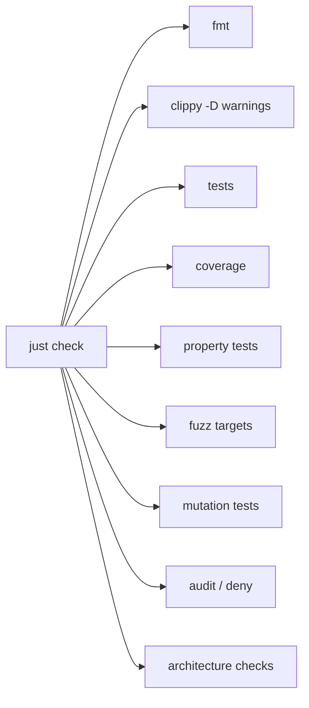
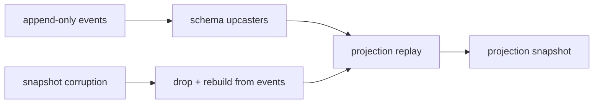

# constraints.md -- livespec-console-beads-fabro

This file defines non-functional and architectural constraints.

## Implementation Language

- Product code MUST be Rust.
- The executable SHOULD be a single binary that can run TUI/service/API
  modes from one artifact.
- `unsafe` is forbidden by default: crates MUST use `#![forbid(unsafe_code)]`
  unless a future spec revision grants a narrow exception.

## Railway-Oriented Programming

- Expected failures MUST be represented with typed `Result` values.
- Panics are bugs, not domain control flow.
- Domain and application code MUST NOT use `unwrap` or `expect` outside tests
  and startup wiring.
- Error types MUST distinguish domain rejection from infrastructure failure.
- Use cases SHOULD read as railway pipelines: validate, transform, call port,
  map errors, and emit events.

## Domain-Driven Design

- Bounded contexts MUST own their language, commands, events, invariants, and
  projections.
- Domain crates MUST not depend on infrastructure crates such as web, db,
  process, HTTP, filesystem adapters, or terminal UI.
- Application crates MAY depend on domain crates and port traits.
- Adapter crates MAY depend on application/domain contracts but MUST NOT
  depend on each other.
- UI crates MUST talk to projections and command APIs, not directly to source
  systems.

## Architecture Tests

The repo MUST include architecture tests inspired by ArchUnitTS and
ArchUnitPython, adapted to Rust.

Architecture checks MUST enforce at least:

- no forbidden dependency direction in the workspace crate graph
- domain has no direct dependency on adapters, SQLite, web server, TUI, HTTP,
  subprocess, or filesystem APIs
- adapters do not depend on each other
- UI does not call Beads/Fabro/LiveSpec/GitHub directly
- product crates do not use `unwrap`/`expect` outside allowed scopes
- event and command types live in domain/application contracts, not adapters
- all use cases return typed `Result`

`cargo metadata` MAY enforce crate graph rules. Source-level checks MAY use
Rust syntax parsing where needed.

## Quality Gate

The full check aggregate MUST include:

- `cargo fmt --check`
- `cargo clippy --all-targets --all-features -- -D warnings`
- tests with a modern Rust test runner
- coverage with a declared threshold
- property tests for pure logic and replay/projector behavior
- fuzz tests for event decoding, adapter normalization, and source payload
  parsing where practical
- mutation testing where practical
- dependency audit/deny checks
- architecture checks

## Event-Sourcing Safety

- Event append MUST be idempotent for adapter replay.
- Adapter checkpoints MUST advance only after durable event append.
- Projections MUST be rebuildable from the event log.
- Snapshot/read-model corruption MUST be recoverable by replay.
- Schema changes MUST include event upcasting or a documented migration path.
- Rollback MUST be modeled as compensating events rather than event deletion.

## Beads/Fabro Family Secret Convention

The console and its docs MUST use the current family secret convention:
the 1Password Environment wrapper exports one bare `BEADS_DOLT_PASSWORD`.
There is no per-tenant `BEADS_DOLT_PASSWORD_<tenant>` variable and no
per-tenant-to-bare mapping. Secrets MUST never be committed or echoed.

## Red-Green-Replay

Rust product changes MUST adopt the family Red-Green-Replay commit
discipline once the repo hooks exist:

1. Red commit stages the test only and records the failing test evidence.
2. Green amend stages implementation and records passing evidence.
3. The final commit carries test and implementation plus both trailer sets.

Non-product or spec-only changes MAY use the family non-Python/non-product
exemption pattern.
