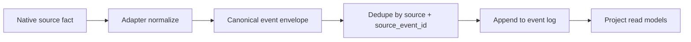
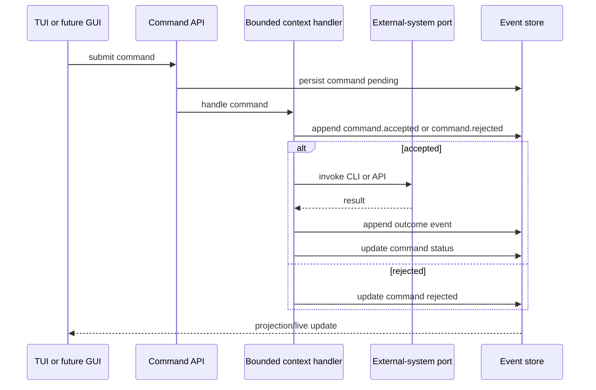
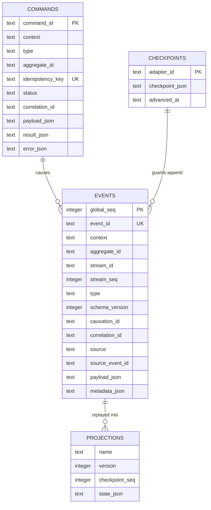
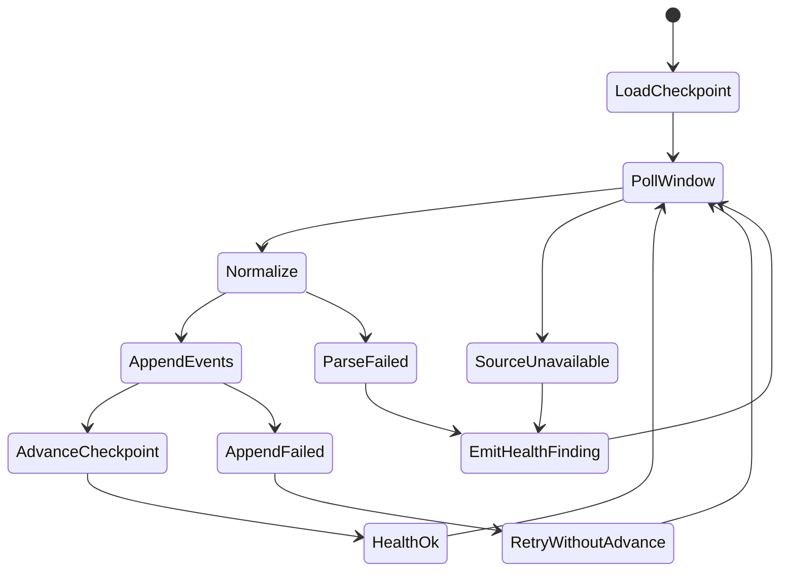
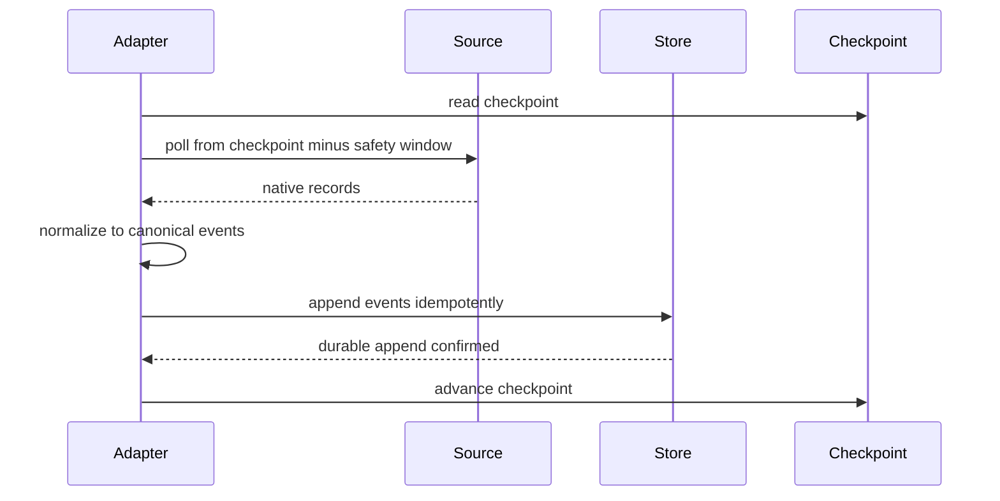
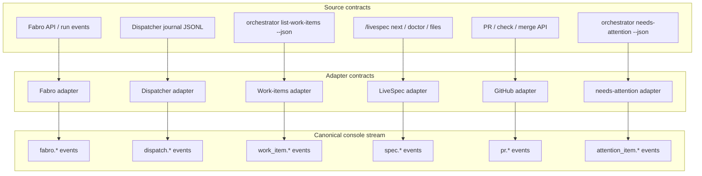
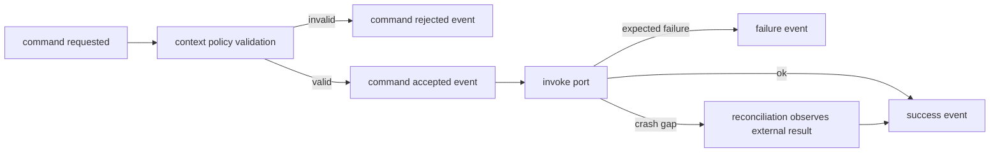
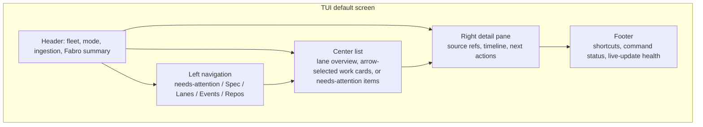
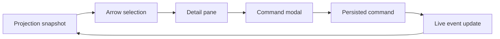

# contracts.md -- livespec-console-beads-fabro

This file defines the console's wire-level and persistence contracts.

## Event Envelope

Every canonical event MUST carry:

```jsonc
{
  "event_id": "evt_...",
  "schema_version": 1,
  "context": "factory",
  "type": "factory.drain.started",
  "source": "console",
  "source_event_id": "optional-source-stable-id",
  "aggregate_id": "repo:livespec-runtime",
  "stream_id": "factory:livespec-runtime",
  "stream_seq": 12,
  "causation_id": "optional-causing-command-or-event-id",
  "correlation_id": "corr_...",
  "occurred_at": "2026-06-22T00:00:00Z",
  "observed_at": "2026-06-22T00:00:01Z",
  "payload": {},
  "metadata": {}
}
```

`event_id` is globally unique. `(source, source_event_id)` MUST be unique
when `source_event_id` is present so adapter replay is idempotent.

The `events` table (see SQLite Persistence) is a faithful 1:1 projection
of this envelope: every envelope field is a column and every column has
an envelope source. `correlation_id` and `causation_id` are scalar ids,
not structured objects; `aggregate_id` is the event's routing key (e.g.
`"repo:<id>"`, the same shape as a command's `aggregate_id`).



## Command Envelope

Commands are persisted intentions, not facts. A command MUST carry:

```jsonc
{
  "command_id": "cmd_...",
  "context": "factory",
  "type": "factory.drain_requested",
  "aggregate_id": "repo:livespec-runtime",
  "idempotency_key": "operator-provided-or-derived-key",
  "requested_by": "user-or-agent",
  "requested_at": "2026-06-22T00:00:00Z",
  "causation_event_id": null,
  "correlation_id": "corr_...",
  "payload": {}
}
```

Commands MAY be rejected. State changes become durable only through
events such as `command.accepted`, `factory.drain.started`,
`factory.drain.failed`, `factory.drain.completed`, and
`factory.drain.not_wired` (the honest outcome a simulated or
unimplemented drain port emits instead of fabricating success, per the
honesty rule in the Command Handling section).



## SQLite Persistence

The initial durable store is SQLite in WAL mode.

Required tables:

```text
events
  global_seq integer primary key
  event_id text unique
  context text
  aggregate_id text
  stream_id text
  stream_seq integer
  type text
  schema_version integer
  occurred_at text
  observed_at text
  causation_id text null
  correlation_id text
  source text
  source_event_id text null
  payload_json text
  metadata_json text

commands
  command_id text primary key
  context text
  type text
  aggregate_id text null
  idempotency_key text unique
  requested_by text
  requested_at text
  causation_event_id text null
  correlation_id text
  status text
  payload_json text
  result_json text null
  error_json text null
  updated_at text

checkpoints
  adapter_id text primary key
  checkpoint_json text
  advanced_at text

projections
  name text
  version integer
  checkpoint_seq integer
  state_json text
```

Events are append-only. Rollback is represented by compensating events, not
by deleting or mutating prior domain events.



## Adapter Contract

Every pull adapter MUST implement:

```text
adapter_id
source_kind
checkpoint_key
initial_backfill()
poll_since(checkpoint)
normalize(native_record) -> canonical events[]
advance_checkpoint(only after durable append)
reconcile(window)
health()
```

Adapter rules:

- The adapter MUST persist a durable checkpoint per source instance.
- The adapter MUST append normalized events before advancing its checkpoint.
- The adapter MUST provide at-least-once delivery; duplicates are allowed
  and MUST be deduplicated by stable source event identity.
- The adapter MUST support cold-start backfill and bounded backfill.
- The adapter MUST re-read a sliding reconciliation window on normal polls.
- The adapter MUST emit explicit ingestion health events for parse failures,
  unavailable sources, invalid checkpoints, backfill incompleteness, or
  unprovable continuity.
- If a source cannot provide complete historical transitions, the adapter
  MUST emit snapshot/reconciliation events and a completeness finding rather
  than claiming full history.
- If an adapter does not actually perform real source I/O (a minimal or
  simulated first-milestone adapter per `spec.md` -> Initial-adapter
  fidelity), it MUST emit an explicit not-observed / simulated /
  unimplemented health signal and MUST NOT emit an event asserting an
  observed source fact it did not observe.





## Initial Adapters

Initial adapters:

- **Fabro adapter** -- reads Fabro API/SSE or `fabro ps` / run details and
  emits run, blocked, human-gate, terminal, and run-link events.
- **Dispatcher adapter** -- tails and backfills Dispatcher journal JSONL and
  emits dispatch wave/item/outcome events.
- **Work-items adapter** -- reads work-item state through the orchestrator
  CLI (`list-work-items --json`, one batch read carrying every item with its
  orchestrator-computed `lane` / `lane_reason`) and emits work-item snapshot
  events that carry the emitted lane assignment verbatim. The console holds
  zero Beads knowledge: this adapter MUST NOT invoke `bd` or parse
  Beads-native records, and MUST NOT re-derive a lane from `status` or any
  other field -- lane re-derivation is the shadow-state failure the
  lifecycle design killed (design record: repo `thewoolleyman/livespec`,
  `plan/archive/work-item-state-machine/research/03-decision-log.md`,
  decisions 15/16).
- **LiveSpec adapter** -- reads spec-side `next`, doctor output,
  proposed changes, history, and filesystem/git state.
- **GitHub adapter** -- reads PR, check, branch, and merge state.
- **needs-attention adapter** -- reads the product `needs-attention` snapshot
  through the orchestrator CLI (`needs-attention --json`, one point-in-time
  read of the flat `attention[]` array; each item carries its stable `id`,
  `kind`, `urgency`, `summary`, `source_ref`, and `handoff`) and DIFFS that
  snapshot against the last ingested one at ingest, emitting
  `attention_item.appeared` (an `id` not previously present),
  `attention_item.changed` (a present `id` whose composed content changed),
  and `attention_item.resolved` (a previously-present `id` now absent), each
  keyed by the stable `id`. The diff is idempotent: an unchanged `id` emits
  nothing. The `needs-attention` surface is stateless / point-in-time (no
  timestamps, no events, no history) and re-derives none of the primitives it
  composes (impl-side ready work, the human valves, spec-side actions, open
  `plan/<topic>` threads, repository hygiene); the console consumes the
  composed snapshot verbatim, and this diff-at-ingest is what turns the
  point-in-time snapshots into a durable event stream -- ALL event-sourcing
  lives in the console. This mirrors the Work-items adapter's
  snapshot-without-transition-history pattern (`scenarios.md` Scenario 4 and
  the new Scenario 12; design record: repo `thewoolleyman/livespec`,
  `plan/needs-attention/research/design.md` §"Statelessness and the console
  event-sourcing boundary"). The `needs-attention` CLI surface is owned by the
  orchestrator plugin, not the console; the console MUST NOT reach around this
  port to recompute the inbox.

Adapters MUST call existing stable CLIs/APIs through ports. UI code MUST NOT
call Fabro, Beads, LiveSpec, Dispatcher, or GitHub directly. Work-item state
enters the console ONLY through the orchestrator-CLI port: no console code --
adapter, application, or UI -- invokes `bd` or reads the Beads tenant directly.
When a console run needs orchestrator-owned backing CLIs, it MUST resolve and
validate the orchestrator plugin entry points before invoking them: explicit
per-program overrides win, then an explicit plugin-root override, then the
selected repo checkout's `.claude-plugin/scripts/bin/`, then the installed
Claude plugin cache; a malformed selected plugin root fails loudly, while an
absent plugin degrades through named not-observed findings rather than
fabricating source state.



## Command Handling

Command handlers live in bounded contexts. A handler MUST:

1. Validate the command against context policy and aggregate/projection state.
2. Persist acceptance or rejection.
3. Invoke external systems only through ports/adapters.
4. Append success/failure/outcome events.
5. Leave recovery to reconciliation/backfill when a crash occurs between an
   external side effect and outcome event append.
6. Never emit a success or outcome event for an effect the port did not
   actually achieve. A simulated or unimplemented port MUST surface a
   not-observed / simulated / unimplemented outcome (or a typed failure),
   never a fabricated success.

Initial commands:

- `factory.drain_requested`
- `factory.dispatch_item_requested`
- `factory.pause_requested`
- `factory.resume_requested`
- `spec.doctor_requested`
- `work_item.approve_requested`
- `work_item.accept_requested`
- `work_item.reject_requested`
- `work_item.set_admission_requested`
- `work_item.set_acceptance_requested`
- `config.autonomous_mode_set`
- `factory.autonomous_mode_enable_requested`
- `factory.autonomous_mode_disable_requested`

The five `work_item.*` commands are the Work-item Lifecycle context's
vocabulary. Each maps 1:1 onto the orchestrator's published `drive`
action-id surface, and the console MUST issue them ONLY through that surface --
it never writes the ledger directly: `work_item.approve_requested` ->
`approve:<work-item-id>`; `work_item.accept_requested` ->
`accept:<work-item-id>`; `work_item.reject_requested` (payload `mode` in
{rework, regroom}) -> `reject:<work-item-id>:rework|regroom`;
`work_item.set_admission_requested` (payload `policy` in {auto, manual}) ->
`set-admission:<work-item-id>:<policy>`; `work_item.set_acceptance_requested`
(payload `policy` in {ai-only, human-only, ai-then-human}) ->
`set-acceptance:<work-item-id>:<policy>`. Approve is the human approval act --
the `pending-approval -> ready` transition -- and a policy edit never moves an
item between states (the no-surprise-transitions rule); these semantics and the
two policy-edit action ids are the orchestrator's ratified contract (repo
`thewoolleyman/livespec-orchestrator-beads-fabro`, `SPECIFICATION/contracts.md`,
its Work-item state semantics section and its `drive` action-id surface).
The honesty rule of this section applies unchanged: a simulated or unimplemented
orchestrator port MUST surface a not-observed / not_wired outcome and MUST NOT
fabricate success. Snooze/acknowledge remain killed (design record decision
16): there is no local-dismiss command; "not now" is defer/re-rank via the
orchestrator.



## Autonomous Mode

The console's full-autonomous-mode preference (see `spec.md` -> Full
Autonomous Mode) is NOT persisted by the console. The single persistent
record of the operator's intent to allow unattended autonomous runs for a
repo is the orchestrator plane's permission key
`livespec-orchestrator-beads-fabro.dispatcher.autonomous_mode` in that repo's
`.livespec.jsonc` -- the orchestrator's PUBLISHED arming surface (repo
`thewoolleyman/livespec-orchestrator-beads-fabro`,
`SPECIFICATION/contracts.md` -> Arming full autonomous mode). The console
does not persist a second, console-owned autonomous-mode preference; any such
duplicate would be redundant with that key.

The console's Configuration context MUST derive the current per-repo mode by
reading that orchestrator key; an absent key MUST be treated as disabled.

The mode is changed only through commands and recorded only through
events:

- `config.autonomous_mode_set` (context `configuration`) carries
  `{ "repo": "<repo-id>", "enabled": <bool>, "confirmed": <bool> }`. The
  handler MUST reject the command when `enabled` is `true` and `confirmed`
  is not `true`, guarding against an accidental enable. On acceptance the
  handler MUST effect the change by writing the orchestrator's
  `livespec-orchestrator-beads-fabro.dispatcher.autonomous_mode` key through
  the orchestrator's published command surface -- issuing the
  `factory.autonomous_mode_enable_requested` /
  `factory.autonomous_mode_disable_requested` command below -- AND append the
  matching audit event, rather than persisting a console-owned
  `autonomous_mode` block, so the orchestrator key and the console's audit
  log never disagree.
- `config.autonomous_mode.enabled` and `config.autonomous_mode.disabled`
  (context `configuration`) are the durable audit facts, each carrying the
  target `repo`, the requesting actor, and `occurred_at`.
- `factory.autonomous_mode_enable_requested` and
  `factory.autonomous_mode_disable_requested` (context `factory`) are the
  commands the console issues to the orchestrator plane, through that
  plane's published command surface, to turn the orchestrator's own
  autonomous mode on or off. They obey the honesty rule in Command
  Handling: a simulated or unimplemented orchestrator port MUST surface a
  not-wired / not-observed outcome (for example
  `factory.autonomous_mode.not_wired`) and MUST NOT fabricate success.

## TUI Contract

The TUI is the first frontend. It MUST be a projection consumer and command
producer, not a source-system client.

Required TUI views:

- needs-attention
- Spec
- Lanes
- Events
- Repos

The `Lanes` view is the work-item consumer: it renders the seven lifecycle
lanes (`backlog`, `pending-approval`, `ready`, `active`, `acceptance`,
`blocked`, `done`) projected from the orchestrator's emitted `lane` /
`lane_reason` — the console consumes that lane assignment and never re-derives
it (the lane vocabulary is owned by `livespec-orchestrator-beads-fabro`, referenced here, not
re-decided). It is a hybrid sub-view: a lane-overview home listing all seven
lanes with their counts and a preview of each lane's top rank-ordered items,
with drill-in to a single lane's full rank-ordered list. The `Lanes` view
subsumes the earlier ad-hoc `Ready` / `Factory` / `Manual` / `Done` groupings,
which the lane model makes redundant. `Spec`, `Events`, and `Repos` remain as
orthogonal, non-lane views.

The default view MUST be needs-attention. Navigation SHOULD use arrow-driven
selection lists, detail panes, command modals, `/` search, and a command
palette. Numeric selection MAY exist as a fallback but MUST NOT be the only
interaction model.

The TUI MUST expose an autonomous-mode toggle for the selected repo (see
`spec.md` -> Full Autonomous Mode). The toggle MUST render a "dangerous /
use with caution" label; enabling it MUST require an explicit
type-to-confirm modal before the console submits a
`config.autonomous_mode_set` command carrying `confirmed: true`, while
disabling it MUST NOT require confirmation. The header mode indicator
(fleet, mode, ingestion, Fabro summary) MUST reflect whether autonomous
mode is active for the selected repo.




