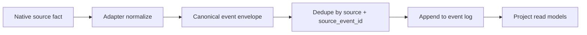
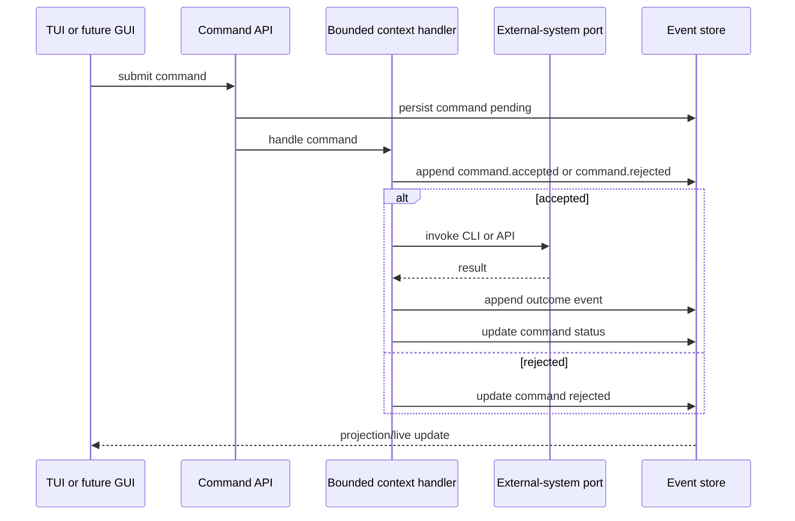
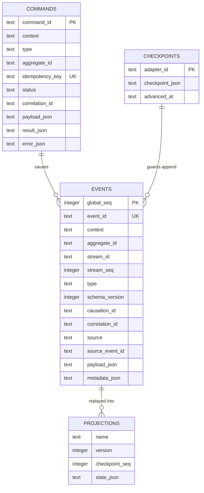
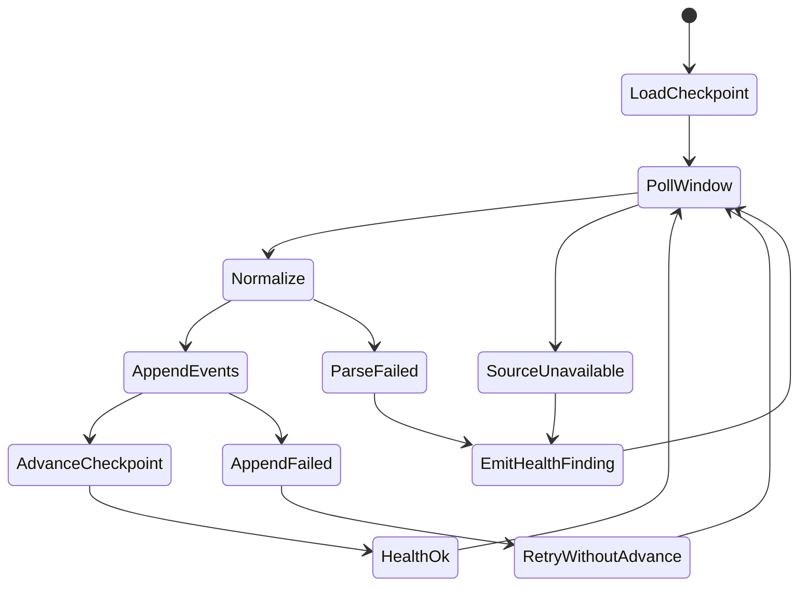
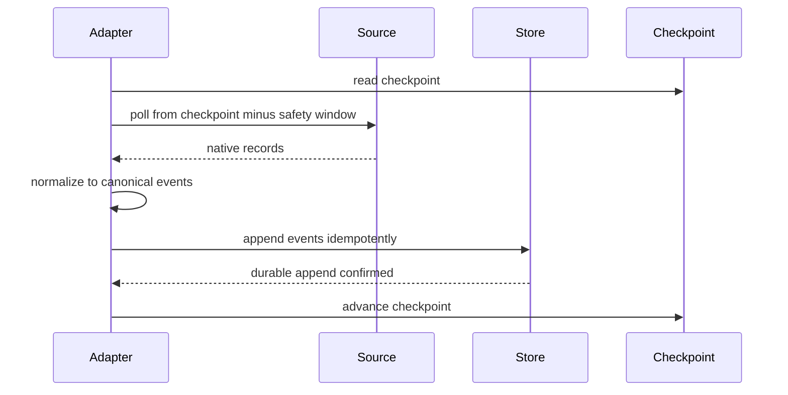
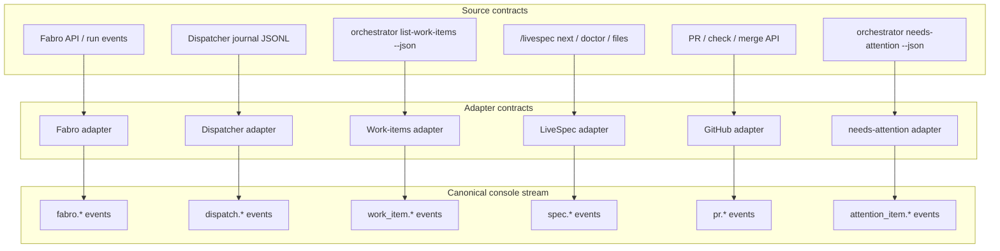
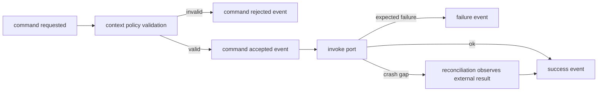
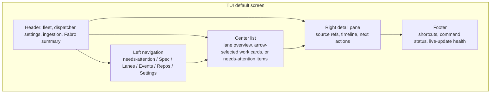
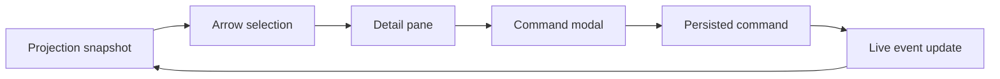

# contracts.md -- livespec-console-beads-fabro

This file defines the console's wire-level and persistence contracts.

## Event Envelope

Every canonical event MUST carry:

```jsonc
{
  "event_id": "evt_...",
  "schema_version": 1,
  "context": "factory",
  "type": "factory.drain.started",
  "source": "console",
  "source_event_id": "optional-source-stable-id",
  "aggregate_id": "repo:livespec-runtime",
  "stream_id": "factory:livespec-runtime",
  "stream_seq": 12,
  "causation_id": "optional-causing-command-or-event-id",
  "correlation_id": "corr_...",
  "occurred_at": "2026-06-22T00:00:00Z",
  "observed_at": "2026-06-22T00:00:01Z",
  "payload": {},
  "metadata": {}
}
```

`event_id` is globally unique. `(source, source_event_id)` MUST be unique
when `source_event_id` is present so adapter replay is idempotent.

The `events` table (see SQLite Persistence) is a faithful 1:1 projection
of this envelope: every envelope field is a column and every column has
an envelope source. `correlation_id` and `causation_id` are scalar ids,
not structured objects; `aggregate_id` is the event's routing key (e.g.
`"repo:<id>"`, the same shape as a command's `aggregate_id`).



## Command Envelope

Commands are persisted intentions, not facts. A command MUST carry:

```jsonc
{
  "command_id": "cmd_...",
  "context": "factory",
  "type": "factory.drain_requested",
  "aggregate_id": "repo:livespec-runtime",
  "idempotency_key": "operator-provided-or-derived-key",
  "requested_by": "user-or-agent",
  "requested_at": "2026-06-22T00:00:00Z",
  "causation_event_id": null,
  "correlation_id": "corr_...",
  "payload": {}
}
```

Commands MAY be rejected. State changes become durable only through
events such as `command.accepted`, `factory.drain.started`,
`factory.drain.failed`, `factory.drain.completed`, and
`factory.drain.not_wired` (the honest outcome a simulated or
unimplemented drain port emits instead of fabricating success, per the
honesty rule in the Command Handling section).



## SQLite Persistence

The initial durable store is SQLite in WAL mode.

Required tables:

```text
events
  global_seq integer primary key
  event_id text unique
  context text
  aggregate_id text
  stream_id text
  stream_seq integer
  type text
  schema_version integer
  occurred_at text
  observed_at text
  causation_id text null
  correlation_id text
  source text
  source_event_id text null
  payload_json text
  metadata_json text

commands
  command_id text primary key
  context text
  type text
  aggregate_id text null
  idempotency_key text unique
  requested_by text
  requested_at text
  causation_event_id text null
  correlation_id text
  status text
  payload_json text
  result_json text null
  error_json text null
  updated_at text

checkpoints
  adapter_id text primary key
  checkpoint_json text
  advanced_at text

projections
  name text
  version integer
  checkpoint_seq integer
  state_json text
```

Events are append-only. Rollback is represented by compensating events, not
by deleting or mutating prior domain events.



## Adapter Contract

Every pull adapter MUST implement:

```text
adapter_id
source_kind
checkpoint_key
initial_backfill()
poll_since(checkpoint)
normalize(native_record) -> canonical events[]
advance_checkpoint(only after durable append)
reconcile(window)
health()
```

Adapter rules:

- The adapter MUST persist a durable checkpoint per source instance.
- The adapter MUST append normalized events before advancing its checkpoint.
- The adapter MUST provide at-least-once delivery; duplicates are allowed
  and MUST be deduplicated by stable source event identity.
- The adapter MUST support cold-start backfill and bounded backfill.
- The adapter MUST re-read a sliding reconciliation window on normal polls.
- The adapter MUST emit explicit ingestion health events for parse failures,
  unavailable sources, invalid checkpoints, backfill incompleteness, or
  unprovable continuity.
- If a source cannot provide complete historical transitions, the adapter
  MUST emit snapshot/reconciliation events and a completeness finding rather
  than claiming full history.
- If an adapter does not actually perform real source I/O (a minimal or
  simulated first-milestone adapter per `spec.md` -> Initial-adapter
  fidelity), it MUST emit an explicit not-observed / simulated /
  unimplemented health signal and MUST NOT emit an event asserting an
  observed source fact it did not observe.

The adapter honesty rule tightens to separate a reachable-but-empty
source from a genuinely unreachable one:

- A SUCCESSFUL observation of an EMPTY source is NOT an unavailability.
  When the adapter reaches its source and the source simply holds
  nothing to report -- an empty work-item ledger, zero open pull
  requests, or an absent-but-expected dispatch journal -- the adapter
  MUST treat it as observed-and-idle and MUST NOT emit a not-observed
  finding for it. A not-observed finding is reserved for GENUINE
  unreachability: an unresolvable program, a non-zero command exit, an
  unreadable or absent required file, or an uninterpretable payload, or
  the preceding bullet's simulated / unimplemented (no real source I/O)
  case. This is the cockpit-blind-vs-idle distinction (`scenarios.md`
  Scenario 13): an idle factory MUST NEVER be counted or named as an
  unavailable source.
- A not-observed finding MUST carry a human-readable reason, and that
  reason MUST be durably persisted with the finding so the operator can
  see WHY a source is unavailable, not merely THAT it is.
- The header's source-availability tally MUST reflect the LATEST poll
  outcome per source: a source counts as unavailable only while its
  MOST RECENT poll was not-observed. A source that is observed on a
  later cycle MUST clear from the tally, so a transient failure is never
  a permanent brand.





## Initial Adapters

Initial adapters:

- **Fabro adapter** -- reads Fabro API/SSE or `fabro ps` / run details and
  emits run, blocked, human-gate, terminal, and run-link events.
- **Dispatcher adapter** -- tails and backfills Dispatcher journal JSONL and
  emits dispatch wave/item/outcome events.
- **Work-items adapter** -- reads work-item state through the orchestrator
  CLI (`list-work-items --json`, one batch read carrying every item with its
  orchestrator-computed `lane` / `lane_reason`) and emits work-item snapshot
  events that carry the emitted lane assignment verbatim. The console holds
  zero Beads knowledge: this adapter MUST NOT invoke `bd` or parse
  Beads-native records, and MUST NOT re-derive a lane from `status` or any
  other field -- lane re-derivation is the shadow-state failure the
  lifecycle design killed (design record: repo `thewoolleyman/livespec`,
  `plan/archive/work-item-state-machine/research/03-decision-log.md`,
  decisions 15/16).
- **LiveSpec adapter** -- reads spec-side `next`, doctor output,
  proposed changes, history, and filesystem/git state.
- **GitHub adapter** -- reads PR, check, branch, and merge state.
- **needs-attention adapter** -- reads the product `needs-attention` snapshot
  through the orchestrator CLI (`needs-attention --json`, one point-in-time
  read of the flat `attention[]` array; each item carries its stable `id`,
  `kind`, `urgency`, `summary`, `source_ref`, and `handoff`) and DIFFS that
  snapshot against the last ingested one at ingest, emitting
  `attention_item.appeared` (an `id` not previously present),
  `attention_item.changed` (a present `id` whose composed content changed),
  and `attention_item.resolved` (a previously-present `id` now absent), each
  keyed by the stable `id`. The diff is idempotent: an unchanged `id` emits
  nothing. The `needs-attention` surface is stateless / point-in-time (no
  timestamps, no events, no history) and re-derives none of the primitives it
  composes (impl-side ready work, the human valves, spec-side actions, open
  `plan/<topic>` threads, repository hygiene); the console consumes the
  composed snapshot verbatim, and this diff-at-ingest is what turns the
  point-in-time snapshots into a durable event stream -- ALL event-sourcing
  lives in the console. This mirrors the Work-items adapter's
  snapshot-without-transition-history pattern (`scenarios.md` Scenario 4 and
  the new Scenario 12; design record: repo `thewoolleyman/livespec`,
  `plan/needs-attention/research/design.md` §"Statelessness and the console
  event-sourcing boundary"). The `needs-attention` CLI surface is owned by the
  orchestrator plugin, not the console; the console MUST NOT reach around this
  port to recompute the inbox.

Adapters MUST call existing stable CLIs/APIs through ports. UI code MUST NOT
call Fabro, Beads, LiveSpec, Dispatcher, or GitHub directly. Work-item state
enters the console ONLY through the orchestrator-CLI port: no console code --
adapter, application, or UI -- invokes `bd` or reads the Beads tenant directly.
When a console run needs orchestrator-owned backing CLIs, it MUST resolve and
validate the orchestrator plugin entry points before invoking them: explicit
per-program overrides win, then an explicit plugin-root override, then the
selected repo checkout's `.claude-plugin/scripts/bin/`, then the installed
Claude plugin cache; a malformed selected plugin root fails loudly, while an
absent plugin degrades through named not-observed findings rather than
fabricating source state.



## Command Handling

Command handlers live in bounded contexts. A handler MUST:

1. Validate the command against context policy and aggregate/projection state.
2. Persist acceptance or rejection.
3. Invoke external systems only through ports/adapters.
4. Append success/failure/outcome events.
5. Leave recovery to reconciliation/backfill when a crash occurs between an
   external side effect and outcome event append.
6. Never emit a success or outcome event for an effect the port did not
   actually achieve. A simulated or unimplemented port MUST surface a
   not-observed / simulated / unimplemented outcome (or a typed failure),
   never a fabricated success.

Initial commands:

- `factory.drain_requested`
- `factory.dispatch_item_requested`
- `factory.pause_requested`
- `factory.resume_requested`
- `spec.doctor_requested`
- `work_item.approve_requested`
- `work_item.accept_requested`
- `work_item.reject_requested`
- `work_item.set_admission_requested`
- `work_item.set_acceptance_requested`
- `work_item.resolve_blocked_requested`
- `work_item.move_requested`
- `work_item.set_dispatcher_override_requested`
- `config.dispatcher_setting_set`

Eight `work_item.*` commands form the Work-item Lifecycle context's vocabulary.
SEVEN of them -- the human-valve, policy-edit, and status-move commands -- each
map 1:1 onto the orchestrator's published `drive` action-id surface, and the
console MUST issue those seven ONLY through that surface -- it never writes the
ledger directly: `work_item.approve_requested` ->
`approve:<work-item-id>`; `work_item.accept_requested` ->
`accept:<work-item-id>`; `work_item.reject_requested` (payload `mode` in
{rework, regroom}) -> `reject:<work-item-id>:rework|regroom`;
`work_item.set_admission_requested` (payload `policy` in {auto, manual}) ->
`set-admission:<work-item-id>:<policy>`; `work_item.set_acceptance_requested`
(payload `policy` in {ai-only, human-only, ai-then-human}) ->
`set-acceptance:<work-item-id>:<policy>`; `work_item.resolve_blocked_requested`
(payload `target_status` in {ready, backlog}) ->
`resolve-blocked:<work-item-id>:ready|backlog`; `work_item.move_requested`
(payload `target_status` in {backlog, ready, blocked, active}) ->
`move:<work-item-id>:<target-status>`. Approve is the human approval act --
the `pending-approval -> ready` transition -- and a policy edit never moves an
item between states (the no-surprise-transitions rule); these semantics and the
two policy-edit action ids are the orchestrator's ratified contract (repo
`thewoolleyman/livespec-orchestrator-beads-fabro`, `SPECIFICATION/contracts.md`,
its Work-item state semantics section and its `drive` action-id surface).
`resolve-blocked` is the operator resolution of a `blocked` work-item to
`ready` or `backlog`; the orchestrator source-guards it to a `blocked` item
awaiting a human. `move` is the guarded broad relocation among the PRE-TERMINAL
pipeline statuses: the orchestrator REFUSES `done`, `acceptance`, and
`pending-approval` as move targets (the target-guard) and leaves the source
status unguarded, so `done` stays reachable ONLY via `accept` from `acceptance`
(the ship-guard is preserved), and the console's move-status picker further
offers no move OUT of a `done` work-item. The EIGHTH command,
`work_item.set_dispatcher_override_requested`, does NOT map 1:1 -- it fans out
to the orchestrator's three per-setting override actions (Dispatcher Policy
Settings below) -- and the console MUST issue it ONLY through that surface,
never writing the ledger label directly.
The honesty rule of this section applies unchanged: a simulated or unimplemented
orchestrator port MUST surface a not-observed / not_wired outcome and MUST NOT
fabricate success. Snooze/acknowledge remain killed (design record decision
16): there is no local-dismiss command; "not now" is defer/re-rank via the
orchestrator.



## Dispatcher Policy Settings

The console holds NO dispatcher-setting state of its own (see `spec.md` ->
Dispatcher Policy Settings). The single persistent record of each setting is
the orchestrator's own: the `dispatcher.*` keys in the repo's
`.livespec.jsonc` for the six global defaults, and the per-item ledger labels
for the overrides (repo `thewoolleyman/livespec-orchestrator-beads-fabro`,
`SPECIFICATION/contracts.md`, its Dispatcher policy settings section). The
console's Configuration context MUST derive each effective value by reading
the orchestrator's published read surface, and MUST NOT persist a second,
console-owned copy of any setting; an unreadable surface MUST degrade to a
named not-observed finding rather than an assumed value.

The six settings the console commands and observes are `auto_approve_ready`,
`merge_on_review_cap`, `acceptance_mode`, `review_fix_cap`,
`acceptance_rework_cap`, and `wip_cap`. The console MUST NOT hardcode that
list: it MUST read the orchestrator's published declaration of its
API-configurable keys, so a key the orchestrator adds needs no console spec
change to appear.

Settings are changed only through commands and recorded only through events:

- `config.dispatcher_setting_set` (context `configuration`) carries
  `{ "repo": "<repo-id>", "setting": "<dispatcher-key>", "value": <json> }`
  and sets ONE global default. It is a per-setting write: a single command
  MUST NOT change more than one setting, and the console MUST NOT offer an
  arming command that flips several settings at once. On acceptance the
  handler MUST effect the change through the orchestrator's published command
  surface and MUST append the audit event below, rather than writing the
  orchestrator's `.livespec.jsonc` itself.
- `work_item.set_dispatcher_override_requested` (context `work_item`) carries
  `{ "work_item_id": "<id>", "setting": "<dispatcher-key>", "value": <json> }`
  and sets, or with a null `value` clears, ONE per-item override. The handler
  MUST reject the command when `setting` is `wip_cap`, a per-repo concurrency
  ceiling that admits no per-item override. It MUST also reject
  `auto_approve_ready` and `acceptance_mode`, whose per-item overrides are the
  established `work_item.set_admission_requested` and
  `work_item.set_acceptance_requested` commands above, so that each
  overridable setting has exactly one console command; this command therefore
  serves `merge_on_review_cap`, `review_fix_cap`, and `acceptance_rework_cap`.
  It maps onto the orchestrator's published per-setting override action for
  that key, and the console MUST NOT write the ledger label directly.
- `config.dispatcher_setting.changed` and
  `work_item.dispatcher_override.changed` (contexts `configuration` and
  `work_item`) are the durable audit facts, each carrying the target repo or
  work-item id, the setting, its previous and new values, the requesting
  actor, and `occurred_at`.

Enabling a dangerous setting is an ordinary recorded settings write. It MUST
be recorded through the same command-plus-outcome-event path as any other
operator command, and its handler MUST NOT require a type-the-repo-name
acknowledgement or any other arming ceremony as a precondition of the write.

Both commands obey the honesty rule in Command Handling: a simulated or
unimplemented orchestrator port MUST surface a not-wired / not-observed
outcome (for example `config.dispatcher_setting.not_wired`) and MUST NOT
fabricate success.

The orchestrator journals every auto-disposition a setting enables and
escalates every decision no setting may auto-dispose. The console MUST read
both from the orchestrator's published journal read surface and MUST surface
each escalation as a needs-attention item; it MUST NOT re-derive an
escalation from any other source.

### Factory-drain launcher argv

Dispatch-time policy is NOT armed per run. The Dispatcher reads the
orchestrator-owned `dispatcher.*` settings for itself, so there is no per-run
policy flag to pass and its argument parser recognizes none. The console's
factory-drain path MUST therefore invoke the Dispatcher with NO policy-arming
argument; passing one would send an unrecognized argument and the run would
fail. This is a distinct obligation from the settings writes above: a per-run
flag writes no setting, so no settings clause constrains it.

### Settings-surface completeness

Every key the orchestrator declares as API-configurable MUST appear, in
lockstep, in three places: a row under the console's Settings surface, the
TUI's inline / context help for that row, and the console's settings doc
(`docs/detailed-usage.md`, per the User Documentation Contract section). A
mechanical completeness check MUST fail when a declared key is missing from
the Settings surface or from the settings doc.

That check lives HERE, on the consumer side: it reads the orchestrator's
declared API-configurable-key surface and compares it against the console's
own Settings rows and settings doc. Per the No-Circular-Dependency Directive
the orchestrator MUST NOT read into the console, so this check MUST NOT be
placed upstream -- a foundational plane never reads into its consumer.

## User Documentation Contract

The console's user-facing documentation MUST live under a `docs/` tree at the repository root: the repository's top-level `README.md` MUST NOT carry user-facing documentation of its own beyond a project overview and a pointer into that tree, and `docs/README.md` MUST be an overview plus a table of contents whose entries link the substantive sub-documents by relative path.

The `docs/` tree MUST carry four sub-documents: `docs/installing.md` covering installation, including the download-install path and running the console against a repository other than its own; `docs/overview-quickstart.md` covering a general overview and quick start; `docs/cli-options.md` covering the console's environment variables, CLI options, and sub-commands; and `docs/detailed-usage.md` covering detailed usage with a section per TUI pane; the tree MAY carry further sub-documents, and what additional headings each one carries is an implementation detail.

The console's settings doc -- the documentation surface the Settings-surface completeness check reads -- MUST be `docs/detailed-usage.md` and MUST NOT be the top-level `README.md`; this supersedes the earlier settings-doc-is-the-README anchor, which held only while the console had no `docs/` tree.

Contributor-facing material (build, development, and gate documentation) is NOT user-facing documentation and is unconstrained by this contract: it MAY remain in the top-level `README.md`.

## TUI Contract

The TUI is the first frontend. It MUST be a projection consumer and command
producer, not a source-system client.

Required TUI views:

- needs-attention
- Spec
- Lanes
- Events
- Repos
- Settings

The `Lanes` view is the work-item consumer: it renders the seven lifecycle
lanes (`backlog`, `pending-approval`, `ready`, `active`, `acceptance`,
`blocked`, `done`) projected from the orchestrator's emitted `lane` /
`lane_reason` — the console consumes that lane assignment and never re-derives
it (the lane vocabulary is owned by `livespec-orchestrator-beads-fabro`, referenced here, not
re-decided). It is a hybrid sub-view: a lane-overview home listing all seven
lanes with their counts and a preview of each lane's top rank-ordered items,
with drill-in to a single lane's full rank-ordered list and, from there, a
second drill-in to the selected work-item's full standardized record. The `Lanes` view
subsumes the earlier ad-hoc `Ready` / `Factory` / `Manual` / `Done` groupings,
which the lane model makes redundant. `Spec`, `Events`, and `Repos` remain as
orthogonal, non-lane views.

The default view MUST be needs-attention. Navigation SHOULD use arrow-driven
selection lists, detail panes, command modals, `/` search, and a command
palette. Numeric selection MAY exist as a fallback but MUST NOT be the only
interaction model.

The TUI MUST present its in-app help as a navigable, context-specific
modal overlay invoked by `?`. The overlay MUST be a window drawn ON TOP
of the main screen occupying nearly the full viewport, with only a
3-character border on each side and on top and bottom, and it MUST never
render wider than the viewport. It MUST lay out as a LEFT-side menu of
help sections beside a RIGHT-side help-text pane whose text scrolls UP
and DOWN only, never left or right. The menu MUST carry one `Global
actions` section plus one section PER focusable pane, and pressing `?`
while a pane is focused MUST open the overlay auto-focused to THAT pane's
section. While open the overlay is modal: it holds input focus, the
underlying view neither switches nor scrolls, and it MUST close ONLY on
`Esc` — no other key, command, valve, or view-switch dismisses it — with
the text `esc to exit` printed at the bottom of the overlay at all
times. This modal help is the console's primary help surface across all
views; it is in addition to, and does not remove, the per-row inline
help the `Settings` view carries.

The `Settings` view is the dispatcher-settings surface. It MUST offer a
`Dispatcher settings` sub-menu rendering one row per orchestrator-declared
setting -- Auto-approve ready, Merge on review cap, Acceptance mode, Review
fix cap, Acceptance rework cap, and WIP cap -- each row showing the effective
value the console observed and carrying context-specific inline help. A row
whose non-default value lets the factory act without a human MUST render a
"dangerous / use with caution" label. Editing a row MUST submit a
`config.dispatcher_setting_set` command for that one setting, and MUST NOT
require a type-to-confirm modal or any other arming ceremony. The header
indicator (fleet, dispatcher settings, ingestion, Fabro summary) MUST reflect
the effective dispatcher settings for the selected repo.

The header/status line MUST surface backing-source unavailability for the
current cycle -- how many and which sources degraded to a not-observed
finding rather than an observed snapshot -- so an operator can tell a
cockpit-blind screen (sources unreachable) from an idle factory (nothing
actionable). When every source is observed the header carries no phantom
unavailability count, so a true-empty screen is never dressed as a false
alarm.

The TUI's Status line MUST render context-specific shortcut key hints — the keys that act in the CURRENTLY-focused context — and MUST NOT render a static or empty hint line where actions are available. The hints MUST reflect the currently-focused pane: switching focus to a different pane MUST change the hints to that pane's available actions. The hints MUST also reflect any open modal or overlay: opening a modal or overlay MUST replace the pane's hints with the hints for that modal/overlay, and closing it MUST restore the focused pane's hints. No context in which shortcut actions are available may show an empty hint line. A hint MUST NOT advertise a binding the key does not perform in that context: a key that is inert there MUST NOT be listed, and a key whose action differs between two contexts (including between a view's sub-views) MUST be described by the action it actually performs in the current one — a hint that names an action the key does not take is worse than no hint, because the operator cannot tell a broken key from a mis-documented one. The specific hint strings and key bindings are an implementation detail; the contract is that the hint line is non-empty, honest, and appropriate to the currently-focused pane and any open overlay, and changes as focus or overlay changes.

The TUI MUST let the operator read a selected work-item's FULL standardized record without leaving the console. The record surface MUST be reachable from the drilled-in lane list, where an individual work-item is selected. It MUST render every field of the orchestrator's standardized work-item shape — at minimum the title, the description, the type, the status, the lane, the rank, the origin, the gap id, the assignee, the dependencies, the capture time, the resolution, the reason, the audit trail, the superseding item, and the spec commitment hint — and a field the orchestrator did not emit MUST render as explicitly absent rather than be omitted, so the operator can tell an unset field from an undisplayed one. The description MUST be carried as emitted rather than reformatted, and the surface MUST scroll when the record is taller than the viewport, so no part of a long record is unreachable. The standardized work-item shape is owned by `livespec-orchestrator-beads-fabro` and consumed here verbatim: the console MUST NOT re-derive, re-compute, or reformat a record field, and MUST NOT drop a work-item from the board because a descriptive field it does not recognize is absent or unparseable. The specific key binding, modal geometry, and field ordering are an implementation detail; the contract is that every standardized field of the selected work-item is readable inside the console.

The TUI's top/header pane MUST be focusable within the pane focus cycle: the operator MUST be able to move focus onto it as onto any other pane. While the top/header pane holds focus, it MUST support HORIZONTAL scrolling to reveal content clipped at the current viewport width — content cut off on a narrow viewport MUST become reachable by scrolling the pane left and right while it is focused. When focus moves away from the top/header pane (on blur), the pane MUST return to its default left-justified position rather than remaining mid-scroll. The specific key bindings, scroll step, and column counts are an implementation detail; the contract is that the top/header pane joins the focus cycle, scrolls horizontally to reveal clipped content while focused, and snaps back to its left-justified default on blur.

The TUI's pane bodies MUST render operational content only — the live data and state an operator acts on — and MUST NOT carry baked-in explanatory or documentation prose describing what the console is, how a projection is derived, or how a view behaves; any such explanation belongs in the user documentation, not the live panes. What operational content each pane renders is an implementation detail; the contract is that a pane body carries operational content only, with no explanatory or documentation sentences baked into it beyond the operational help surfaces this contract separately requires (the Status-line hints, the modal Help overlay, and the Settings per-row inline help).

The TUI MUST let the operator drive each of the eight Work-item Lifecycle
commands against the selected work-item -- the seven human-valve, policy-edit,
and status-move commands (approve, accept, reject, set-admission,
set-acceptance, resolve-blocked, move) plus the per-item dispatcher-setting
override -- each routed through the shared orchestrator action port rather than
any direct ledger write, and a destructive reject gated behind an explicit
confirmation step before the command is submitted. The override control MUST
NOT be offered for `wip_cap`.




