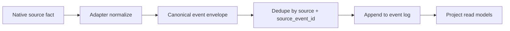
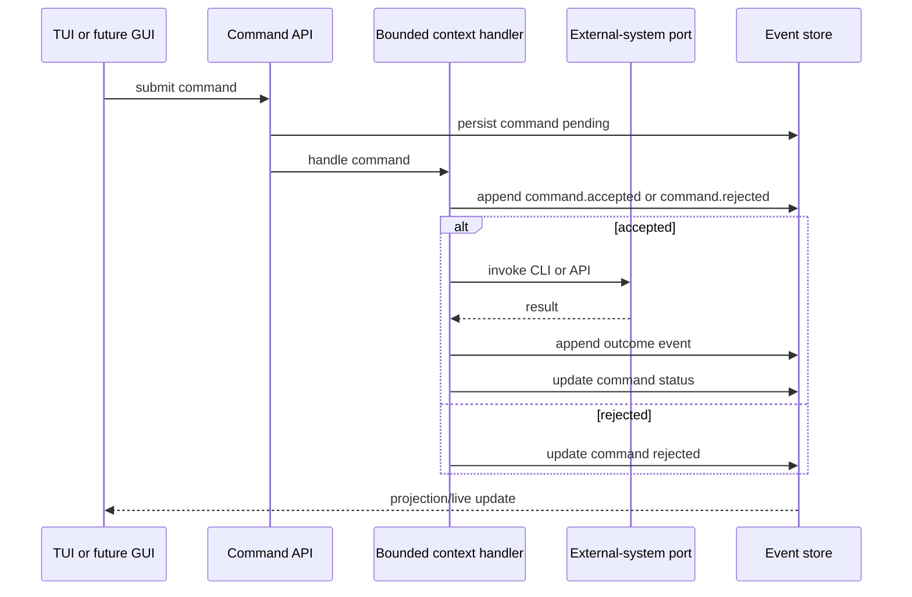
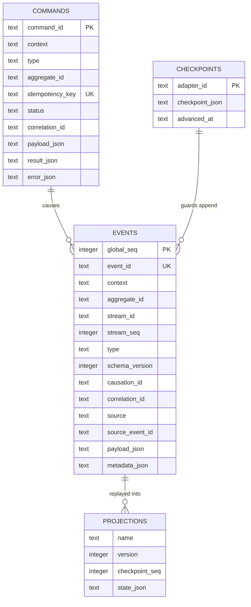
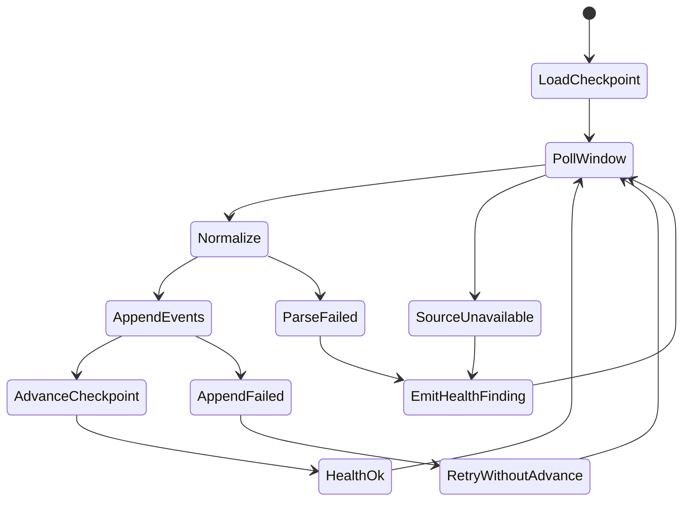
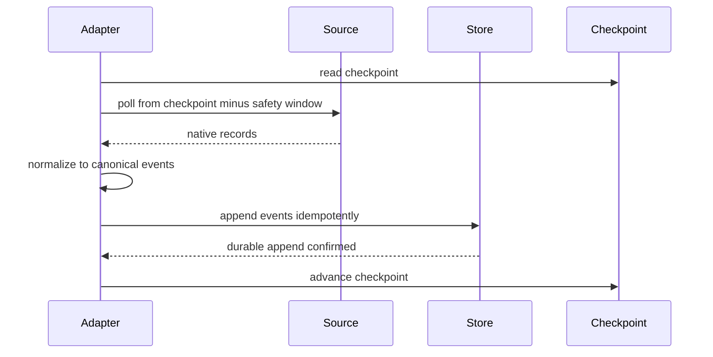
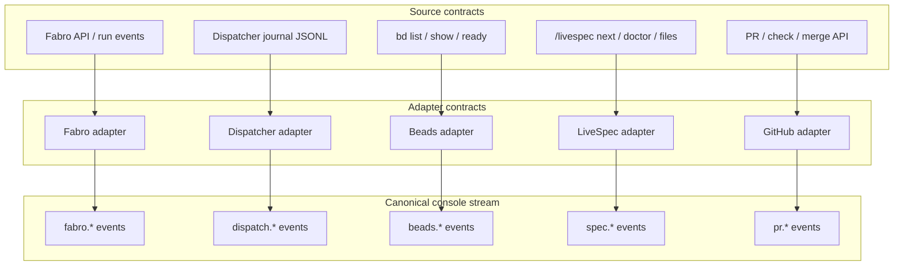
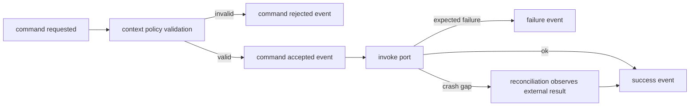
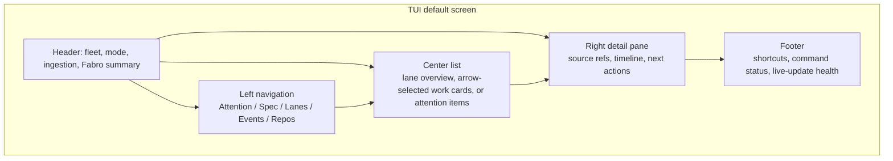
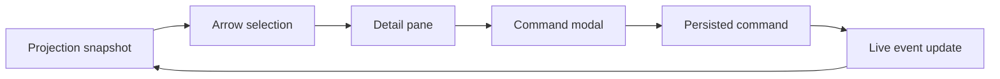

# contracts.md -- livespec-console-beads-fabro

This file defines the console's wire-level and persistence contracts.

## Event Envelope

Every canonical event MUST carry:

```jsonc
{
  "event_id": "evt_...",
  "schema_version": 1,
  "context": "factory",
  "type": "factory.drain.started",
  "source": "console",
  "source_event_id": "optional-source-stable-id",
  "aggregate_id": "repo:livespec-runtime",
  "stream_id": "factory:livespec-runtime",
  "stream_seq": 12,
  "causation_id": "optional-causing-command-or-event-id",
  "correlation_id": "corr_...",
  "occurred_at": "2026-06-22T00:00:00Z",
  "observed_at": "2026-06-22T00:00:01Z",
  "payload": {},
  "metadata": {}
}
```

`event_id` is globally unique. `(source, source_event_id)` MUST be unique
when `source_event_id` is present so adapter replay is idempotent.

The `events` table (see SQLite Persistence) is a faithful 1:1 projection
of this envelope: every envelope field is a column and every column has
an envelope source. `correlation_id` and `causation_id` are scalar ids,
not structured objects; `aggregate_id` is the event's routing key (e.g.
`"repo:<id>"`, the same shape as a command's `aggregate_id`).



## Command Envelope

Commands are persisted intentions, not facts. A command MUST carry:

```jsonc
{
  "command_id": "cmd_...",
  "context": "factory",
  "type": "factory.drain_requested",
  "aggregate_id": "repo:livespec-runtime",
  "idempotency_key": "operator-provided-or-derived-key",
  "requested_by": "user-or-agent",
  "requested_at": "2026-06-22T00:00:00Z",
  "causation_event_id": null,
  "correlation_id": "corr_...",
  "payload": {}
}
```

Commands MAY be rejected. State changes become durable only through
events such as `command.accepted`, `factory.drain.started`,
`factory.drain.failed`, `factory.drain.completed`, and
`factory.drain.not_wired` (the honest outcome a simulated or
unimplemented drain port emits instead of fabricating success, per the
honesty rule in the Command Handling section).



## SQLite Persistence

The initial durable store is SQLite in WAL mode.

Required tables:

```text
events
  global_seq integer primary key
  event_id text unique
  context text
  aggregate_id text
  stream_id text
  stream_seq integer
  type text
  schema_version integer
  occurred_at text
  observed_at text
  causation_id text null
  correlation_id text
  source text
  source_event_id text null
  payload_json text
  metadata_json text

commands
  command_id text primary key
  context text
  type text
  aggregate_id text null
  idempotency_key text unique
  requested_by text
  requested_at text
  causation_event_id text null
  correlation_id text
  status text
  payload_json text
  result_json text null
  error_json text null
  updated_at text

checkpoints
  adapter_id text primary key
  checkpoint_json text
  advanced_at text

projections
  name text
  version integer
  checkpoint_seq integer
  state_json text
```

Events are append-only. Rollback is represented by compensating events, not
by deleting or mutating prior domain events.



## Adapter Contract

Every pull adapter MUST implement:

```text
adapter_id
source_kind
checkpoint_key
initial_backfill()
poll_since(checkpoint)
normalize(native_record) -> canonical events[]
advance_checkpoint(only after durable append)
reconcile(window)
health()
```

Adapter rules:

- The adapter MUST persist a durable checkpoint per source instance.
- The adapter MUST append normalized events before advancing its checkpoint.
- The adapter MUST provide at-least-once delivery; duplicates are allowed
  and MUST be deduplicated by stable source event identity.
- The adapter MUST support cold-start backfill and bounded backfill.
- The adapter MUST re-read a sliding reconciliation window on normal polls.
- The adapter MUST emit explicit ingestion health events for parse failures,
  unavailable sources, invalid checkpoints, backfill incompleteness, or
  unprovable continuity.
- If a source cannot provide complete historical transitions, the adapter
  MUST emit snapshot/reconciliation events and a completeness finding rather
  than claiming full history.
- If an adapter does not actually perform real source I/O (a minimal or
  simulated first-milestone adapter per `spec.md` -> Initial-adapter
  fidelity), it MUST emit an explicit not-observed / simulated /
  unimplemented health signal and MUST NOT emit an event asserting an
  observed source fact it did not observe.





## Initial Adapters

Initial adapters:

- **Fabro adapter** -- reads Fabro API/SSE or `fabro ps` / run details and
  emits run, blocked, human-gate, terminal, and run-link events.
- **Dispatcher adapter** -- tails and backfills Dispatcher journal JSONL and
  emits dispatch wave/item/outcome events.
- **Beads adapter** -- reads Beads work-item state through the `bd` CLI and
  emits snapshot/ready/closed/needs-regroom/manual-routing events.
- **LiveSpec adapter** -- reads spec-side `next`, doctor output,
  proposed changes, history, and filesystem/git state.
- **GitHub adapter** -- reads PR, check, branch, and merge state.

Adapters MUST call existing stable CLIs/APIs through ports. UI code MUST NOT
call Fabro, Beads, LiveSpec, Dispatcher, or GitHub directly.



## Command Handling

Command handlers live in bounded contexts. A handler MUST:

1. Validate the command against context policy and aggregate/projection state.
2. Persist acceptance or rejection.
3. Invoke external systems only through ports/adapters.
4. Append success/failure/outcome events.
5. Leave recovery to reconciliation/backfill when a crash occurs between an
   external side effect and outcome event append.
6. Never emit a success or outcome event for an effect the port did not
   actually achieve. A simulated or unimplemented port MUST surface a
   not-observed / simulated / unimplemented outcome (or a typed failure),
   never a fabricated success.

Initial commands:

- `factory.drain_requested`
- `factory.dispatch_item_requested`
- `factory.pause_requested`
- `factory.resume_requested`
- `spec.doctor_requested`
- `attention.acknowledge_requested`
- `attention.snooze_requested`
- `grooming.regroom_requested`



## TUI Contract

The TUI is the first frontend. It MUST be a projection consumer and command
producer, not a source-system client.

Required TUI views:

- Attention
- Spec
- Lanes
- Events
- Repos

The `Lanes` view is the work-item consumer: it renders the seven lifecycle
lanes (`backlog`, `pending-approval`, `ready`, `active`, `acceptance`,
`blocked`, `done`) projected from the orchestrator's emitted `lane` /
`lane_reason` — the console consumes that lane assignment and never re-derives
it (the lane vocabulary is owned by livespec core, referenced here, not
re-decided). It is a hybrid sub-view: a lane-overview home listing all seven
lanes with their counts and a preview of each lane's top rank-ordered items,
with drill-in to a single lane's full rank-ordered list. The `Lanes` view
subsumes the earlier ad-hoc `Ready` / `Factory` / `Manual` / `Done` groupings,
which the lane model makes redundant. `Spec`, `Events`, and `Repos` remain as
orthogonal, non-lane views.

The default view MUST be Attention. Navigation SHOULD use arrow-driven
selection lists, detail panes, command modals, `/` search, and a command
palette. Numeric selection MAY exist as a fallback but MUST NOT be the only
interaction model.




