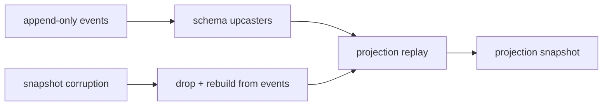

# constraints.md -- livespec-console-beads-fabro

This file defines the operator-observable architectural and runtime
constraints -- those whose violation a console operator could observe.
Contributor-facing non-functional requirements (the implementation
language, railway-oriented error handling, bounded-context layering,
architecture tests, the quality gate, the family secret convention, and
the Red-Green-Replay commit discipline) live in
`non-functional-requirements.md`.

## Runtime Shape

- The executable SHOULD be a single binary that can run TUI/service/API
  modes from one artifact.

## Event-Sourcing Safety

- Event append MUST be idempotent for adapter replay.
- Adapter checkpoints MUST advance only after durable event append.
- Projections MUST be rebuildable from the event log.
- Snapshot/read-model corruption MUST be recoverable by replay.
- Schema changes MUST include event upcasting or a documented migration
  path.
- Rollback MUST be modeled as compensating events rather than event
  deletion.

