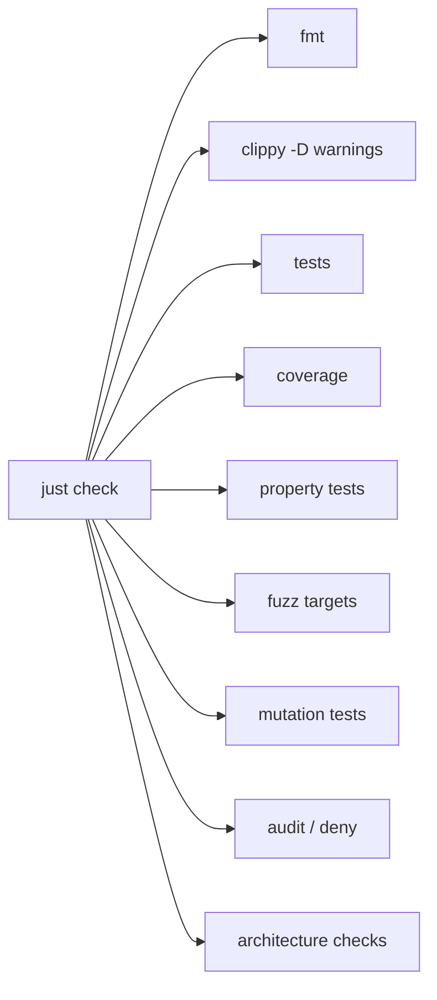
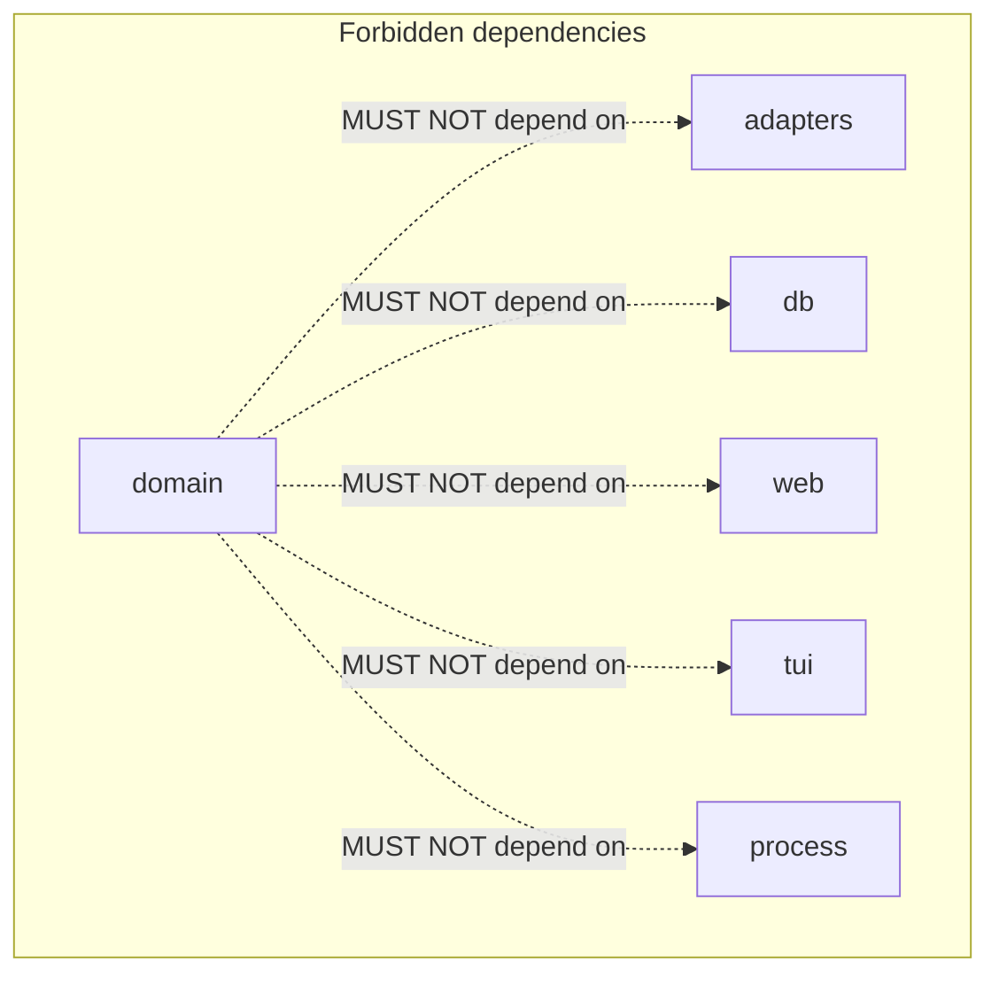
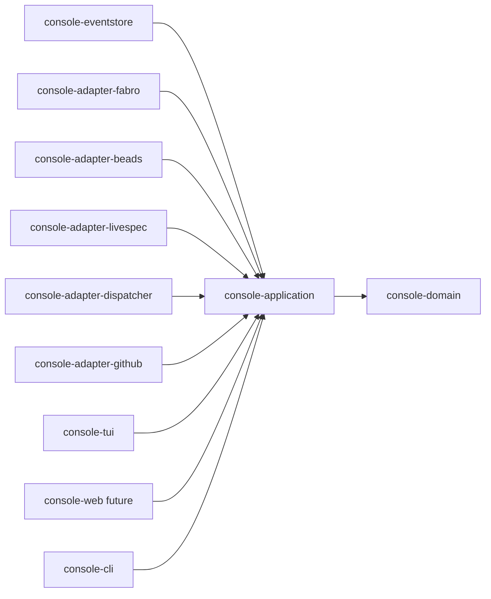
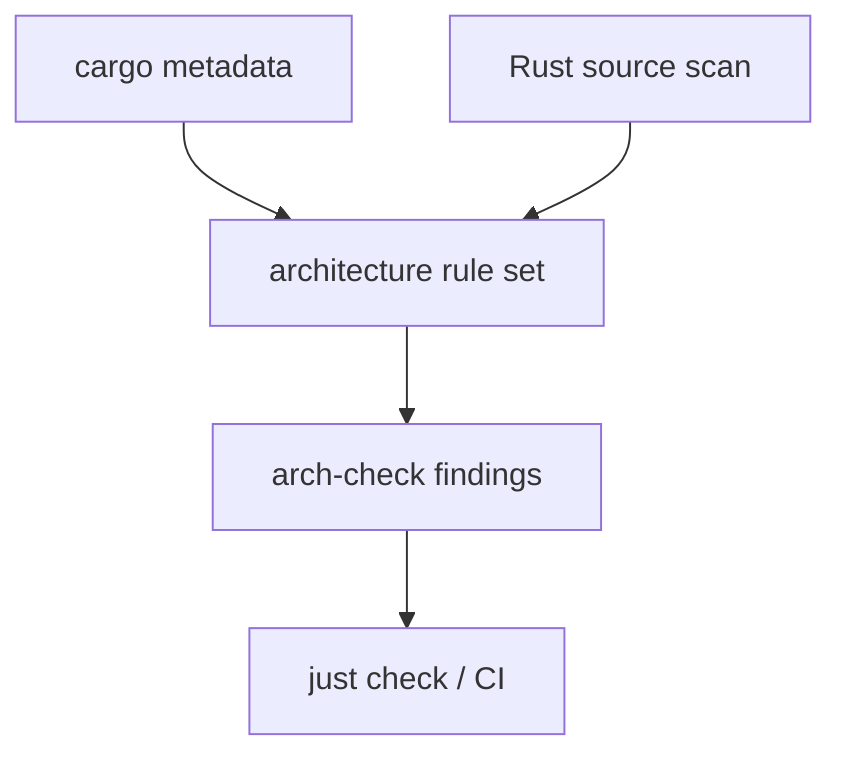

# non-functional-requirements.md -- livespec-console-beads-fabro

This document MUST be read alongside `spec.md`, `contracts.md`,
`constraints.md`, and `scenarios.md`. It enumerates the project's
non-functional requirements: contributor-facing concerns -- the
development environment, repository tooling, build and test discipline,
architectural invariants on the implementation, and contributor
workflow -- that are NOT observable at the console's operator-facing
TUI/CLI/API surface.

The four top-level `##` sections below mirror the same four-file
boundary the operator-facing spec uses (`Spec` / `Contracts` /
`Constraints` / `Scenarios`) plus a `Boundary` preamble, so
contributors and agents apply the same categorization rule when landing
new content.

## Boundary

`non-functional-requirements.md` covers concerns of the form "how the
console is built, tested, and maintained". The litmus test for new
content: a constraint a console operator could observe stays in the
operator-facing functional files; a constraint that binds only the
project's contributors lives here.

The boundary against the operator-facing functional files:

- Operator-facing intent or behavior MUST stay in `spec.md`.
- Operator-facing wire contracts (event/command envelopes, persistence
  schemas, adapter and TUI contracts) MUST stay in `contracts.md`.
- Constraints whose violation a console operator could observe MUST
  stay in `constraints.md` (the single-binary multi-mode runtime shape
  and the event-sourcing safety guarantees).
- Operator-facing scenarios MUST stay in `scenarios.md`.

The trickiest boundary is `constraints.md` <->
`non-functional-requirements.md`: constraints whose violation an
operator could observe MUST stay in `constraints.md`; constraints that
bind only the project's contributors MUST move here. The implementation
language, the railway-oriented error discipline, the bounded-context
layering, the architecture tests, and the quality gate are all
contributor-facing and live here; the event-sourcing safety guarantees
an operator relies on stay in `constraints.md`.

The decision rule for each section below:

- `## Spec` -- contributor-facing process intent and behavior: the
  commit discipline and what "done" means. Mirrors `spec.md`'s role.
- `## Contracts` -- contributor-facing toolchain and invocation
  surface: the tools the project depends on, the `just check`
  aggregate, and the family secret convention. Mirrors `contracts.md`'s
  role.
- `## Constraints` -- architectural invariants on the implementation:
  language, error handling, bounded-context layering, and architecture
  tests. Mirrors `constraints.md`'s role.
- `## Scenarios` -- Gherkin-style scenarios for contributor-facing
  workflows. Empty initially; populated when a specific contributor
  flow needs to be pinned.

## Spec

This section enumerates the project's contributor-facing process intent
and behavior -- the analogue of `spec.md`'s role for the
operator-facing surface.

### Red-Green-Replay

Rust product changes MUST adopt the family Red-Green-Replay commit
discipline once the repo hooks exist:

1. Red commit stages the test only and records the failing test
   evidence.
2. Green amend stages implementation and records passing evidence.
3. The final commit carries test and implementation plus both trailer
   sets.

Non-product or spec-only changes MAY use the family
non-Python/non-product exemption pattern.

## Contracts

This section enumerates the contributor-facing toolchain and invocation
surface -- the analogue of `contracts.md`'s role for the
operator-facing surface.

### Quality Gate

The full check aggregate MUST include:

- `cargo fmt --check`
- `cargo clippy --all-targets --all-features -- -D warnings`
- tests with a modern Rust test runner
- coverage with a declared threshold
- property tests for pure logic and replay/projector behavior
- fuzz tests for event decoding, adapter normalization, and source
  payload parsing where practical
- mutation testing where practical
- dependency audit/deny checks
- architecture checks

### Beads/Fabro Family Secret Convention

The console and its docs MUST use the current family secret convention:
the 1Password Environment wrapper exports one bare `BEADS_DOLT_PASSWORD`.
There is no per-tenant `BEADS_DOLT_PASSWORD_<tenant>` variable and no
per-tenant-to-bare mapping. Secrets MUST never be committed or echoed.

## Constraints

This section enumerates the architectural invariants on the
implementation -- the analogue of `constraints.md`'s role for the
operator-facing surface.

### Implementation Language

- Product code MUST be Rust.
- `unsafe` is forbidden by default: crates MUST use
  `#![forbid(unsafe_code)]` unless a future spec revision grants a
  narrow exception.

The single-binary multi-mode runtime shape is operator-observable and
stays in `constraints.md`.

### Railway-Oriented Programming

- Expected failures MUST be represented with typed `Result` values.
- Panics are bugs, not domain control flow.
- Domain and application code MUST NOT use `unwrap` or `expect` outside
  tests and startup wiring.
- Error types MUST distinguish domain rejection from infrastructure
  failure.
- Use cases SHOULD read as railway pipelines: validate, transform, call
  port, map errors, and emit events.

### Domain-Driven Design

- Bounded contexts MUST own their language, commands, events,
  invariants, and projections.
- Domain crates MUST not depend on infrastructure crates such as web,
  db, process, HTTP, filesystem adapters, or terminal UI.
- Application crates MAY depend on domain crates and port traits.
- Adapter crates MAY depend on application/domain contracts but MUST NOT
  depend on each other.
- UI crates MUST talk to projections and command APIs, not directly to
  source systems.

### Architecture Tests

The repo MUST include architecture tests inspired by ArchUnitTS and
ArchUnitPython, adapted to Rust.

Architecture checks MUST enforce at least:

- no forbidden dependency direction in the workspace crate graph
- domain has no direct dependency on adapters, SQLite, web server, TUI,
  HTTP, subprocess, or filesystem APIs
- adapters do not depend on each other
- UI does not call Beads/Fabro/LiveSpec/GitHub directly
- product crates do not use `unwrap`/`expect` outside allowed scopes
- event and command types live in domain/application contracts, not
  adapters
- all use cases return typed `Result`

`cargo metadata` MAY enforce crate graph rules. Source-level checks MAY
use Rust syntax parsing where needed.

## Scenarios

No contributor-facing scenarios are pinned yet. Operator-facing
scenarios live in `scenarios.md`.
