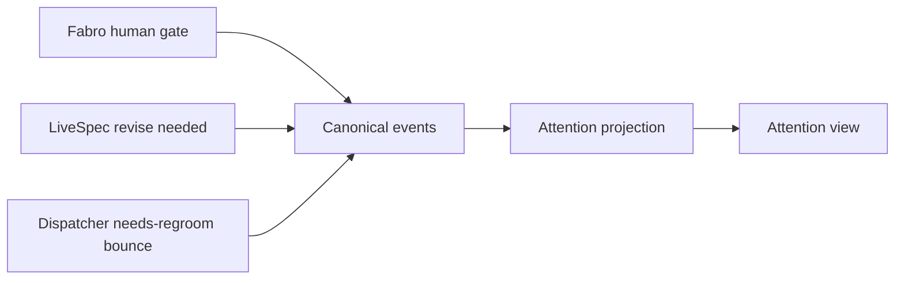
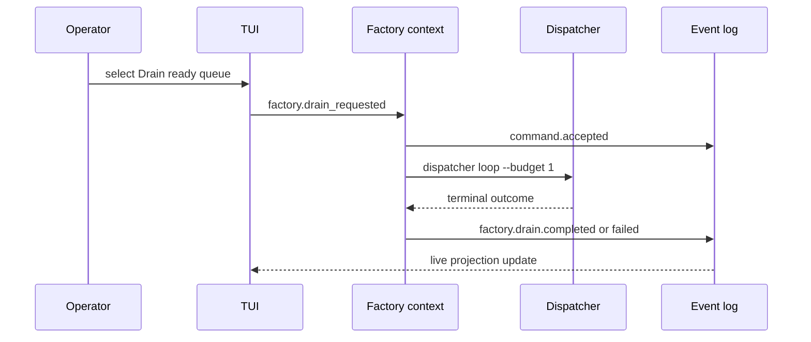
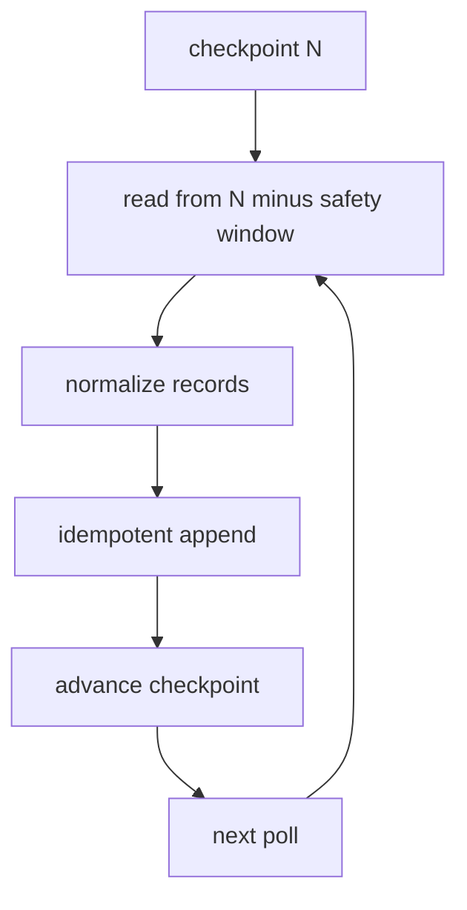
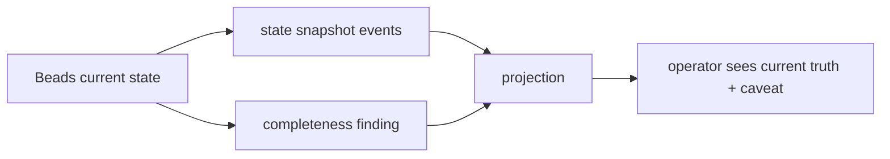
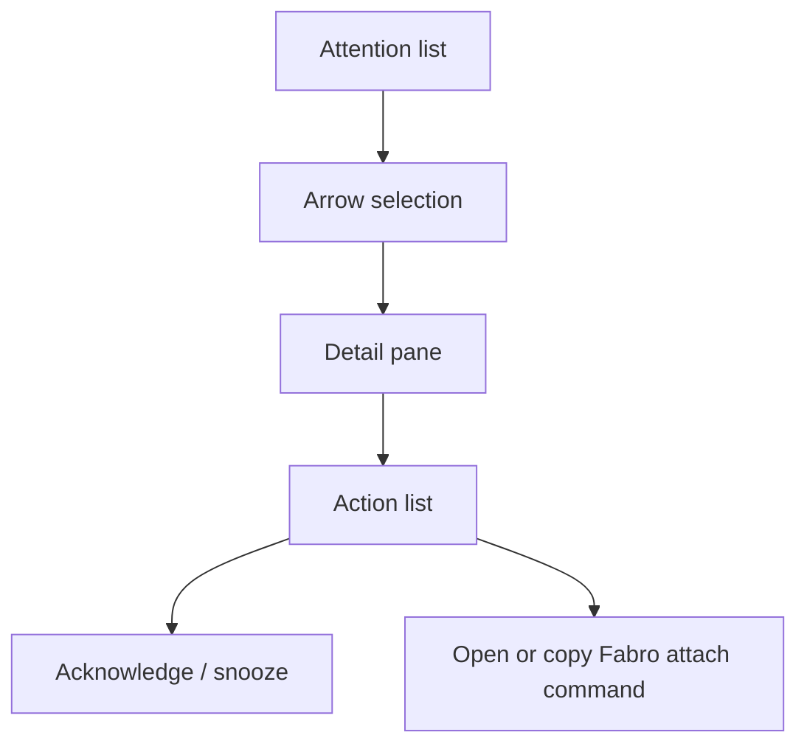

# scenarios.md -- livespec-console-beads-fabro

Behavioral journeys for the console.

## Scenario 1 -- Operator sees one attention inbox



```gherkin
Feature: Unified attention inbox
  As a LiveSpec operator
  I want one place to see work requiring my attention
  So that I do not have to poll LiveSpec, Beads, Dispatcher, Fabro, and GitHub separately

Scenario: Mixed source signals appear as attention items
  Given the Fabro adapter observes a blocked run with a human gate
  And the LiveSpec adapter observes pending proposed changes requiring revise
  And the Dispatcher adapter observes a non-converging item bounced to needs-regroom
  When the console projects the event log
  Then the Attention view lists all three items
  And each item carries a source reference and next operator action
```

## Scenario 2 -- Factory drain command



```gherkin
Feature: Factory drain command
  As an operator
  I want to request a bounded factory drain from the console
  So that ready Beads work can enter Dispatcher/Fabro without manual command assembly

Scenario: A bounded drain emits command and outcome events
  Given a repo has ready implementation work
  When the operator selects "Drain ready queue" with budget 1 and parallel 1
  Then the console persists a `factory.drain_requested` command
  And the Factory context validates and accepts the command
  And invokes Dispatcher through its port
  And appends started and terminal outcome events
  And the TUI updates live from projections
```

## Scenario 3 -- Pull adapter backfill avoids silent missed data



```gherkin
Feature: Checkpointed pull ingestion
  As a console maintainer
  I want every adapter to checkpoint and backfill
  So that polling does not silently miss source activity

Scenario: Adapter replays a reconciliation window idempotently
  Given an adapter has checkpointed source position N
  When it polls again
  Then it reads from N minus its configured safety window
  And emits canonical events with stable source event ids
  And duplicate events are ignored by the event store
  And the checkpoint advances only after durable append
```

## Scenario 4 -- Source cannot prove full transition history



```gherkin
Feature: Honest completeness findings
  As an operator
  I want incomplete source history to be visible
  So that the console never overclaims certainty

Scenario: Beads current-state snapshot lacks transition history
  Given the Beads adapter can observe current work-item state
  And the source cannot prove every historical transition
  When the adapter backfills the repo
  Then it emits state snapshot events
  And emits an ingestion completeness finding
  And the projection shows current truth without pretending full transition history is known
```

## Scenario 5 -- TUI-first operator workflow



```gherkin
Feature: TUI operator workflow
  As an operator using a terminal
  I want arrow-driven views and detail panes
  So that I can drive common orchestration actions before the GUI exists

Scenario: Operator handles a human gate
  Given a selected Attention item represents a Fabro human gate
  When the operator opens the detail pane
  Then the TUI shows the repo, work item, Fabro run, latest timeline events, and attach action
  And the operator can acknowledge, snooze, or open/copy the Fabro attach command
```
