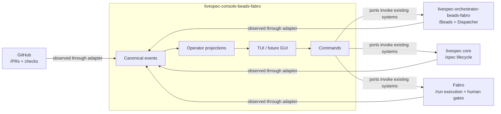
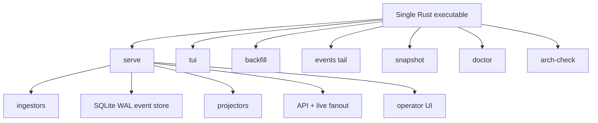
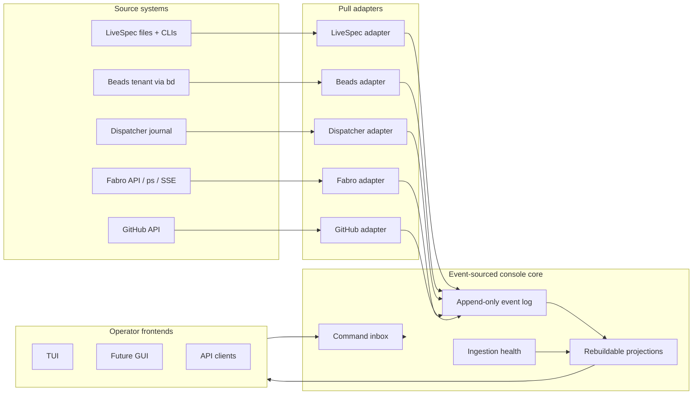
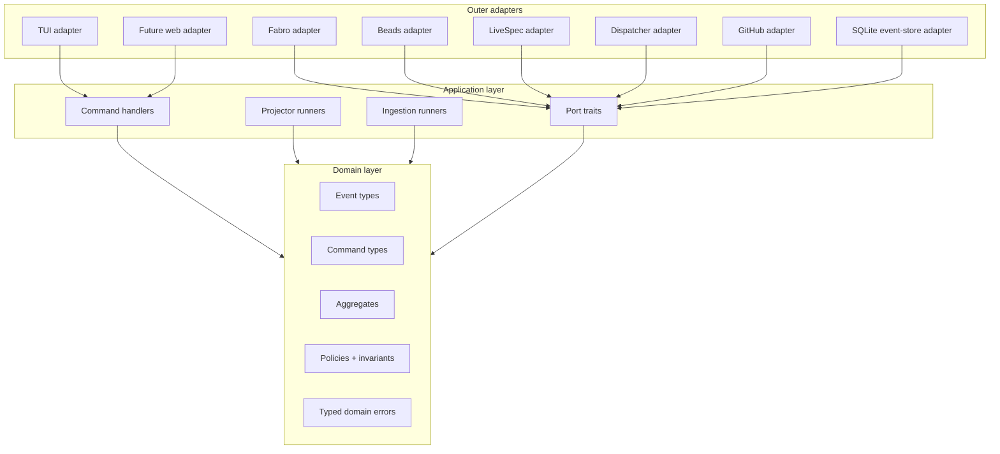
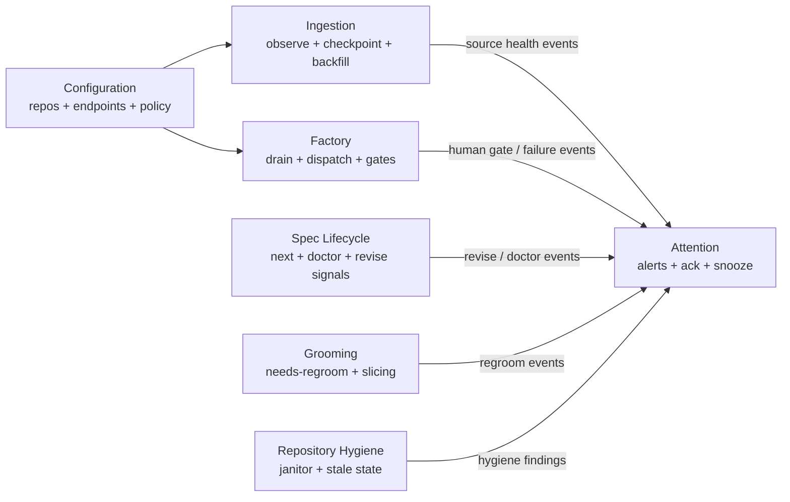

# spec.md -- livespec-console-beads-fabro

`livespec-console-beads-fabro` is the LiveSpec-family operator console
for repositories whose implementation work is tracked in Beads and
driven through the Beads/Fabro orchestrator. It is a separate product
from LiveSpec core, the Beads/Fabro orchestrator, and Fabro itself.

## Purpose

The console gives a human operator one coherent place to answer:

- What needs attention now?
- What spec-side action is pending?
- What implementation work is ready?
- What is currently in the factory?
- Which Fabro runs are blocked on human input?
- Which work is manual or host-only and must not enter Fabro?
- What commands can be safely issued next?

The console is event-sourced. It consumes source facts from LiveSpec,
Beads, Dispatcher, Fabro, GitHub, and local repository state, translates
them into canonical console events, and derives operator projections such
as attention inboxes, cards, timelines, and repository health.

## Scope Boundary

The console owns:

- canonical console events and commands
- source adapters and ingestion checkpoints
- event store and command persistence
- projections/read models for operator use
- TUI-first operator UI and later GUI/API surfaces
- human-attention routing and notification-ready alert semantics

The console does not own:

- `/livespec:*` spec mutation semantics
- Beads issue storage semantics
- Dispatcher's factory execution behavior
- Fabro workflow execution, run internals, logs, or sandbox UI
- GitHub pull request merge policy

The console may invoke existing CLIs or APIs through ports/adapters, but
those systems remain the source of truth for their own domains.



## Product Shape

The steady-state product is a single Rust executable:

```text
livespec-console-beads-fabro serve
```

`serve` starts ingestion, the durable event store, projections, API, live
event fanout, and the operator UI surface. Supporting subcommands may
include:

```text
livespec-console-beads-fabro tui
livespec-console-beads-fabro backfill
livespec-console-beads-fabro events tail
livespec-console-beads-fabro snapshot
livespec-console-beads-fabro doctor
livespec-console-beads-fabro arch-check
```

The first UI is a TUI with arrow-driven selection lists, detail panes,
command modals, and live updates. A GUI can later consume the same
events, commands, and projections.



## Architecture

The architecture follows event sourcing, domain-driven design, and
ports/adapters.

```text
source systems
  -> pull adapters
  -> canonical events
  -> durable event log
  -> projectors
  -> TUI / GUI / API

UI commands
  -> command store
  -> bounded-context handlers
  -> ports/adapters
  -> outcome events
```

Adapters start as pull shims over existing systems. Over time, upstream
systems may emit stronger native events, but the console contract is the
canonical event shape it consumes.



The hexagonal boundary keeps source-specific mechanics outside the domain:



## Bounded Contexts

Initial bounded contexts:

- **Ingestion** -- source observation, checkpointing, backfill,
  reconciliation, source health.
- **Factory** -- Dispatcher/Fabro queue drains, selected item dispatch,
  factory pause/resume, human gate observation.
- **Spec Lifecycle** -- LiveSpec `next`, doctor, proposed changes,
  critique, revise-required signals.
- **Grooming** -- needs-regroom routing, slice proposal/approval events,
  factory/manual/spec routing.
- **Attention** -- alerts, acknowledgement, snooze, owner/triage state.
- **Repository Hygiene** -- janitor checks, stale PR/branch/worktree
  findings, primary checkout health.
- **Configuration** -- registered repos, source endpoints, notification
  policy, adapter enablement.

Each bounded context owns its command vocabulary, events, invariants,
aggregates, and projections.



## Terminology

**Canonical event** -- A durable fact in the console event log. It may be
directly emitted by the console or synthesized by an adapter from a source
system's native fact.

**Command** -- An operator intention, such as requesting a factory drain.
Commands are persisted separately from domain events. A command may be
accepted, rejected, run, fail, or succeed; it is not itself proof that the
requested action occurred.

**Adapter** -- A source-specific translator that observes a system such as
Fabro, Beads, LiveSpec, Dispatcher, or GitHub and emits canonical events.

**Projection** -- A derived read model, rebuilt from events, such as the
attention inbox, work card list, event timeline, or repo health view.

**Attention item** -- A projection entry requiring human review or action,
such as a Fabro human gate, LiveSpec revise need, doctor failure, host-only
task, or non-converging factory item.

**Factory** -- The Beads/Fabro execution path: ready work-items selected for
Dispatcher, run in Fabro sandboxes, gated, merged, closed, bounced, or
surfaced.
