# scenarios.md -- livespec-console-beads-fabro

Behavioral journeys for the console.

## Scenario 1 -- Operator sees one needs-attention inbox

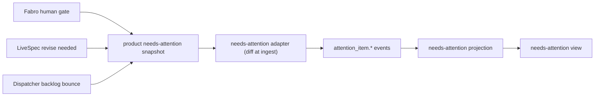

```gherkin
Feature: Unified needs-attention inbox
  As a LiveSpec operator
  I want one place to see work requiring my attention
  So that I do not have to poll LiveSpec, the orchestrator's work-items surface, Dispatcher, Fabro, and GitHub separately

Scenario: Mixed source signals appear as needs-attention items
  Given the product needs-attention snapshot composes a blocked Fabro run with a human gate, pending proposed changes requiring revise, and a non-converging item bounced to `backlog` for re-grooming
  When the needs-attention adapter ingests the snapshot and diffs it into attention_item events
  Then the needs-attention view lists all three items from the attention_item stream
  And each item carries a source reference and next operator action
```

## Scenario 2 -- Factory drain command

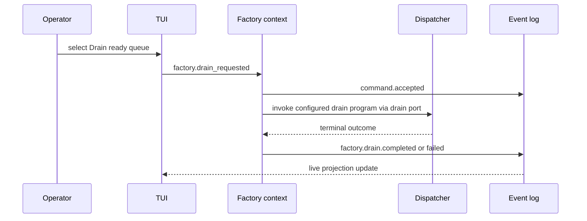

```gherkin
Feature: Factory drain command
  As an operator
  I want to request a bounded factory drain from the console
  So that ready work-items can enter Dispatcher/Fabro without manual command assembly

Scenario: A bounded drain emits command and outcome events
  Given a repo has ready implementation work
  When the operator selects "Drain ready queue" with budget 1 and parallel 1
  Then the console persists a `factory.drain_requested` command
  And the Factory context validates and accepts the command
  And invokes Dispatcher through its port
  And appends started and terminal outcome events
  And the TUI updates live from projections
```

## Scenario 3 -- Pull adapter backfill avoids silent missed data

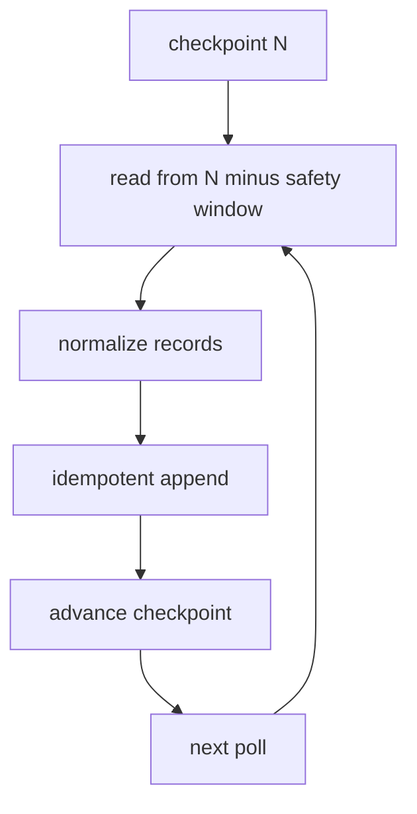

```gherkin
Feature: Checkpointed pull ingestion
  As a console maintainer
  I want every adapter to checkpoint and backfill
  So that polling does not silently miss source activity

Scenario: Adapter replays a reconciliation window idempotently
  Given an adapter has checkpointed source position N
  When it polls again
  Then it reads from N minus its configured safety window
  And emits canonical events with stable source event ids
  And duplicate events are ignored by the event store
  And the checkpoint advances only after durable append
```

## Scenario 4 -- Source cannot prove full transition history

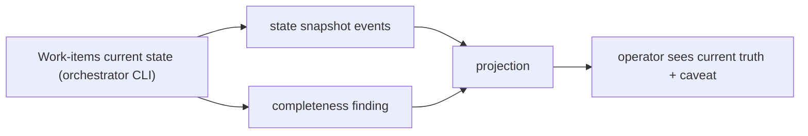

```gherkin
Feature: Honest completeness findings
  As an operator
  I want incomplete source history to be visible
  So that the console never overclaims certainty

Scenario: Work-items current-state snapshot lacks transition history
  Given the Work-items adapter can observe current work-item state through the orchestrator CLI
  And the source cannot prove every historical transition
  When the adapter backfills the repo
  Then it emits state snapshot events
  And emits an ingestion completeness finding
  And the projection shows current truth without pretending full transition history is known
```

## Scenario 5 -- TUI-first operator workflow

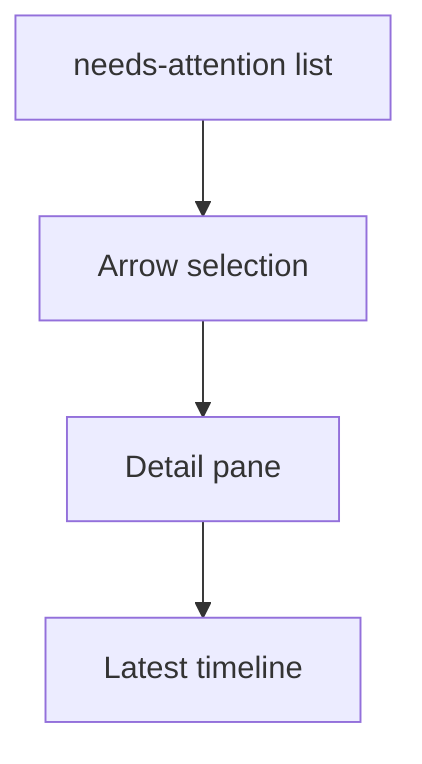

```gherkin
Feature: TUI operator workflow
  As an operator using a terminal
  I want arrow-driven views and detail panes
  So that I can drive common orchestration actions before the GUI exists

Scenario: Operator inspects a lane-derived needs-attention item
  Given a selected needs-attention item is derived from a blocked needs-human work-item lane
  When the operator opens the detail pane
  Then the TUI shows the repo, work item, and latest timeline events
  And no local dismiss command is offered from the needs-attention lens
```

## Scenario 6 -- Policy-rejected command produces no side effect

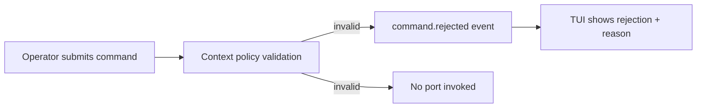

```gherkin
Feature: Policy-rejected command
  As an operator
  I want commands that violate context policy to be rejected without side effects
  So that the console never acts on an invalid request

Scenario: An invalid drain is rejected and nothing is dispatched
  Given a repo has no ready implementation work
  When the operator requests a factory drain
  Then the Factory context validates the command against policy
  And persists a `command.rejected` event carrying the rejection reason
  And no Dispatcher port is invoked
  And the TUI shows the command as rejected with its reason
```

## Scenario 7 -- Crash-gap recovery reconstructs a missing outcome

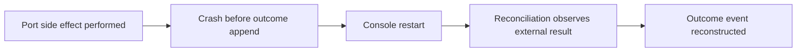

```gherkin
Feature: Crash-gap recovery
  As an operator
  I want the console to recover when it crashes between a side effect and its outcome event
  So that the event log eventually reflects what actually happened

Scenario: Reconciliation reconstructs a missing outcome after a crash
  Given a command's port side effect has been performed
  And the console crashed before appending the outcome event
  When the console restarts and reconciliation runs
  Then it observes the external result through the adapter
  And appends the corresponding outcome event
  And the command status reflects the true outcome
```

## Scenario 8 -- Corrupted projection rebuilds by replay

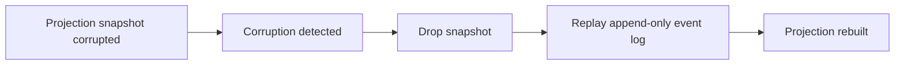

```gherkin
Feature: Snapshot corruption recovery
  As an operator
  I want corrupted read models to rebuild from the event log
  So that projection corruption never loses durable truth

Scenario: A corrupted projection is rebuilt by replay
  Given a projection snapshot is detected as corrupt
  When the console recovers the projection
  Then it drops the corrupt snapshot
  And rebuilds the projection by replaying the append-only event log
  And the rebuilt projection matches the event log
```

## Scenario 9 -- Enabling full autonomous mode is guarded and audited

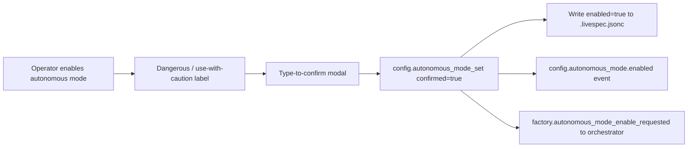

```gherkin
Feature: Guarded, audited full autonomous mode
  As a LiveSpec operator
  I want autonomous mode to be off by default, confirmed, and audited
  So that a dangerous mode can never be enabled by accident or silently

Scenario: Enabling autonomous mode is confirmed, persisted, and audited
  Given a registered repo whose autonomous mode is disabled by default
  When the operator enables autonomous mode from the TUI
  Then the TUI shows a "dangerous / use with caution" label
  And requires an explicit type-to-confirm modal
  And the console submits config.autonomous_mode_set with confirmed true
  And persists enabled true to the repo's .livespec.jsonc
  And appends a config.autonomous_mode.enabled audit event
  And issues factory.autonomous_mode_enable_requested to the orchestrator through its published command surface

Scenario: An unconfirmed enable is rejected with no effect
  Given a registered repo whose autonomous mode is disabled
  When a config.autonomous_mode_set with enabled true arrives without confirmed true
  Then the Configuration context rejects the command
  And no setting is written and no audit event is appended
```

## Scenario 10 -- Autonomous mode resolves the decidable and escalates the rest

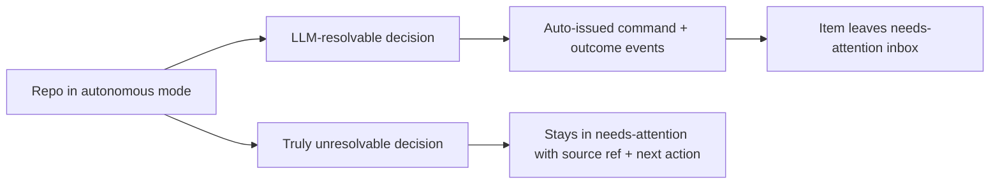

```gherkin
Feature: Autonomous mode resolves the decidable and escalates the rest
  As an operator running a repo in autonomous mode
  I want the console to auto-resolve decisions it can and escalate the rest
  So that only truly unresolvable decisions still need me

Scenario: A decidable needs-attention item is auto-resolved and recorded
  Given a repo in autonomous mode
  And a needs-attention item derived from a decision the LLM can resolve
  When the console runs autonomously
  Then it records the auto-decision as a command and its outcome events
  And the item leaves the needs-attention inbox

Scenario: A truly unresolvable decision still reaches the operator
  Given a repo in autonomous mode
  And a decision the LLM cannot resolve with sufficient confidence
  When the console runs autonomously
  Then the decision remains a needs-attention item with its source reference and next operator action
  And the console neither drops nor fabricates the decision
```

## Scenario 11 -- Human valve and policy-edit commands map onto the orchestrator surface

The approve and policy-edit scenes below realize the orchestrator's ratified
work-item state semantics (repo
`thewoolleyman/livespec-orchestrator-beads-fabro`, `SPECIFICATION/contracts.md`,
its Work-item state semantics section and its `orchestrate` action-id surface):
approve is the `pending-approval -> ready` transition and a policy edit never
moves an item between states.

```gherkin
Feature: Human valve and policy-edit commands
  As a LiveSpec operator
  I want to approve, accept, reject, and re-policy work-items from the console
  So that the two human valves and the policy dials are one keystroke away, with the orchestrator owning the ledger write

Scenario: Approve routes through the orchestrator's published action surface
  Given a `pending-approval` work-item whose effective admission_policy is manual, shown in needs-attention
  When the operator invokes Approve on it
  Then the console persists a `work_item.approve_requested` command
  And invokes the orchestrator's published action surface with `approve:<work-item-id>` through its port
  And appends the outcome events from the orchestrator result
  And observes the item's lane change on a subsequent work-items poll

Scenario: Reject with mode regroom maps onto the reject action id
  Given an `acceptance` work-item the operator judges wrongly scoped
  When the operator invokes Reject with mode regroom
  Then the console persists a `work_item.reject_requested` command carrying mode regroom
  And invokes the orchestrator's published action surface with `reject:<work-item-id>:regroom`
  And never writes the ledger directly

Scenario: A policy edit never moves an item between states
  Given a work-item whose stored admission_policy is manual
  When the operator invokes set-admission with policy auto
  Then the console persists a `work_item.set_admission_requested` command
  And invokes the orchestrator's published action surface with `set-admission:<work-item-id>:auto`
  And the item's lifecycle state is unchanged
```

## Scenario 12 -- needs-attention snapshot diffed at ingest into attention_item events

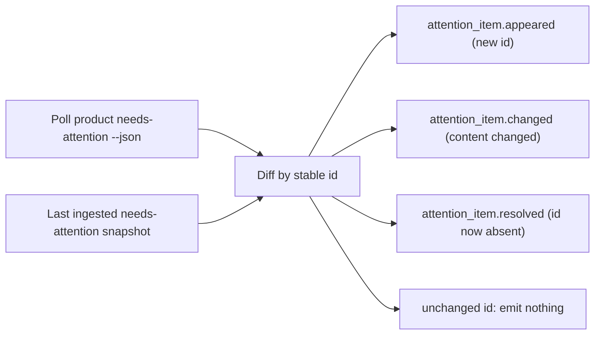

```gherkin
Feature: needs-attention snapshot diffed at ingest
  As a console maintainer
  I want the stateless product needs-attention snapshot turned into durable events at ingest
  So that the event-sourced console can project appeared, changed, and resolved attention items without the source keeping history

Scenario: The needs-attention adapter diffs a point-in-time snapshot into keyed events
  Given the needs-attention adapter has a prior ingested snapshot of the product needs-attention surface
  And the surface is stateless and point-in-time with no transition history
  When the adapter polls the surface and diffs the new snapshot against the prior one by stable id
  Then it emits an attention_item.appeared event for each id not present before
  And an attention_item.changed event for each present id whose composed content changed
  And an attention_item.resolved event for each previously-present id now absent
  And emits nothing for an unchanged id
  And every emitted event is keyed by the item's stable id
```
