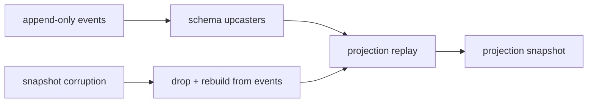

# constraints.md -- livespec-console-beads-fabro

This file defines the operator-observable architectural and runtime
constraints -- those whose violation a console operator could observe.
Contributor-facing non-functional requirements (the implementation
language, railway-oriented error handling, bounded-context layering,
architecture tests, the quality gate, the family secret convention, and
the Red-Green-Replay commit discipline) live in
`non-functional-requirements.md`.

## Runtime Shape

- The executable SHOULD be a single binary that can run TUI/service/API
  modes from one artifact.

## Event-Sourcing Safety

- Event append MUST be idempotent for adapter replay.
- Adapter checkpoints MUST advance only after durable event append.
- Projections MUST be rebuildable from the event log.
- Snapshot/read-model corruption MUST be recoverable by replay.
- Schema changes MUST include event upcasting or a documented migration
  path.
- Rollback MUST be modeled as compensating events rather than event
  deletion.

## Autonomous-Mode Safety

These constraints govern the operator-observable safety of full autonomous
mode (`spec.md` -> Full Autonomous Mode); its wire form is in
`contracts.md` -> Autonomous Mode.

- Autonomous mode MUST default to disabled for every repo; a repo with no
  autonomous-mode setting MUST be treated as disabled.
- Enabling autonomous mode MUST require explicit operator confirmation AND
  MUST emit a durable `config.autonomous_mode.enabled` audit event; it
  MUST NOT be enabled without both.
- In autonomous mode the console MUST still surface every truly
  unresolvable decision as a needs-attention item, and MUST NOT drop, silently
  defer, or fabricate a decision no plane's engine resolved.
- Every command the console itself issues in autonomous mode -- the
  plane-arming command and the human-valve commands -- MUST be recorded
  through the same command-plus-outcome-event path as an operator-issued
  command, and every auto-resolution an owning plane's engine makes MUST be
  observed and reflected through that same path; no console side effect MUST
  occur without an auditable command and outcome.
- The console MUST NOT reach around a plane to force a decision that plane
  owns; it MUST enable the plane's own autonomous mode through that plane's
  published command surface.
