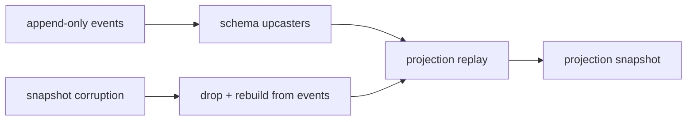

# constraints.md -- livespec-console-beads-fabro

This file defines the operator-observable architectural and runtime
constraints -- those whose violation a console operator could observe.
Contributor-facing non-functional requirements (the implementation
language, railway-oriented error handling, bounded-context layering,
architecture tests, the quality gate, the family secret convention, and
the Red-Green-Replay commit discipline) live in
`non-functional-requirements.md`.

## Runtime Shape

- The executable SHOULD be a single binary that can run TUI/service/API
  modes from one artifact.

## Event-Sourcing Safety

- Event append MUST be idempotent for adapter replay.
- Adapter checkpoints MUST advance only after durable event append.
- Projections MUST be rebuildable from the event log.
- Snapshot/read-model corruption MUST be recoverable by replay.
- Schema changes MUST include event upcasting or a documented migration
  path.
- Rollback MUST be modeled as compensating events rather than event
  deletion.

## Dispatcher-Settings Safety

These constraints govern the operator-observable safety of the console's
dispatcher-settings surface (`spec.md` -> Dispatcher Policy Settings); its
wire form is in `contracts.md` -> Dispatcher Policy Settings.

- The console MUST hold no dispatcher-setting state of its own; it MUST derive
  every effective value from the orchestrator's published read surface, and
  MUST NOT write the orchestrator's `.livespec.jsonc` keys or the per-item
  ledger labels directly.
- A settings write MUST change exactly one setting; the console MUST NOT offer
  a command that arms several settings at once.
- Enabling a dangerous setting MUST be an ordinary recorded settings write: it
  MUST emit a durable audit event, and it MUST NOT be gated behind a
  type-the-repo-name acknowledgement or any other arming ceremony.
- The console MUST NOT offer a per-item override for `wip_cap`, a per-repo
  concurrency ceiling that admits none; for every other setting the console
  MUST render the effective value the orchestrator reports rather than one it
  re-derived from the global default.
- The console MUST NOT arm dispatch-time policy per run; the factory-drain
  path MUST pass the Dispatcher no policy-arming argument, leaving the
  Dispatcher to read the orchestrator-owned settings itself.
- The console MUST surface every orchestrator escalation as a needs-attention
  item, and MUST NOT drop, silently defer, or fabricate a decision the
  orchestrator did not dispose.
- Every settings write the console issues MUST be recorded through the same
  command-plus-outcome-event path as an operator-issued command; no console
  side effect MUST occur without an auditable command and outcome.
- The console MUST NOT reach around the orchestrator to write a setting the
  orchestrator owns; it MUST issue every write through the orchestrator's
  published command surface.
