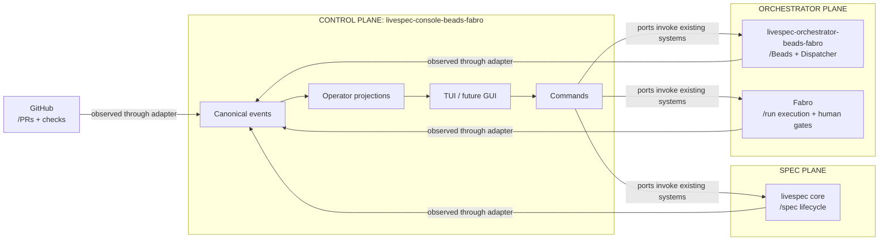
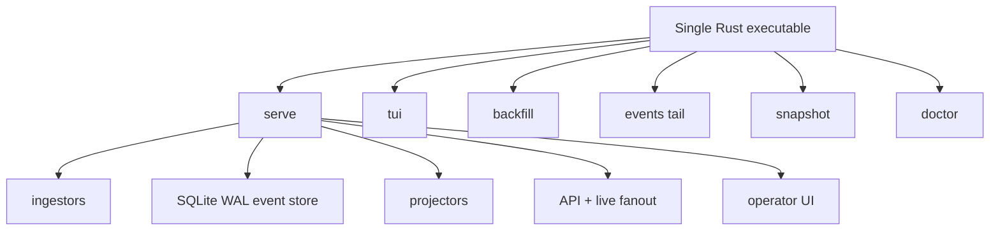
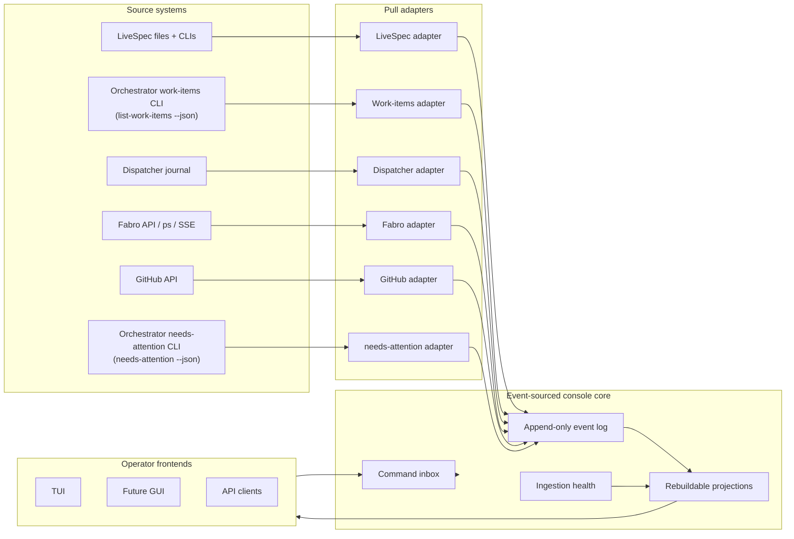
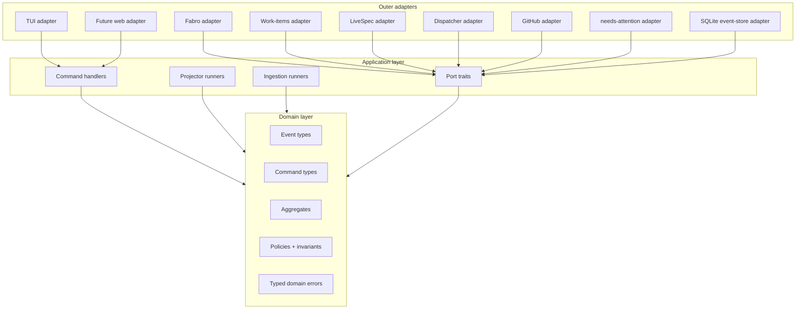
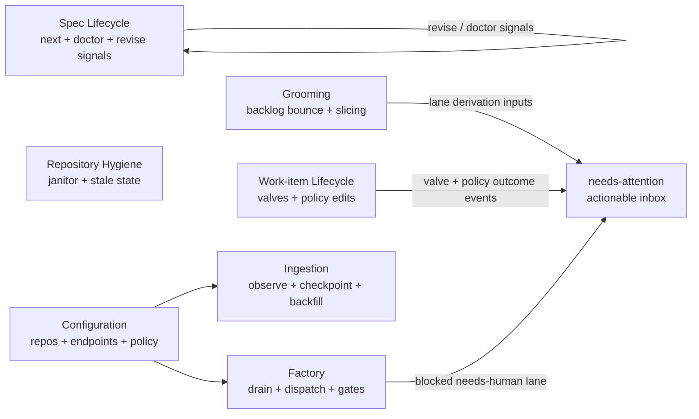

# spec.md -- livespec-console-beads-fabro

`livespec-console-beads-fabro` is the LiveSpec-family operator console
for repositories whose implementation work is tracked in Beads and
driven through the Beads/Fabro orchestrator. It is a separate product
from LiveSpec core, the Beads/Fabro orchestrator, and Fabro itself.

## Purpose

The console gives a human operator one coherent place to answer:

- What needs attention now?
- What spec-side action is pending?
- What implementation work is ready?
- What is currently in the factory?
- Which Fabro runs are blocked on human input?
- Which work rests at `pending-approval` awaiting my explicit approval
  (effective `admission_policy: manual` -- the first-class field that
  replaced the retired `host-only` / `human-gated` markers)?
- What commands can be safely issued next?

The console is event-sourced. It consumes source facts from LiveSpec,
the orchestrator's work-items surface, Dispatcher, Fabro, GitHub, and local
repository state, translates
them into canonical console events, and derives operator projections such
as needs-attention inboxes, cards, timelines, and repository health.

## Scope Boundary

The console owns:

- canonical console events and commands
- source adapters and ingestion checkpoints
- event store and command persistence
- projections/read models for operator use
- TUI-first operator UI and later GUI/API surfaces
- human-attention routing and notification-ready alert semantics

The console does not own:

- `/livespec:*` spec mutation semantics
- Beads issue storage semantics
- Dispatcher's factory execution behavior
- Fabro workflow execution, run internals, logs, or sandbox UI
- GitHub pull request merge policy

The console may invoke existing CLIs or APIs through ports/adapters, but
those systems remain the source of truth for their own domains.

**Control-Plane realization.** This console is the reference realization of livespec's **Control Plane** -- the operator-cockpit role livespec core defines in its workflow-planes architecture (`spec.md`) and elaborates as non-normative *Control-Plane console guidance* in its `non-functional-requirements.md`. As that role prescribes, the console *observes* every plane read-only through that plane's own published surface, *composes* the cross-plane operator picture that no single plane can produce alone, *invokes* each plane's own operations on the operator's behalf -- issuing commands only through that plane's published command surface, never reaching around it -- and *coordinates* the human, while *never owning* any plane's semantics (the owns / does-not-own lists above are the concrete expression of that boundary). The console is the Control Plane / operator cockpit, NOT a Driver (the per-agent-runtime binding, e.g. `livespec-driver-claude`). It is also not a required dependency of the workflow it observes: the spec lifecycle and the orchestrator skills remain independently drivable without it, and the console enriches the operator experience rather than gating it.



## Product Shape

The steady-state product is intended to be a single Rust executable
(its normative force is a SHOULD; see `constraints.md` -> Runtime
Shape):

```text
livespec-console-beads-fabro serve
```

`serve` starts ingestion, the durable event store, projections, API, live
event fanout, and the operator UI surface. Supporting subcommands may
include:

```text
livespec-console-beads-fabro tui
livespec-console-beads-fabro backfill
livespec-console-beads-fabro events tail
livespec-console-beads-fabro snapshot
livespec-console-beads-fabro doctor
```

The first UI is a TUI with arrow-driven selection lists, detail panes,
command modals, and live updates. A GUI can later consume the same
events, commands, and projections.

Architecture checks are NOT an operator capability: the console
performs no architecture check for an operator. They are a
contributor quality-gate concern owned by
`non-functional-requirements.md` -> Architecture Tests and realized as
the separate `console-arch-check` binary. The console binary surfaces
an `arch-check` token only as a discoverability redirect -- it appears
in `help` output and its handler prints a pointer to the contributor
gate (`just check-arch`) instead of running any check.

### Initial-adapter fidelity

First-milestone adapters and command ports MAY be minimal or simulated
rather than performing full real source I/O, so the event flow and the
UI can be built incrementally. Honesty is mandatory: an adapter or port
that has not actually performed or observed an action MUST signal that
fact (an explicit not-observed / simulated / unimplemented signal) and
MUST NOT emit a success or observed-fact event asserting an effect it
did not achieve or observe. The wire-level form of this rule lives in
`contracts.md` -> Adapter Contract and Command Handling.



## Architecture

The architecture follows event sourcing, domain-driven design, and
ports/adapters.

```text
source systems
  -> pull adapters
  -> canonical events
  -> durable event log
  -> projectors
  -> TUI / GUI / API

UI commands
  -> command store
  -> bounded-context handlers
  -> ports/adapters
  -> outcome events
```

Adapters start as pull shims over existing systems. Over time, upstream
systems may emit stronger native events, but the console contract is the
canonical event shape it consumes.

Each source adapter is a logical, per-source boundary sitting behind its
own port. Whether adapters are packaged as separate crates or as
per-source modules within one adapters crate is a contributor-facing
concern governed by `non-functional-requirements.md`, not an
operator-facing guarantee; the binding rule is that adapters stay
isolated behind their ports.



The hexagonal boundary keeps source-specific mechanics outside the domain:



## Bounded Contexts

Initial bounded contexts:

- **Ingestion** -- source observation, checkpointing, backfill,
  reconciliation, source health.
- **Factory** -- Dispatcher/Fabro queue drains, selected item dispatch,
  factory pause/resume, human gate observation.
- **Spec Lifecycle** -- LiveSpec `next`, doctor, proposed changes,
  critique, revise-required signals.
- **Grooming** -- backlog-bounce observation (a Dispatcher non-convergence
  bounce lands the item back in `backlog` for re-decomposition; there is no
  needs-regroom state or label), slice proposal/approval events,
  factory/manual/spec routing.
- **Work-item Lifecycle** -- the human-valve commands (approve / accept /
  reject) and the policy-edit commands (set-admission / set-acceptance),
  issued through the orchestrator's published `drive` action surface, plus
  the per-item dispatcher-setting override command, issued through the
  orchestrator's published per-setting override action; observes the
  resulting lane transitions.
- **needs-attention** -- the console's consumption of the product
  `needs-attention` surface: a point-in-time inbox of everything actionable
  about the repo, sourced from the `needs-attention` snapshot the console
  ingests. It is not derived from a single work-item lane alone -- the
  snapshot composes impl-side ready work and the human valves (work-item lane,
  lane reason, admission policy, acceptance policy), spec-side actions (revise
  / propose-change / critique / prune-history), open `plan/<topic>` threads,
  and repository hygiene. The console consumes this snapshot through a
  dedicated snapshot-source port and diffs it at ingest, emitting
  `attention_item.appeared` / `.changed` / `.resolved` events keyed by each
  item's stable id (the wire form lives in `contracts.md` -> Initial
  Adapters). Source-health/telemetry is an observability concern (deferred),
  not part of this inbox.
- **Repository Hygiene** -- janitor checks, stale PR/branch/worktree
  findings, primary checkout health.
- **Configuration** -- registered repos, source endpoints, notification
  policy, adapter enablement, and the orchestrator's dispatcher policy
  settings.

Each bounded context owns its command vocabulary, events, invariants,
aggregates, and projections.



## Dispatcher Policy Settings

The Dispatcher's routine dispositions are governed by six orchestrator-owned
`dispatcher.*` policy settings -- `auto_approve_ready`, `merge_on_review_cap`,
`acceptance_mode`, `review_fix_cap`, `acceptance_rework_cap`, and `wip_cap`
(the ratified set: repo `thewoolleyman/livespec-orchestrator-beads-fabro`,
`SPECIFICATION/contracts.md`, its Dispatcher policy settings section; design
record: repo `thewoolleyman/livespec`, `plan/autonomous-mode/handoff.md`).
They are independent and orthogonal: no setting implies another, and there is
no master switch that arms several at once.

The orchestrator OWNS the setting state: the `dispatcher.*` keys in the repo's
`.livespec.jsonc` for the global defaults, and the per-item ledger labels for
the overrides. The console COMMANDS and OBSERVES those settings and holds NO
setting state of its own. It MUST derive every effective value it renders from
the orchestrator's published read surface, and MUST issue every write through
the orchestrator's published command surface; it MUST NOT write the
orchestrator's `.livespec.jsonc` keys or the per-item ledger labels itself.
Consistent with the Scope Boundary above, the console never owns the
orchestrator's policy semantics.

Five of the six settings admit a **per-item override**, which the console lets
the operator set against a single work-item. `wip_cap` is the sole exception:
it is a per-repo concurrency ceiling, so a per-item value is structurally
meaningless, and the console MUST NOT offer a per-item override for it. Where
an override exists the per-item value beats the global default, and an item
carrying no override inherits the global; the console renders the effective
value the orchestrator reports and MUST NOT re-derive that precedence itself.

Dispatch-time policy is read by the Dispatcher from those settings, never
armed per run by the console: the console's factory-drain path MUST invoke the
Dispatcher with no per-run policy-arming argument.

A setting whose non-default value lets the factory act without a human is
**dangerous**, and the console MUST label it "dangerous / use with caution"
wherever it is presented in any UI surface (TUI and future GUI/API). Enabling
one is nonetheless an ordinary recorded settings write: like every operator
command it MUST be recorded through the same command-plus-outcome-event path,
and the console MUST NOT gate it behind a type-the-repo-name acknowledgement
or any other arming ceremony. Every setting is revocable at any time by
writing it back.

The orchestrator journals every auto-disposition a setting enables -- an
auto-approve, an AI auto-accept, an AI-fail auto-rework, a ship-on-cap, or a
cap-exceeded escalation -- and escalates to a human every decision no setting
may auto-dispose. The console MUST read those auto-dispositions and
escalations from the orchestrator's published journal read surface, MUST
surface each escalation as a needs-attention item carrying its source
reference and next operator action, and MUST NOT drop, silently defer, or
fabricate a decision the orchestrator did not dispose.

The wire form of the settings surface -- the per-setting write command, the
per-item override command, the factory-drain launcher argv, and the mechanical
completeness check -- is in `contracts.md` -> Dispatcher Policy Settings; the
operator-observable safety constraints are in `constraints.md` ->
Dispatcher-Settings Safety.

## Terminology

**Canonical event** -- A durable fact in the console event log. It may be
directly emitted by the console or synthesized by an adapter from a source
system's native fact.

**Command** -- An operator intention, such as requesting a factory drain.
Commands are persisted separately from domain events. A command may be
accepted, rejected, run, fail, or succeed; it is not itself proof that the
requested action occurred.

**Adapter** -- A source-specific translator that observes a system such as
Fabro, the orchestrator's work-items surface, LiveSpec, Dispatcher, or GitHub
and emits canonical events.

**Projection** -- A derived read model, rebuilt from events, such as the
needs-attention inbox, work card list, event timeline, or repo health view.

**needs-attention item** -- A projection entry requiring human review or
action, sourced from the product `needs-attention` snapshot the console
consumes -- not derived from a single work-item lane alone. The snapshot
composes impl-side ready work and the human valves (pending approval with
manual admission, acceptance with ai-then-human review, blocked with a
needs-human lane reason), spec-side actions (revise / propose-change /
critique / prune-history), open `plan/<topic>` threads, and repository
hygiene. Source-health/telemetry findings are an observability concern
(deferred), not needs-attention items.

**Factory** -- The Beads/Fabro execution path: ready work-items selected for
Dispatcher, run in Fabro sandboxes, gated, merged, closed, bounced, or
surfaced.
