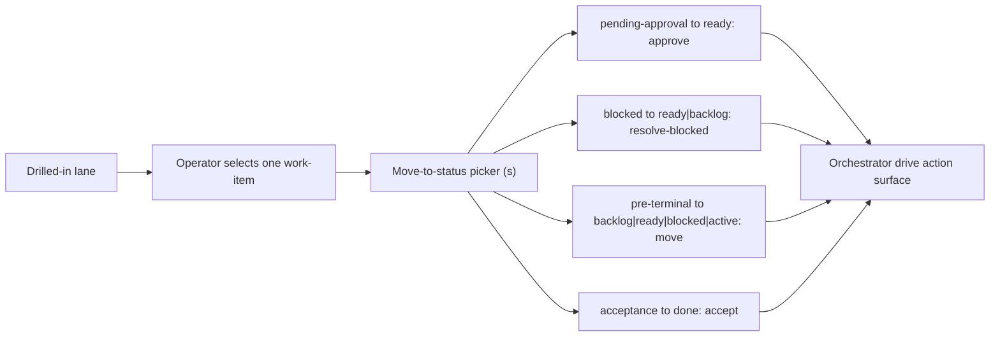

## Proposal: Spec the operator status-move surface -- W7 selection + `s` picker + resolve-blocked (backfill) and the new guarded broad move

### Target specification files

- SPECIFICATION/contracts.md
- SPECIFICATION/scenarios.md
- tests/heading-coverage.json
- crates/console-spec-check/src/tests.rs

### Summary

Bring the console spec into lockstep with the shipped W7 operator status-move surface AND add the new guarded broad move. PR #248 shipped individual work-item selection in a drilled-in lane, the `s` move-to-status picker, and the `work_item.resolve_blocked_requested` command WITHOUT spec coverage; the Work-item Lifecycle vocabulary still reads "Six commands ... FIVE map 1:1". This amendment (a) adds `work_item.resolve_blocked_requested` and the NEW `work_item.move_requested` to the command vocabulary, (b) fixes the count framing to EIGHT commands, SEVEN mapping 1:1 onto the `drive` action-id surface (the eighth, `set_dispatcher_override_requested`, fans out to the three per-setting override actions), (c) documents the two new action-id mappings with their guards -- `resolve-blocked:<id>:ready|backlog` and the guarded broad `move:<id>:backlog|ready|blocked|active` (target-guard refuses `done`/`acceptance`/`pending-approval`; source unguarded; the ship-guard keeps `done` reachable only via `accept`; the console picker offers no move out of a `done` item), (d) corrects the two OTHER stale "six/five" command-count sites the same framing seeds -- the TUI-Contract's command-count MUST clause and Scenario 10's closing command-count gherkin line -- to "eight/seven", and (e) adds Scenario 17 binding the new selection/move/resolve-blocked surface to a top-of-pyramid test. `work_item.set_dispatcher_override_requested` and its clear-to-inherit are ALREADY spec'd (Scenario 10 + Dispatcher Policy Settings); that command's semantics are unchanged here (CONSOLE-C wires its code only) -- only Scenario 10's one command-count line is touched.

### Motivation

The maintainer ratified W7 as "broad moves, keep ship-guard": the operator may move a selected work-item freely among the PRE-TERMINAL pipeline statuses (backlog / ready / blocked / active), while reaching `done` still requires the acceptance path. The orchestrator shipped the guarded `move:<id>:<status>` action plus the three per-setting override actions (release 0.42.0); CONSOLE-C binds them.

PR #248's W7 surface (selection + the `s` picker + `work_item.resolve_blocked_requested`, the 7th command) landed with no spec coverage. `console-spec-check` did not catch it because it enforces spec-clause -> scenario -> test, not impl -> spec; leaving that drift while adding the new move would document the new capability on top of an undocumented foundation. This amendment closes the drift and adds the new move in one coherent change, so the vocabulary, the action-id mappings, the guards, and the tests all agree.

The `move` action's SOURCE is deliberately unguarded on the orchestrator (it relocates from any current status), but the console's move-status picker narrows that: it offers only sensible forward/lateral moves and never a move OUT of a shipped `done` item, so the operator surface never invites un-shipping. `done` remains reachable only through `accept` from `acceptance` -- the one preserved ship-guard invariant.

### Proposed Changes

Every REPLACE-target below was verified to occur VERBATIM, exactly once, in the live file on branch `console-c-w5w7-completion` (base `509f366`, code child `425c7f6`) by mechanical substring match: A.1 (the command bullet block), A.2 (the vocabulary-count framing paragraph), A.3 (the TUI-Contract command-count clause), and B.2 (Scenario 10's command-count gherkin line). A drift sweep across `spec.md`/`contracts.md`/`constraints.md`/`scenarios.md` confirms these are the COMPLETE set of Work-item-vocabulary "six/five" command-count sites -- every remaining "six"/"five"/"seven" occurrence counts dispatcher SETTINGS (six settings, five overridable) or lifecycle LANES (seven), not commands, and is intentionally left. The Scenario 17 append (B.1) is wrapped in a `~~~text` outer fence so its inner ```mermaid```/```gherkin``` fences survive (the file's convention). The clause rebinds and the clause-count ledger are reconciled mechanically at revise (section C) so `console-spec-check` reports 0 unlinked, 0 untested and the pinned count matches.

#### A. `SPECIFICATION/contracts.md`

**A.1 -- ADD the two new commands to the Work-item Lifecycle command bullet list.**

REPLACE:

```text
- `work_item.set_acceptance_requested`
- `work_item.set_dispatcher_override_requested`
- `config.dispatcher_setting_set`
```

WITH:

```text
- `work_item.set_acceptance_requested`
- `work_item.resolve_blocked_requested`
- `work_item.move_requested`
- `work_item.set_dispatcher_override_requested`
- `config.dispatcher_setting_set`
```

**A.2 -- AMEND the vocabulary-count framing paragraph.** It names six commands / five mapping 1:1 and stops at the sixth; it now names eight / seven and documents the two new status actions with their guards. (Line breaks are load-bearing -- `console-spec-check` derives each clause's gap-id from the line text, so the co-edits in C are pinned to this exact wrapping.)

REPLACE:

```text
Six `work_item.*` commands form the Work-item Lifecycle context's vocabulary.
FIVE of them -- the human-valve and policy-edit commands -- each map 1:1 onto
the orchestrator's published `drive` action-id surface, and the console MUST
issue those five ONLY through that surface -- it never writes the ledger
directly: `work_item.approve_requested` ->
`approve:<work-item-id>`; `work_item.accept_requested` ->
`accept:<work-item-id>`; `work_item.reject_requested` (payload `mode` in
{rework, regroom}) -> `reject:<work-item-id>:rework|regroom`;
`work_item.set_admission_requested` (payload `policy` in {auto, manual}) ->
`set-admission:<work-item-id>:<policy>`; `work_item.set_acceptance_requested`
(payload `policy` in {ai-only, human-only, ai-then-human}) ->
`set-acceptance:<work-item-id>:<policy>`. Approve is the human approval act --
the `pending-approval -> ready` transition -- and a policy edit never moves an
item between states (the no-surprise-transitions rule); these semantics and the
two policy-edit action ids are the orchestrator's ratified contract (repo
`thewoolleyman/livespec-orchestrator-beads-fabro`, `SPECIFICATION/contracts.md`,
its Work-item state semantics section and its `drive` action-id surface). The
SIXTH command, `work_item.set_dispatcher_override_requested`, maps onto the
orchestrator's published per-setting override action (Dispatcher Policy
Settings below), and the console MUST issue it ONLY through that surface,
never writing the ledger label directly.
```

WITH:

```text
Eight `work_item.*` commands form the Work-item Lifecycle context's vocabulary.
SEVEN of them -- the human-valve, policy-edit, and status-move commands -- each
map 1:1 onto the orchestrator's published `drive` action-id surface, and the
console MUST issue those seven ONLY through that surface -- it never writes the
ledger directly: `work_item.approve_requested` ->
`approve:<work-item-id>`; `work_item.accept_requested` ->
`accept:<work-item-id>`; `work_item.reject_requested` (payload `mode` in
{rework, regroom}) -> `reject:<work-item-id>:rework|regroom`;
`work_item.set_admission_requested` (payload `policy` in {auto, manual}) ->
`set-admission:<work-item-id>:<policy>`; `work_item.set_acceptance_requested`
(payload `policy` in {ai-only, human-only, ai-then-human}) ->
`set-acceptance:<work-item-id>:<policy>`; `work_item.resolve_blocked_requested`
(payload `target_status` in {ready, backlog}) ->
`resolve-blocked:<work-item-id>:ready|backlog`; `work_item.move_requested`
(payload `target_status` in {backlog, ready, blocked, active}) ->
`move:<work-item-id>:<target-status>`. Approve is the human approval act --
the `pending-approval -> ready` transition -- and a policy edit never moves an
item between states (the no-surprise-transitions rule); these semantics and the
two policy-edit action ids are the orchestrator's ratified contract (repo
`thewoolleyman/livespec-orchestrator-beads-fabro`, `SPECIFICATION/contracts.md`,
its Work-item state semantics section and its `drive` action-id surface).
`resolve-blocked` is the operator resolution of a `blocked` work-item to
`ready` or `backlog`; the orchestrator source-guards it to a `blocked` item
awaiting a human. `move` is the guarded broad relocation among the PRE-TERMINAL
pipeline statuses: the orchestrator REFUSES `done`, `acceptance`, and
`pending-approval` as move targets (the target-guard) and leaves the source
status unguarded, so `done` stays reachable ONLY via `accept` from `acceptance`
(the ship-guard is preserved), and the console's move-status picker further
offers no move OUT of a `done` work-item. The EIGHTH command,
`work_item.set_dispatcher_override_requested`, does NOT map 1:1 -- it fans out
to the orchestrator's three per-setting override actions (Dispatcher Policy
Settings below) -- and the console MUST issue it ONLY through that surface,
never writing the ledger label directly.
```

**A.3 -- AMEND the TUI-Contract command-count clause.** It still names six Work-item Lifecycle commands / the five human-valve and policy-edit commands; it now names eight / the seven human-valve, policy-edit, and status-move commands. This is a `MUST` clause, so its gap-id re-derives (rebind folded into C).

REPLACE:

```text
The TUI MUST let the operator drive each of the six Work-item Lifecycle
commands against the selected work-item -- the five human-valve and
policy-edit commands (approve, accept, reject, set-admission, set-acceptance)
plus the per-item dispatcher-setting override -- each routed through the
shared orchestrator action port rather than any direct ledger write, and a
destructive reject gated behind an explicit confirmation step before the
command is submitted. The override control MUST NOT be offered for `wip_cap`.
```

WITH:

```text
The TUI MUST let the operator drive each of the eight Work-item Lifecycle
commands against the selected work-item -- the seven human-valve, policy-edit,
and status-move commands (approve, accept, reject, set-admission,
set-acceptance, resolve-blocked, move) plus the per-item dispatcher-setting
override -- each routed through the shared orchestrator action port rather than
any direct ledger write, and a destructive reject gated behind an explicit
confirmation step before the command is submitted. The override control MUST
NOT be offered for `wip_cap`.
```

#### B. `SPECIFICATION/scenarios.md`

**B.1 -- APPEND Scenario 17 after Scenario 16** (which ends the file), covering individual work-item selection, the move-to-status picker, and the four transition routes (approve / resolve-blocked / move / accept) with the ship-guard.

REPLACEMENT (verbatim; append after the Scenario 16 gherkin block, which ends the file):

~~~text
## Scenario 17 -- Operator selects a work-item and moves it along the pipeline



```gherkin
Feature: Individual work-item selection and pipeline status moves
  As a LiveSpec operator
  I want to select one work-item in a lane and move it to a status it may be driven to
  So that I can shepherd a single item along the pipeline, with the orchestrator owning every transition

Scenario: The operator selects an individual work-item in a drilled-in lane
  Given the Lanes view drilled into a lane holding more than one work-item
  When the operator moves the selection within the lane
  Then an individual work-item is selected, not merely the lane
  And the per-item valves act on the selected work-item

Scenario: Moving a pending-approval item to ready routes through approve
  Given a selected `pending-approval` work-item in a drilled-in lane
  When the operator moves it to `ready` from the move-to-status picker
  Then the console persists a `work_item.approve_requested` command
  And invokes the orchestrator's published action surface with `approve:<work-item-id>`
  And never writes the ledger directly

Scenario: Moving a blocked item routes through resolve-blocked
  Given a selected `blocked` work-item
  When the operator moves it to `ready` or `backlog` from the picker
  Then the console persists a `work_item.resolve_blocked_requested` command carrying that target status
  And invokes the orchestrator's published action surface with `resolve-blocked:<work-item-id>:ready|backlog`

Scenario: Moving an item to a pre-terminal status routes through the guarded move action
  Given a selected work-item whose target is not served by a semantic valve
  When the operator moves it to `backlog`, `ready`, `blocked`, or `active`
  Then the console persists a `work_item.move_requested` command carrying that target status
  And invokes the orchestrator's published action surface with `move:<work-item-id>:<target-status>`
  And the orchestrator refuses `done`, `acceptance`, and `pending-approval` as move targets

Scenario: Reaching done requires the acceptance path and the picker never un-ships a done item
  Given a selected work-item
  When the operator opens the move-to-status picker
  Then `done` is offered only for an `acceptance` item and routes through `accept:<work-item-id>`
  And the picker offers no move to `done` for any other source status
  And the picker offers no move out of a `done` work-item
```
~~~

**B.2 -- AMEND Scenario 10's closing command-count line.** Scenario 10's final gherkin line still tallies the vocabulary as six commands / five mapping 1:1; correct that one line to eight / seven. Scenario 10 is otherwise unchanged -- its per-item-override semantics stand.

REPLACE:

```text
  And the Work-item Lifecycle vocabulary is therefore six commands, five of them mapping 1:1 onto the orchestrator's `drive` action-id surface
```

WITH:

```text
  And the Work-item Lifecycle vocabulary is therefore eight commands, seven of them mapping 1:1 onto the orchestrator's `drive` action-id surface
```

#### C. `tests/heading-coverage.json` and `crates/console-spec-check/src/tests.rs` (CO-EDIT -- REQUIRED, atomic with the accept)

At revise, once the amended clause text above is final, run the clause extractor over the final files and reconcile the registry MECHANICALLY -- do NOT take any count in this prose at face value:

**C.1 -- REGISTER Scenario 17** in `tests/heading-coverage.json`: add one entry with `"scenario": "Scenario 17 -- Operator selects a work-item and moves it along the pipeline"`, `"scenario_file": "scenarios.md"`, and a SINGLE `"test"` field -- `crates/console-tui/src/lib.rs::move_status_on_a_pending_approval_lane_item_persists_the_approve_command` (the top-of-pyramid selection -> move -> orchestrator-action proof from code child 425c7f6) -- plus a `reason` citing the sibling move tests (`move_handler_maps_each_pre_terminal_target_onto_the_move_action_id`, `move_handler_rejects_ship_guarded_and_malformed_targets_and_empty_ids`, `valve_and_move_status_keys_fire_on_a_selected_lane_item`) that complete the pyramid, and the `clauses[]` from C.2.

**C.2 -- REBIND the re-derived normative clauses.** Only `contracts.md` MUST clauses carry gap-ids; the `scenarios.md` gherkin lines edited in B.1/B.2 do NOT. The A.2 rewrap re-derives the gap-ids of the two MUST clauses in the framing paragraph (the "issue those seven ... ONLY through that surface" clause and the override clause -- a net of ZERO new clauses, two re-wrapped), and the A.3 rewrap re-derives the TUI-Contract command-count MUST clause. Rebind each re-derived gap-id to its scenario (Scenario 17 for the status-move surface; keep any clause that already bound elsewhere on its existing scenario) so `console-spec-check` reports 0 unlinked.

**C.3 -- SET the clause-count ledger to the ACTUAL mechanical count** in `crates/console-spec-check/src/tests.rs`: recompute the running normative-clause total + per-file breakdown from the extractor over the final text and pin exactly that -- NOT a blind `+N` bump. The A.2 rewrap nets zero new MUST-clauses; the A.3 rewrap re-wraps one; the true delta is whatever the extractor reports, and the count assertion must match it.

Exact gap-ids and counts are computed mechanically from the final text at revise; they are not guessed here.
