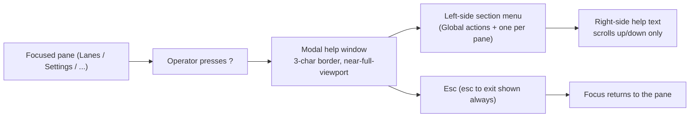

## Proposal: Pane-specific modal help overlay

### Target specification files

- SPECIFICATION/contracts.md
- SPECIFICATION/scenarios.md
- tests/heading-coverage.json

### Summary

The TUI's in-app help MUST be a pane-specific modal overlay — content scoped to the focused view, a menu navigated by arrow keys, and Esc as the only dismissal — not the current always-dismissible render_help_overlay. Adds a §"TUI Contract" clause, a new Scenario 18, and the tests/heading-coverage.json co-edit binding the clause to the scenario. This proposal is the B4 Help-modal spec of the console `plan/cockpit-ux-docs-release` program.

### Motivation

Maintainer-declared requirement (2026-07-18): the docs/help surface must be a proper modal — pane-specific, menu + arrow-key navigation, exit ONLY with Esc. The shipped console help overlay does not meet this (not menu-driven, not Esc-only-modal). Capturing it spec-first with a scenario and a declared impl commitment before implementation, per the livespec workflow. Enriched to the full B4 spec: left-side menu + right-pane up/down-only scroll, a Global-actions section plus one per focusable pane, `?` auto-focusing the current pane's section, a 3-character-border near-full-viewport window, and `esc to exit` shown at the bottom at all times.

### Proposed Changes

--- CHANGE 1: SPECIFICATION/contracts.md, §"TUI Contract" ---
ADD the following as a new paragraph, inserted immediately AFTER the existing paragraph that begins "The default view MUST be needs-attention. Navigation SHOULD use arrow-driven selection lists..." (currently around line 575-578) and BEFORE the paragraph beginning "The `Settings` view is the dispatcher-settings surface." Verbatim text to add:

"The TUI MUST present its in-app help as a navigable, context-specific modal overlay invoked by `?`. The overlay MUST be a window drawn ON TOP of the main screen occupying nearly the full viewport, with only a 3-character border on each side and on top and bottom, and it MUST never render wider than the viewport. It MUST lay out as a LEFT-side menu of help sections beside a RIGHT-side help-text pane whose text scrolls UP and DOWN only, never left or right. The menu MUST carry one `Global actions` section plus one section PER focusable pane, and pressing `?` while a pane is focused MUST open the overlay auto-focused to THAT pane's section. While open the overlay is modal: it holds input focus, the underlying view neither switches nor scrolls, and it MUST close ONLY on `Esc` — no other key, command, valve, or view-switch dismisses it — with the text `esc to exit` printed at the bottom of the overlay at all times. This modal help is the console's primary help surface across all views; it is in addition to, and does not remove, the per-row inline help the `Settings` view carries."

--- CHANGE 2: SPECIFICATION/scenarios.md ---
APPEND a new scenario section after Scenario 17 (which ends around line 607). Verbatim:

## Scenario 18 -- Operator opens pane-specific modal help and exits only with Esc



```gherkin
Feature: Navigable, context-specific Help modal
  As a LiveSpec operator
  I want a modal help window whose section matches the pane I am on, with a left menu and a scrollable right pane, dismissed only by Esc
  So that I get contextual guidance in place, without losing my view or leaving help by accident

Scenario: `?` opens Help auto-focused to the focused pane's section
  Given the operator has the Lanes pane focused
  When the operator presses `?`
  Then the Help modal opens auto-focused to the Lanes section
  And pressing `?` with the Settings pane focused opens auto-focused to the Settings section
  And the menu also carries a "Global actions" section

Scenario: The Help modal is a bordered window over the main screen
  Given the Help modal is open
  Then it renders as a window on top of the main screen with a 3-character border on each side and on top and bottom
  And it never renders wider than the viewport

Scenario: The Help modal is a left menu with a right pane scrollable up and down
  Given the Help modal is open
  When the operator navigates the left-side section menu
  Then the right-side help text shows the selected section
  And the right pane scrolls up and down only, never left or right

Scenario: The Help modal is modal, always shows "esc to exit", and exits only on Esc
  Given the Help modal is open
  Then the text "esc to exit" is printed at the bottom at all times
  When the operator presses any key other than Esc
  Then the modal stays open and the underlying view neither switches nor scrolls
  When the operator presses Esc
  Then the modal closes and focus returns to the pane the operator was on
```

--- CHANGE 3: tests/heading-coverage.json (co-edit performed at REVISE time, described here) ---
At revise/accept time, add a coverage entry for the new heading "Scenario 18 -- Operator opens pane-specific modal help and exits only with Esc" following the file's existing pattern, and bind the new §"TUI Contract" modal-help clause to Scenario 18. This propose-change lists tests/heading-coverage.json in target_spec_files so the revise co-edit is not forgotten.
