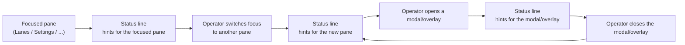

## Proposal: Context-specific Status-line shortcut hints

### Target specification files

- SPECIFICATION/contracts.md
- SPECIFICATION/scenarios.md
- tests/heading-coverage.json

### Summary

The console TUI's Status line MUST render context-specific shortcut key hints — the keys that act in the currently-focused context — and MUST NOT render a static or empty hint line where actions are available. Today that hint line is always empty. The hints MUST change with the focused pane and with any open modal/overlay. Adds a §"TUI Contract" clause, a new Scenario 19, and the tests/heading-coverage.json co-edit registering the new scenario.

### Motivation

The console TUI's Status pane carries a shortcut-hint line that is currently ALWAYS EMPTY, so the actions available in the current context are undiscoverable from the screen. The hint line must reflect what the operator can do right now: the shortcuts for the focused pane, and — while a modal or overlay is open — the shortcuts for that overlay. Capturing this spec-first with a scenario and a declared impl commitment before implementation, per the livespec workflow. The behavior (a non-empty, context-appropriate hint line that changes with focus and overlay) is specified; the exact hint strings and key bindings are left as an implementation detail.

### Proposed Changes

--- CHANGE 1: SPECIFICATION/contracts.md, §"TUI Contract" ---
ADD the following as a new paragraph, inserted immediately AFTER the existing paragraph that ends "...unavailability count, so a true-empty screen is never dressed as a false alarm." (the header/status-line source-unavailability paragraph, currently ending around line 639) and BEFORE the paragraph beginning "The TUI MUST let the operator drive each of the eight Work-item Lifecycle commands against the selected work-item" (currently around line 641). Verbatim text to add:

"The TUI's Status line MUST render context-specific shortcut key hints — the keys that act in the CURRENTLY-focused context — and MUST NOT render a static or empty hint line where actions are available. The hints MUST reflect the currently-focused pane: switching focus to a different pane MUST change the hints to that pane's available actions. The hints MUST also reflect any open modal or overlay: opening a modal or overlay MUST replace the pane's hints with the hints for that modal/overlay, and closing it MUST restore the focused pane's hints. No context in which shortcut actions are available may show an empty hint line. The specific hint strings and key bindings are an implementation detail; the contract is that the hint line is non-empty and appropriate to the currently-focused pane and any open overlay, and changes as focus or overlay changes."

--- CHANGE 2: SPECIFICATION/scenarios.md ---
APPEND a new scenario section after Scenario 18 (which ends at end-of-file, currently around line 685). Verbatim:

## Scenario 19 -- Operator reads context-specific shortcut hints in the Status line



```gherkin
Feature: Context-specific Status-line shortcut hints
  As a LiveSpec operator
  I want the Status line to show the shortcut keys that act in my current context
  So that the actions available on the focused pane or open overlay are always discoverable, never a blank line

Scenario: The Status line shows hints for the focused pane
  Given the operator has the Lanes pane focused
  When the operator screen is rendered
  Then the Status line shows shortcut key hints for the actions available on the Lanes pane
  And the hint line is not empty

Scenario: Switching focus to another pane changes the hints
  Given the operator has the Lanes pane focused and the Status line shows the Lanes hints
  When the operator moves focus to the Settings pane
  Then the Status line shows shortcut key hints for the actions available on the Settings pane
  And those hints differ from the hints shown while the Lanes pane was focused

Scenario: Opening an overlay changes the hints, and closing it restores the pane's hints
  Given the operator has a pane focused and the Status line shows that pane's hints
  When the operator opens a modal or overlay
  Then the Status line shows shortcut key hints for the actions available in that modal or overlay
  When the operator closes the modal or overlay
  Then the Status line again shows the focused pane's hints

Scenario: A context with available actions never shows an empty hint line
  Given a focused pane or open overlay in which shortcut actions are available
  When the operator screen is rendered
  Then the Status line renders a non-empty, context-appropriate set of shortcut key hints
  And it never renders a static or empty hint line where actions are available
```

--- CHANGE 3: tests/heading-coverage.json (co-edit performed at REVISE time, described here) ---
At revise/accept time, when Scenario 19 becomes a live `## ` heading in scenarios.md, add a coverage entry for it so console-spec-check (which requires every live scenario to carry a non-empty test registration) stays green. Following the file's existing `test: "TODO"` pattern (e.g. the Scenario 16 entry), append this entry:

{
  "scenario": "Scenario 19 -- Operator reads context-specific shortcut hints in the Status line",
  "scenario_file": "scenarios.md",
  "test": "TODO",
  "reason": "Pending top-of-pyramid acceptance test for the context-specific Status-line shortcut hints: the Status line renders non-empty, context-appropriate shortcut key hints for the focused pane; switching focus changes the hints; opening a modal/overlay swaps the hints to that overlay's and closing restores the pane's; and no context with available actions shows an empty hint line. Tier: top-of-pyramid acceptance, under crates/console-cli/tests/. Owed by the tui-status-line-context-hints impl follow-up; the new §\"TUI Contract\" Status-line-hints clause binds here.",
  "clauses": []
}

When spec-side revise runs with `--spec-target` = the main `SPECIFICATION/` tree, this file's path in the resulting_files list is spelled `../tests/heading-coverage.json` so the wrapper's `spec_target / path` join resolves it to the project-root file `tests/heading-coverage.json`. Any gap_id clause bindings are filled in at implementation time when the gaps are filed. This propose-change lists tests/heading-coverage.json in target_spec_files so the revise co-edit is not forgotten.
