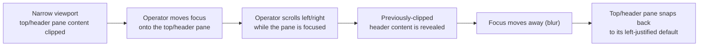

## Proposal: Focusable, horizontally scrollable top/header pane

### Target specification files

- SPECIFICATION/contracts.md
- SPECIFICATION/scenarios.md
- tests/heading-coverage.json

### Summary

The console TUI's top/header pane MUST be focusable within the pane focus cycle, MUST support horizontal scrolling to reveal content clipped at the current viewport width while it is focused, and MUST return to its default left-justified position on blur. Today the top/header pane cannot be focused or scrolled, so on narrow viewports its content clips and the clipped part is unreadable. Adds a §"TUI Contract" clause, a new Scenario 20, and the tests/heading-coverage.json co-edit registering the new scenario.

### Motivation

The console TUI's top/header pane (fleet, dispatcher settings, ingestion, Fabro summary) is CLIPPED on narrow viewports today: it cannot be focused and cannot be scrolled, so any content beyond the current width is silently cut off and unreadable. The operator needs to be able to focus the top/header pane like any other pane and scroll it horizontally to bring the clipped content into view; and when they move on, the pane should return to its normal left-justified default rather than staying stuck mid-scroll. Capturing this spec-first with a scenario and a declared impl commitment before implementation, per the livespec workflow. The behavior (the top/header pane joins the focus cycle, scrolls horizontally while focused, and snaps back on blur) is specified; the exact key bindings, scroll step, and column counts are left as an implementation detail.

### Proposed Changes

--- CHANGE 1: SPECIFICATION/contracts.md, §"TUI Contract" ---
ADD the following as a new paragraph, inserted immediately AFTER the existing Status-line-hints paragraph (the B2 clause, which ends "...and the contract is that the hint line is non-empty and appropriate to the currently-focused pane and any open overlay, and changes as focus or overlay changes.") and BEFORE the paragraph beginning "The TUI MUST let the operator drive each of the eight Work-item Lifecycle commands against the selected work-item". Verbatim text to add:

"The TUI's top/header pane MUST be focusable within the pane focus cycle: the operator MUST be able to move focus onto it as onto any other pane. While the top/header pane holds focus, it MUST support HORIZONTAL scrolling to reveal content clipped at the current viewport width — content cut off on a narrow viewport MUST become reachable by scrolling the pane left and right while it is focused. When focus moves away from the top/header pane (on blur), the pane MUST return to its default left-justified position rather than remaining mid-scroll. The specific key bindings, scroll step, and column counts are an implementation detail; the contract is that the top/header pane joins the focus cycle, scrolls horizontally to reveal clipped content while focused, and snaps back to its left-justified default on blur."

--- CHANGE 2: SPECIFICATION/scenarios.md ---
APPEND a new scenario section after Scenario 19 (which ends at end-of-file, with the closing ` ``` ` fence of its gherkin block). Verbatim:

## Scenario 20 -- Operator focuses and horizontally scrolls the top/header pane on a narrow viewport



```gherkin
Feature: Focusable, horizontally scrollable top/header pane
  As a LiveSpec operator
  I want to focus the top/header pane and scroll it horizontally on a narrow viewport
  So that header content clipped at the current width is still readable, and the pane returns to its default when I move on

Scenario: The top/header pane joins the focus cycle
  Given the operator is cycling focus across the panes
  When the operator moves focus onto the top/header pane
  Then the top/header pane holds input focus like any other pane

Scenario: Horizontal scroll reveals content clipped at the current viewport width
  Given the viewport is narrow enough that the top/header pane's content is clipped
  And the operator has the top/header pane focused
  When the operator scrolls the top/header pane horizontally
  Then the previously-clipped header content is revealed
  And content beyond the current viewport width becomes reachable by scrolling left and right

Scenario: Moving focus away returns the pane to its left-justified default
  Given the operator has scrolled the focused top/header pane away from its left edge
  When focus moves away from the top/header pane
  Then the top/header pane returns to its default left-justified position

Scenario: A wide-enough viewport needs no horizontal scroll
  Given the viewport is wide enough to show the whole top/header pane
  When the top/header pane is focused
  Then all header content is already visible without horizontal scrolling
```

--- CHANGE 3: tests/heading-coverage.json (co-edit performed at REVISE time, described here) ---
At revise/accept time, when Scenario 20 becomes a live `## ` heading in scenarios.md, add a coverage entry for it so console-spec-check (which requires every live scenario to carry a non-empty test registration) stays green. Following the file's existing `test: "TODO"` pattern (e.g. the Scenario 16 and Scenario 19 entries), append this entry (path spelled `../tests/heading-coverage.json` in the revise `resulting_files[]` so the wrapper's `spec_target / path` join resolves it to the project-root file `tests/heading-coverage.json`):

{
  "scenario": "Scenario 20 -- Operator focuses and horizontally scrolls the top/header pane on a narrow viewport",
  "scenario_file": "scenarios.md",
  "test": "TODO",
  "reason": "Pending top-of-pyramid acceptance test for the focusable, horizontally scrollable top/header pane: the top/header pane joins the pane focus cycle; while focused, horizontal scroll reveals content clipped at the current viewport width; on blur the pane returns to its default left-justified position; and a wide-enough viewport needs no horizontal scroll. Tier: top-of-pyramid acceptance, under crates/console-cli/tests/. Owed by the tui-top-pane-focus-hscroll impl follow-up; the new §\"TUI Contract\" top/header-pane focus + horizontal-scroll clause binds here.",
  "clauses": []
}

NOTE — lockstep co-edits the REVISE step MUST perform (this repo's `check-behavior-coverage` + `console-spec-check` ground-truth gates fail the MOMENT the new MUST clause lands at revise time, NOT at impl time; the B2 revision `78be28c` and the B4/B1 revision `3b230f7` established this exact precedent):

(a) Clause linkage. The `clauses: []` above is a PLACEHOLDER. The revise step derives the gap-id for the B3 top/header-pane focus + horizontal-scroll TUI-Contract clause and links it into the Scenario 20 entry's `clauses` array, e.g.:

  "clauses": [
    {
      "gap_id": "<newly-derived-gap-id>",
      "scenario": "Scenario 20 -- Operator focuses and horizontally scrolls the top/header pane on a narrow viewport"
    }
  ]

This repo's ratification-time clause-link gate requires the entry to bind the newly-derived clause (the "clauses filled at impl time" assumption does NOT hold here — B2 hit exactly this and had to link its gap at revise time).

(b) Ground-truth clause-count bump. CHANGE 1 adds exactly ONE normative MUST clause to contracts.md §"TUI Contract". The revise step MUST bump the console-spec-check ground-truth counts in `crates/console-spec-check/src/tests.rs` accordingly: `contracts.md` 71 -> 72 and the total 160 -> 161 (leaving `spec.md` 15, `constraints.md` 22, and `non-functional-requirements.md` 52 unchanged), and update the adjacent explanatory comment to note the B3 top/header-pane focus + horizontal-scroll clause (mirroring the B2 comment block). This is the same lockstep co-edit `78be28c` performed (contracts.md 70 -> 71, total 159 -> 160).

This propose-change lists tests/heading-coverage.json in the target specification files so the revise co-edit and the accompanying ground-truth bump are not forgotten.
