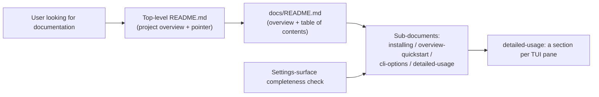

## Proposal: User-facing documentation lives in a docs/ tree with the README as a pointer

### Target specification files

- SPECIFICATION/contracts.md
- SPECIFICATION/scenarios.md
- tests/heading-coverage.json

### Summary

The console's user-facing documentation MUST live under a `docs/` tree at the repository root — `docs/README.md` an overview plus table of contents only, with the substantive documentation in linked sub-documents covering installation, overview/quick start, environment variables + CLI options + sub-commands, and detailed usage with a section per TUI pane — and the top-level `README.md` MUST NOT carry user-facing documentation of its own beyond a project overview and a pointer into that tree. Because the console's settings doc is today PINNED to the top-level `README.md` by §"Settings-surface completeness" (ratified as v024 'settings-doc-is-readme'), this change also RELOCATES that anchor: the settings doc MUST become the detailed-usage sub-document of the `docs/` tree. Adds a new contracts.md §"User Documentation Contract" (+3 normative clauses), re-words the §"Settings-surface completeness" doc-anchor line, amends Scenario 14's `README.md` references to the relocated settings doc, adds a new Scenario 22, and co-edits tests/heading-coverage.json (new Scenario 22 entry, plus the Scenario 14 clause re-link the re-worded line forces).

### Motivation

The console's user-facing documentation is today a single 300-line top-level `README.md` that interleaves the project overview, install instructions, a full TUI usage manual, the dispatcher-settings reference, and contributor-only build/development notes. That single file is the wrong shape for a shipped operator tool: a user looking for how to install the binary, how to launch the TUI, what each pane does, or what a given environment variable means has to scroll past contributor material to find it, and a maintainer updating one pane's documentation has to edit the same file that carries the release and development notes. The B1-B5 cockpit-UX behaviors have now landed (context-specific Status-line hints, a focusable horizontally-scrollable top pane, a navigable modal Help overlay, and panes that render operational content only), and the B5 change explicitly RELOCATED the explanatory prose stripped from the TUI panes into 'the user documentation' — a tree that does not yet exist. Authoring that tree now, with the TUI settled, is what makes the relocated explanation reachable and keeps the shipped documentation matching the shipped behavior. This proposal specifies the documentation SHAPE (a `docs/` tree, a pointer README, an overview-plus-TOC `docs/README.md`, and the subjects the sub-documents must cover) so the layout is spec-anchored rather than convention, and so the mechanical settings-doc completeness gate has a specified surface to read. It deliberately SUPERSEDES the earlier ratified decision that the settings doc IS the top-level `README.md` (v024, 'settings-doc-is-readme'): that decision was correct only while there was no `docs/` tree, and its own contract text says so; leaving the settings doc in the README would contradict the very invariant this change establishes. The proposal specifies WHERE user documentation lives and WHAT subjects it covers; the exact headings, wording, and the authored prose itself are an implementation detail. The key-by-key lifecycle walkthrough (B7) and the de-gating of the download-install instructions (B8) are SEPARATE deliverables and are out of scope here. In-flight-survey note: no `spec/*` remote branches and no open spec-touching pull requests exist, so this proposal has no concurrent in-flight spec design to align with, accommodate, or supersede.

### Proposed Changes

--- CHANGE 1: SPECIFICATION/contracts.md, §"Settings-surface completeness" ---
REPLACE the section's first paragraph, which reads VERBATIM (four physical lines):

"Every key the orchestrator declares as API-configurable MUST appear, in
lockstep, in three places: a row under the console's Settings surface, the
TUI's inline / context help for that row, and the console's settings doc
(the repo `README.md`). A mechanical completeness check MUST fail when a
declared key is missing from the Settings surface or from the settings doc."

with VERBATIM:

"Every key the orchestrator declares as API-configurable MUST appear, in
lockstep, in three places: a row under the console's Settings surface, the
TUI's inline / context help for that row, and the console's settings doc
(the detailed-usage sub-document of the `docs/` user-documentation tree; see
§\"User Documentation Contract\"). A mechanical completeness check MUST fail
when a declared key is missing from the Settings surface or from the settings
doc."

This is a RE-ANCHOR, not a new obligation: the section keeps exactly its three normative clauses (the `MUST appear` line, the `MUST fail` line, and the `MUST NOT read into` / `MUST NOT be placed upstream` line in the following paragraph), and the second paragraph ("That check lives HERE, on the consumer side: ...") is UNCHANGED. Note for the revise step: the first line ("Every key the orchestrator declares as API-configurable MUST appear, in") is preserved BYTE-FOR-BYTE so its derived gap-id is stable; the `MUST fail` line's text DOES change, so its gap-id changes and MUST be re-linked (see CHANGE 5(b)).

--- CHANGE 2: SPECIFICATION/contracts.md, new section ---
ADD a new top-level section, inserted AFTER the §"Settings-surface completeness" section (i.e. after its final line "placed upstream -- a foundational plane never reads into its consumer.") and BEFORE the existing `## TUI Contract` heading. Each of the three normative clauses below MUST land as ONE UNWRAPPED PHYSICAL LINE (see the ground-truth note in CHANGE 5(c)); the heading and blank lines are as shown:

## User Documentation Contract

"The console's user-facing documentation MUST live under a `docs/` tree at the repository root: the repository's top-level `README.md` MUST NOT carry user-facing documentation of its own beyond a project overview and a pointer into that tree, and `docs/README.md` MUST be an overview plus a table of contents whose entries link the substantive sub-documents by relative path."

"Across its linked sub-documents the `docs/` tree MUST cover installation (including the download-install path and use from a repository other than the console's own), a general overview and quick start, the console's environment variables / CLI options / sub-commands, and detailed usage carrying a section per TUI pane; which sub-document carries which additional heading is an implementation detail, and the contract is that user documentation lives under `docs/`, the top-level `README.md` is a pointer, and every one of those subjects is covered somewhere in the tree."

"The console's settings doc -- the documentation surface the §\"Settings-surface completeness\" check reads -- MUST be the detailed-usage sub-document of this `docs/` tree and MUST NOT be the top-level `README.md`; this SUPERSEDES the earlier settings-doc-is-the-README anchor, which held only while the console had no `docs/` tree."

Contributor-facing material (build, development, and gate documentation) is NOT user-facing documentation and is unconstrained by this contract: it MAY remain in the top-level `README.md`.

--- CHANGE 3: SPECIFICATION/scenarios.md, Scenario 14 ---
Amend Scenario 14 ("Settings surface stays in lockstep with the orchestrator's declared keys") so its settings-doc references name the relocated surface rather than the README. Two edits, both verbatim:

(a) In the mermaid block, REPLACE the line

  Doc["README.md"]

with

  Doc["settings doc (docs/ tree)"]

(b) In the gherkin block, REPLACE the line

  Given the orchestrator declares a dispatcher key that `README.md` does not document

with

  Given the orchestrator declares a dispatcher key that the console's settings doc under `docs/` does not document

The scenario's second-case heading ("A declared key missing from the settings doc fails the check") already reads location-agnostically and is UNCHANGED, as are the scenario's other two cases.

--- CHANGE 4: SPECIFICATION/scenarios.md, new Scenario 22 ---
APPEND a new scenario section AFTER Scenario 21 ("Operator sees panes render operational content only, no baked-in documentation prose"), which ends at end-of-file with the closing fence of its gherkin block. Verbatim:

## Scenario 22 -- User-facing documentation lives in the docs/ tree with the README as a pointer



```gherkin
Feature: User-facing documentation lives in the docs/ tree
  As a console user
  I want the user documentation in a browsable docs/ tree rather than one long README
  So that I can find installation, usage, options, and per-pane behavior without scrolling past contributor material

Scenario: The top-level README is a pointer, not the documentation
  Given the repository's top-level README.md
  When a user reads it
  Then it carries the project overview and a link to the docs/ tree's index
  And it carries no user-facing documentation sections of its own
  And contributor-facing build and development material may still appear there

Scenario: The docs index is an overview and a table of contents only
  Given the docs/ tree's index document
  When a user reads it
  Then it carries an overview and a table of contents
  And each table-of-contents entry links a sub-document by a relative path
  And the substantive user documentation lives in those linked sub-documents rather than in the index

Scenario: The docs tree covers every required subject
  Given the docs/ tree and its linked sub-documents
  When a user looks for how to install the console, a general overview and quick start, the environment variables and CLI options and sub-commands, or the detailed behavior of a TUI pane
  Then each of those subjects is covered somewhere in the tree
  And the installation subject covers both the download-install path and use from a repository other than the console's own
  And the detailed-usage subject carries a section per TUI pane

Scenario: The settings doc the completeness check reads is the detailed-usage sub-document
  Given the orchestrator declares an API-configurable dispatcher key
  When the settings-surface completeness check looks for that key in the console's settings doc
  Then it reads the detailed-usage sub-document of the docs/ tree
  And it does not read the top-level README.md
```

--- CHANGE 5: tests/heading-coverage.json + console-spec-check ground truth (co-edits performed at REVISE time, described here) ---
This repo's `check-behavior-coverage` and `console-spec-check` gates fail the MOMENT the new clauses land at revise time, NOT at impl time (the B2/B3/B5 revisions established this precedent), so the revise step MUST perform all three co-edits below atomically with the spec edits.

(a) New Scenario 22 coverage entry. Append to tests/heading-coverage.json (spelled `../tests/heading-coverage.json` in the revise `resulting_files[]` so the wrapper's `spec_target / path` join resolves it to the project-root file), following the file's existing `test: "TODO"` pattern:

{
  "scenario": "Scenario 22 -- User-facing documentation lives in the docs/ tree with the README as a pointer",
  "scenario_file": "scenarios.md",
  "test": "TODO",
  "reason": "Pending top-of-pyramid structural test for the user-documentation tree: the top-level README.md carries the project overview and a link to docs/README.md and no user-facing documentation sections of its own; docs/README.md is an overview plus a table of contents whose entries link each sub-document by relative path; the tree covers installation (download-install and use from another repository), overview and quick start, environment variables / CLI options / sub-commands, and detailed usage with a section per TUI pane; and the settings doc the completeness check reads is the detailed-usage sub-document, not the README. Tier: top-of-pyramid structural, under crates/console-cli/tests/. Owed by the user-docs-tree impl follow-up; the three new contracts.md §\"User Documentation Contract\" clauses bind here.",
  "clauses": []
}

The `clauses: []` is a PLACEHOLDER. The revise step MUST derive the gap-ids of the THREE new §"User Documentation Contract" clauses (each gap-id is a deterministic function of the final line's `(spec_file, heading_path, line_text)` via `derive_gap_id`) and link all three into this entry's `clauses` array — this repo's ratification-time clause-link gate requires the entry to bind every newly-derived clause, and the "clauses filled at impl time" assumption does NOT hold here (B2 hit exactly this).

(b) Scenario 14 clause RE-LINK. CHANGE 1 re-words the `MUST fail` line of §"Settings-surface completeness", so that clause's derived gap-id CHANGES while the clause itself is neither added nor removed. The revise step MUST replace the now-stale gap-id in the Scenario 14 entry's `clauses` array with the newly-derived one (the entry currently binds five gap-ids: gap-u5dlygw2, gap-qgh3bive, gap-qjcrfd64, gap-3dyfo5pk, gap-di4d5msq; exactly ONE of them — the one derived from the old line text "(the repo `README.md`). A mechanical completeness check MUST fail when a" — is the stale one). The other four are unchanged and MUST be left alone. The revise step MUST also update that entry's `reason` prose, which today says "the README settings doc" and names the sibling test `evaluate_names_a_key_missing_from_the_readme_settings_doc`, to the location-agnostic settings-doc vocabulary; the sibling test's RENAME is impl-side work (the user-docs-tree follow-up), so the `reason` MUST describe the surface without asserting a test name that does not yet exist.

(c) Ground-truth clause-count bump. CHANGE 2 adds exactly THREE normative clauses to contracts.md; CHANGE 1 adds and removes none. `console-spec-check`'s `extract_rules` emits exactly one `RuleMatch` per physical line carrying a whole-word `MUST` or `SHOULD`, so each of CHANGE 2's three clauses MUST land as ONE UNWRAPPED PHYSICAL LINE (quotes stripped) — hard-wrapping any of them across two keyword-bearing lines would inflate the count. The non-normative trailing sentence in CHANGE 2 ("Contributor-facing material ... MAY remain in the top-level `README.md`.") carries neither `MUST` nor `SHOULD` and therefore counts as ZERO clauses. The revise step MUST bump the ground-truth counts in `crates/console-spec-check/src/tests.rs` accordingly: `contracts.md` 73 -> 76 and the total 162 -> 165 (leaving `spec.md` 15, `constraints.md` 22, and `non-functional-requirements.md` 52 unchanged), and MUST extend the adjacent explanatory comment with a B6 paragraph naming the three new User-Documentation-Contract clauses (mirroring the existing B3 and B5 comment blocks). The current ground-truth at origin/master (`390fd73`) is verified as `("contracts.md", 73)` / `total, 162`; the target is `76` / `165`.

This propose-change lists tests/heading-coverage.json among its target files so the revise co-edits and the ground-truth bump are not forgotten.
