# non-functional-requirements.md -- livespec-console-beads-fabro

This document MUST be read alongside `spec.md`, `contracts.md`,
`constraints.md`, and `scenarios.md`. It enumerates the project's
non-functional requirements: contributor-facing concerns -- the
development environment, repository tooling, build and test discipline,
architectural invariants on the implementation, and contributor
workflow -- that are NOT observable at the console's operator-facing
TUI/CLI/API surface.

The four top-level `##` sections below mirror the same four-file
boundary the operator-facing spec uses (`Spec` / `Contracts` /
`Constraints` / `Scenarios`) plus a `Boundary` preamble, so
contributors and agents apply the same categorization rule when landing
new content.

## Boundary

`non-functional-requirements.md` covers concerns of the form "how the
console is built, tested, and maintained". The litmus test for new
content: a constraint a console operator could observe stays in the
operator-facing functional files; a constraint that binds only the
project's contributors lives here.

The boundary against the operator-facing functional files:

- Operator-facing intent or behavior MUST stay in `spec.md`.
- Operator-facing wire contracts (event/command envelopes, persistence
  schemas, adapter and TUI contracts) and operator-facing
  documentation-surface contracts (the user-documentation tree and the
  settings doc the completeness check reads) MUST stay in `contracts.md`.
- Constraints whose violation a console operator could observe MUST
  stay in `constraints.md` (the single-binary multi-mode runtime shape
  and the event-sourcing safety guarantees).
- Operator-facing scenarios MUST stay in `scenarios.md`.

The trickiest boundary is `constraints.md` <->
`non-functional-requirements.md`: constraints whose violation an
operator could observe MUST stay in `constraints.md`; constraints that
bind only the project's contributors MUST move here. The implementation
language, the railway-oriented error discipline, the bounded-context
layering, the architecture tests, the quality gate, and the behavioral
coverage discipline are all contributor-facing and live here; the
event-sourcing safety guarantees an operator relies on stay in
`constraints.md`.

The decision rule for each section below:

- `## Spec` -- contributor-facing process intent and behavior: the
  commit discipline and what "done" means. Mirrors `spec.md`'s role.
- `## Contracts` -- contributor-facing toolchain and invocation
  surface: the tools the project depends on, the `just check`
  aggregate, the quality gate, the behavioral-coverage linkage, and the
  family secret convention. Mirrors `contracts.md`'s role.
- `## Constraints` -- architectural invariants on the implementation:
  language, error handling, bounded-context layering, and architecture
  tests. Mirrors `constraints.md`'s role.
- `## Scenarios` -- Gherkin-style scenarios for contributor-facing
  workflows. Empty initially; populated when a specific contributor
  flow needs to be pinned.

## Spec

This section enumerates the project's contributor-facing process intent
and behavior -- the analogue of `spec.md`'s role for the
operator-facing surface.

### Red-Green-Replay

Rust product changes MUST follow the family Red-Green-Replay commit
discipline, and the repo MUST enforce it mechanically:

1. The Red commit stages the test only and records the failing-test
   evidence.
2. The Green amend stages the implementation and records passing
   evidence.
3. The final commit carries test and implementation plus both trailer
   sets.

A repository hook (`commit-msg`) and the `just check` aggregate MUST
enforce this discipline; a commit that violates the staged-phase or
trailer requirements MUST be rejected. The enforcing check MUST be a
first-class check in this repository (this console is currently the
family's only Rust component), porting the discipline of livespec's
`dev-tooling/checks/red_green_replay.py`. Until that check is wired,
this requirement is unmet, not waived.

Non-product or spec-only changes MAY use the family
non-Python/non-product exemption pattern.

## Contracts

This section enumerates the contributor-facing toolchain and invocation
surface -- the analogue of `contracts.md`'s role for the
operator-facing surface.

### Quality Gate

The contributor quality gate is split across three surfaces by cost and
determinism. Fast, deterministic checks run in the inner loop; slow or
non-deterministic checks run on the merge gate and nightly so they
cannot slow or thrash the implementation loop.

**Inner loop -- `just check` (fast + deterministic; runs locally and in
CI on every push and pull request).** It MUST include:

- `cargo fmt --check`
- `cargo clippy --all-targets --all-features -- -D warnings` (the
  workspace already denies `unwrap`, `expect`, `panic`, `todo`, and
  `unimplemented`, and forbids `unsafe`)
- tests run on both the standard runner (`cargo test`, which also exercises doctests `cargo nextest` does not) and a modern Rust test runner (`cargo nextest`)
- coverage gated at **100% line** today
  (`cargo llvm-cov --workspace --lib --fail-under-lines 100`), with
  **100% region** coverage as the stated next target -- adding
  `--fail-under-regions 100` -- tracked as the `coverage-region-gate`
  impl obligation, NOT yet a present gate. Both bind **every** workspace
  library (`--lib`) target with **no per-crate carve-outs** --
  `console-domain`, `console-application`, `console-eventstore`,
  `console-tui`, `console-cli`, and any future library crate.
  Coverage is a design forcing-function, not a QA afterthought: code
  that cannot be exercised by a meaningful unit test MUST be treated as
  a cohesion/coupling smell and redesigned. **No coverage exclusions are
  permitted** -- regions the language makes uncoverable (macro-generated
  code, exhaustiveness arms for states the type system already makes
  impossible) MUST be eliminated by restructuring, never annotated away;
  a UI or I/O branch that resists coverage (e.g. in the TUI or the SQLite
  event store) is a redesign signal, not grounds for a carve-out. The
  binary entry point (`main.rs`) is the only uncovered shim (e.g.
  `console-cli`'s `main.rs`); all testable logic lives in the covered
  library targets. (`--branch` coverage is unstable in `cargo llvm-cov`,
  so **line** coverage is the falsifiable knob that gates today; region
  coverage is the mature next knob the gate is moving to.)
- property tests for pure logic and replay/projector behavior
- dependency-audit checks: `cargo deny` (advisories, licenses, bans, sources) and `cargo machete` (unused-dependency detection)
- architecture checks (see `## Constraints` -> Architecture Tests)
- the behavioral-coverage linkage check, once its checker lands (see
  Behavioral Coverage below)

`just check` MUST NOT include fuzz or mutation runs.

**Merge gate -- CI on every pull request (in addition to `just check`).**
It MUST include:

- **Fuzzing.** Each fuzz target -- at minimum canonical event-envelope
  decoding, adapter normalization, and source-payload parsing -- MUST
  run a bounded libFuzzer pass of at least 60 seconds per target,
  seeded from a committed regression corpus. Any new crash, timeout, or
  OOM MUST fail the merge. Every input that has ever crashed a target
  MUST be committed to the corpus so the crash can never silently
  regress.
- **Mutation.** `cargo mutants` MUST run scoped to the changed lines
  (`--in-diff`) over the logic crates (`console-domain`,
  `console-application`), using the project test runner
  (`--test-tool nextest`) with a bounded `--timeout`. The merge MUST
  fail on any surviving (MISSED) mutant not on the justified-survivor
  allow-list. The score is NOT gated at a blind 100% -- equivalent
  mutants are unkillable by construction. The allow-list is maintained
  in-source via `#[mutants::skip]` with a mandatory justification
  comment (preferred: visible and diff-reviewable), or via a
  `mutants.toml` path/regex filter for a whole untestable module or a
  permanently-ignored class such as `Debug` implementations.

**Nightly -- scheduled run against the canonical branch.** It MUST
include a full fuzz soak (a longer per-target budget) and a full
`cargo mutants` sweep over the logic crates. A nightly finding (a new
crash, or a new surviving mutant not on the allow-list) MUST NOT fail
the canonical branch; it MUST instead file a chore work-item at the
**top of the rank order** in the project's work-items ledger (the
`livespec-console-beads-fabro` tenant), through the orchestrator's
capture surface, so the intake Definition-of-Ready checklist and the
item's effective `admission_policy` route its lifecycle state -- an
item is never filed directly into `ready` (approval IS the
`pending-approval -> ready` transition; the orchestrator's ratified
work-item state semantics govern -- repo
`thewoolleyman/livespec-orchestrator-beads-fabro`,
`SPECIFICATION/contracts.md`, its Work-item state semantics section).
This requires CI to hold credentialed
access to the work-items backend per the Beads/Fabro Family Secret
Convention below.

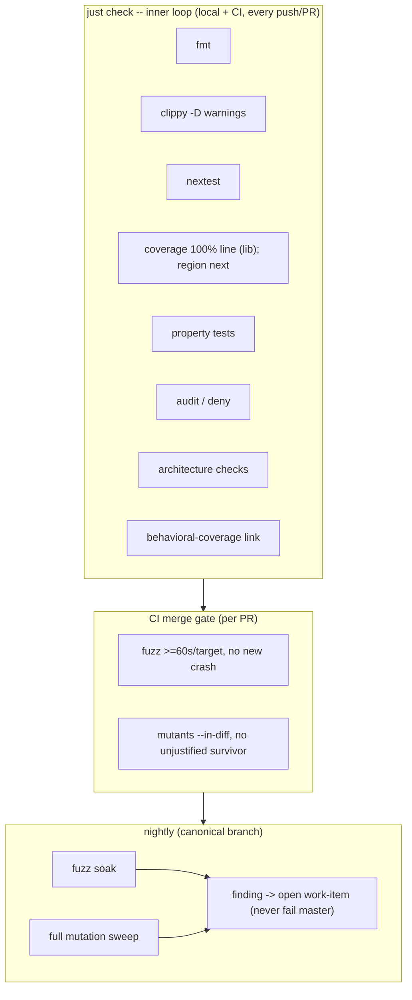

### Behavioral Coverage

Every normative behavior clause -- every `MUST` / `MUST NOT` / `SHOULD`
/ `SHOULD NOT` clause in `spec.md`, `contracts.md`, `constraints.md`,
and this document -- MUST link to a Gherkin scenario, and every scenario
MUST have a corresponding top-of-pyramid acceptance/integration test.
Operator-facing clauses link to a `##` H2 section in `scenarios.md`;
this document's own contributor-facing clauses link to a `##` H2 section
in `## Scenarios` below. This clause -> scenario -> test chain is the
primary guard that the implementation realizes the specification and
that no specified behavior silently regresses.

The linkage MUST be enforced by a mechanical check, run inside
`just check` and CI, implemented as a first-class check in this
repository -- porting the discipline of livespec's Python plumbing
(`dev-tooling/checks/behavior_scenario_link.py` for the clause ->
scenario guardrail, the shared `spec_clauses.py` gap-id primitive, and
the `tests/heading-coverage.json` link registry).

Once it exists, the check MUST run in **`fail` mode** -- not advisory:
the build fails on any normative clause not linked to a scenario, and on
any scenario without a corresponding test. Implementing that Rust checker
-- and backfilling every clause -> scenario -> test link so it passes --
is a **release-blocking, highest-priority obligation**, tracked as the
`scenario-test-rust-checker` work-item; the gate attaches to that real
checker and runs in `just check` and CI the moment it lands.

Until the checker lands, the requirement is enforced by that tracked
release-blocking obligation, NOT by a fail-closed CI placeholder. A
placeholder that hard-fails CI for a not-yet-built checker was found to
deadlock the merge gate -- it blocks every merge, including the checker's
own PR and unrelated work -- so it is NOT used. Enforcement attaches to
the real checker, never to its absence.

**Binding mechanism.** A scenario is identified by its `scenarios.md`
(or `## Scenarios`) H2 section heading. A clause is bound to a scenario,
and a scenario to its top-of-pyramid acceptance/integration test,
through the `tests/heading-coverage.json` link registry (the `clauses[]`
link shape ported from livespec). A link whose scenario name does not
resolve to a live H2 heading, or a scenario with no registered test,
MUST NOT satisfy the guardrail.

### Beads/Fabro Family Secret Convention

The console and its docs MUST use the current family secret convention:
the 1Password Environment wrapper exports one bare `BEADS_DOLT_PASSWORD`.
There is no per-tenant `BEADS_DOLT_PASSWORD_<tenant>` variable and no
per-tenant-to-bare mapping. Secrets MUST never be committed or echoed.
CI MUST obtain `BEADS_DOLT_PASSWORD` through the same convention when it
needs work-items access (e.g. the nightly chore-opening above).

## Constraints

This section enumerates the architectural invariants on the
implementation -- the analogue of `constraints.md`'s role for the
operator-facing surface.

### Implementation Language

- Product code MUST be Rust.
- `unsafe` is forbidden by default: crates MUST use
  `#![forbid(unsafe_code)]` unless a future spec revision grants a
  narrow exception.

The single-binary multi-mode runtime shape is operator-observable and
its normative force is stated in `constraints.md`.

### Railway-Oriented Programming

- Expected failures MUST be represented with typed `Result` values.
- Panics are bugs, not domain control flow.
- Domain and application code MUST NOT use `unwrap` or `expect` outside
  tests and startup wiring.
- Error types MUST distinguish domain rejection from infrastructure
  failure.
- Use cases SHOULD read as railway pipelines: validate, transform, call
  port, map errors, and emit events.

### Domain-Driven Design

The workspace layering invariants (the single source of truth that the
Architecture Tests below enforce):

- Bounded contexts MUST own their language, commands, events,
  invariants, and projections.
- Domain crates MUST NOT depend on infrastructure: adapters, the SQLite
  event store, web server, terminal UI, HTTP, subprocess, or filesystem
  APIs.
- Application crates MAY depend on domain crates and port traits.
- Source adapters MUST sit behind their own per-source port and MUST NOT
  depend on one another's internals. This isolation is the binding
  invariant; the granularity at which adapters are packaged (separate
  `console-adapter-*` crates versus per-source modules in a single
  adapters crate) is NOT mandated -- the implementation MAY use either,
  and currently realizes adapters as per-source modules. The Architecture
  Tests MUST enforce the isolation at whatever granularity is in use.
- UI crates MUST talk only to projections and command APIs, never
  directly to source systems (Beads, Fabro, LiveSpec, Dispatcher,
  GitHub).
- No console crate may invoke the `bd` CLI or parse Beads-native records:
  work-item state enters only through the orchestrator-CLI port
  (`list-work-items --json`), carrying the orchestrator-computed `lane` /
  `lane_reason` verbatim.

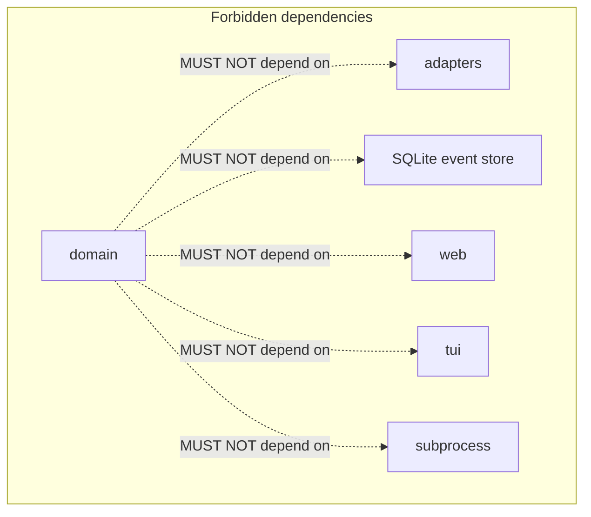

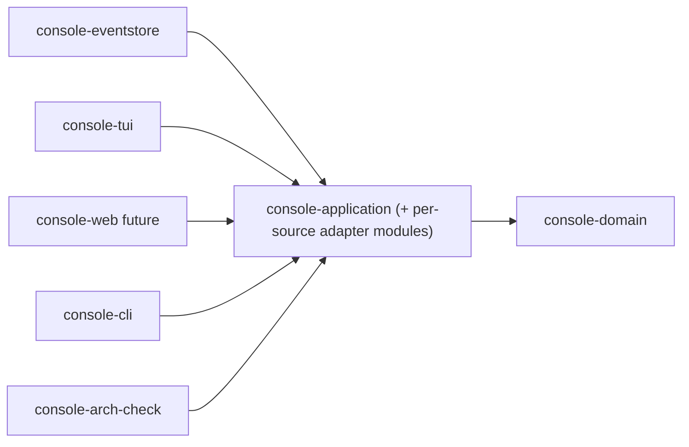

### Architecture Tests

The repo MUST include architecture tests inspired by ArchUnitTS and
ArchUnitPython, adapted to Rust. They exist as a first-class compiled
check (`console-arch-check`) and run inside `just check` and CI.

The Architecture Tests MUST enforce the Domain-Driven Design layering
invariants stated above; that bullet list is the single source of truth
for the rule set, and this section MUST NOT restate a divergent copy of
it. Concretely, the checks MUST enforce at least:

- the workspace crate-graph layering (no forbidden dependency
  direction), and
- domain has no dependency on adapters, the SQLite event store, web
  server, TUI, HTTP, subprocess, or filesystem APIs, and
- source adapters do not depend on one another's internals (at the
  packaging granularity in use), and
- UI does not call Beads/Fabro/LiveSpec/GitHub directly, and
- no crate invokes `bd` or embeds a Beads-native read path (the
  zero-Beads-knowledge rule), and
- product crates do not use `unwrap`/`expect` outside allowed scopes,
  and
- event and command types live in domain/application contracts, not
  adapters, and
- all use cases return typed `Result`.

Each enforced rule MUST be stated and checked falsifiably -- strongly
enough that a reviewer can name an input that makes it fail:

- The crate-graph dependency rules MUST be enforced from a structured
  crate-graph source (`cargo metadata` or equivalent), NOT a text scan.
- Source-level rules (e.g. the `unwrap`/`expect` ban, the
  event/command-type placement, the adapter-isolation rule when adapters
  are modules) MUST be checked at the Rust AST level, distinguishing
  real calls/items from substrings in comments, strings, and identifiers
  such as `unwrap_or`. A bare text scan does NOT satisfy these rules.

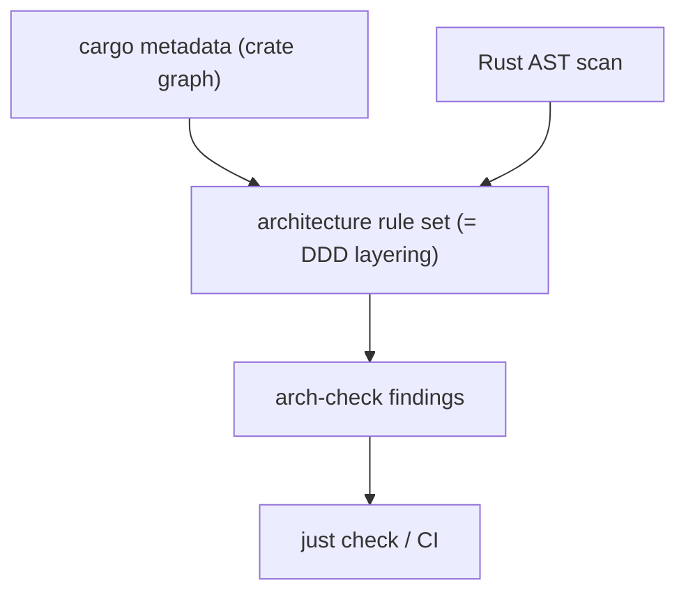

## Scenarios

The `##` H2 sections below are the contributor-facing behavioral
scenarios for this document's own normative clauses, per the
§"Behavioral Coverage" binding rule above (operator-facing scenarios
live in `scenarios.md`). Each theme groups the normative clauses of one
clause-bearing section of this file; the `tests/heading-coverage.json`
registry binds every NFR clause gap-id to the theme H2 below that covers
it, and each theme carries a top-of-pyramid acceptance/integration test.
Together the themes span every contributor-facing normative clause in
this document, so the behavioral-coverage checker reaches `fail` mode
with zero unlinked NFR clauses.

## Contributor Scenario A -- Functional / non-functional placement boundary

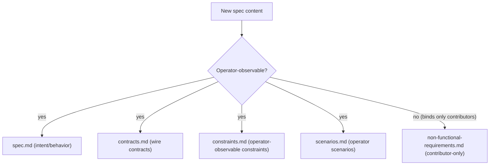

```gherkin
Feature: Content lands on the correct side of the functional boundary
  As a console contributor or agent
  I want a single litmus that routes new content to the right file
  So that operator-facing spec and contributor-facing NFR stay separated

  Background:
    Given non-functional-requirements.md is read alongside spec.md,
      contracts.md, constraints.md, and scenarios.md

  Scenario: Operator-observable intent routes to the functional files
    Given a proposed rule about operator-facing intent or behavior
    When a contributor applies the boundary litmus
    Then operator-facing intent or behavior lands in spec.md
    And operator-facing wire contracts land in contracts.md
    And constraints an operator could observe land in constraints.md
    And operator-facing scenarios land in scenarios.md

  Scenario: A contributor-only constraint moves out of constraints.md
    Given a constraint whose violation no operator could observe
    When a contributor applies the constraints.md <-> NFR litmus
    Then the constraint moves into non-functional-requirements.md
    And an event-sourcing safety guarantee an operator relies on
      stays in constraints.md
```

## Contributor Scenario B -- Red-Green-Replay gates Rust product commits

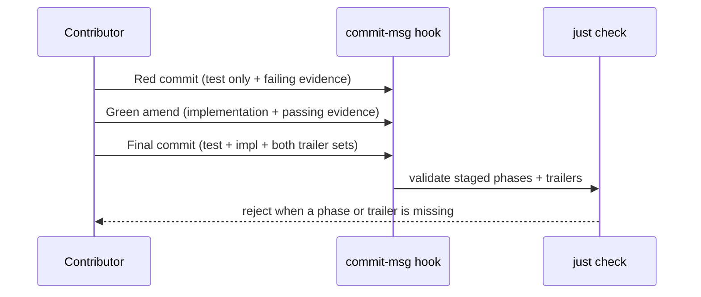

```gherkin
Feature: Red-Green-Replay commit discipline for Rust product changes
  As the console repository
  I want product commits to prove test-first evidence mechanically
  So that no Rust product change lands without a failing-then-passing trail

  Scenario: A well-formed Red-Green-Replay sequence is accepted
    Given a Rust product change
    When the Red commit stages only the test and records failing evidence
    And the Green amend stages the implementation and records passing evidence
    And the final commit carries test, implementation, and both trailer sets
    Then the commit-msg hook and just check accept the sequence

  Scenario: A commit that violates the staged phases is rejected
    Given a product commit missing a required staged phase or trailer
    When the commit-msg hook and just check evaluate it
    Then the commit is rejected

  Scenario: A non-product change uses the family exemption
    Given a spec-only or other non-product change
    When the contributor applies the non-product exemption pattern
    Then the Red-Green-Replay staged-phase requirement does not apply
```

## Contributor Scenario C -- Quality gate enforces the inner and merge loops

```mermaid
flowchart LR
  subgraph Inner["just check (inner loop, every push/PR)"]
    Fmt["fmt --check"]
    Clippy["clippy -D warnings"]
    Tests["cargo test + nextest"]
    Cov["100% line coverage, no carve-outs"]
    Props["property tests"]
    Audit["cargo deny + machete"]
    Arch["arch checks"]
  end
  subgraph Merge["merge gate (per PR)"]
    Fuzz["fuzz >=60s/target, no new crash"]
    Mut["mutants --in-diff, no unjustified survivor"]
  end
  subgraph Night["nightly (canonical branch)"]
    Soak["fuzz soak + full mutation sweep"]
    Chore["finding -> top-ranked chore work-item; never fail master"]
  end
  Inner --> Merge --> Night
```

```gherkin
Feature: Cost-and-determinism split of the contributor quality gate
  As the console CI and local inner loop
  I want fast deterministic checks separated from slow ones
  So that the implementation loop is never slowed or thrashed

  Scenario: The inner loop runs the fast deterministic checks
    Given a push or pull request
    When just check runs
    Then it includes fmt --check, clippy denying warnings,
      cargo test and cargo nextest, 100% line coverage over every
      workspace library with no per-crate carve-outs, property tests,
      cargo deny and cargo machete, and the architecture checks
    And it excludes fuzz and mutation runs
    And a code path that resists a meaningful unit test is redesigned
      rather than annotated with a coverage exclusion

  Scenario: The merge gate adds fuzzing and diff-scoped mutation
    Given a pull request
    When the merge gate runs
    Then each fuzz target runs a bounded pass of at least 60 seconds
      seeded from the committed corpus, and any new crash fails the merge
    And every crashing input is committed to the corpus
    And cargo mutants runs scoped to the changed lines over the logic
      crates, failing the merge on any surviving mutant not on the
      justified-survivor allow-list

  Scenario: A nightly finding opens a chore instead of failing master
    Given the scheduled nightly fuzz soak and full mutation sweep
    When a new crash or a new un-allow-listed surviving mutant is found
    Then the canonical branch does not fail
    And a chore work-item is filed at the top of the rank order in the
      livespec-console-beads-fabro tenant through the orchestrator's
      capture surface
```

## Contributor Scenario D -- Behavioral coverage links every clause to a tested scenario

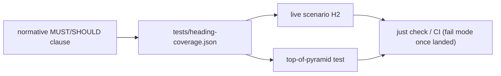

```gherkin
Feature: Clause -> scenario -> test behavioral-coverage chain
  As the console specification
  I want every normative clause bound to a tested scenario
  So that the implementation provably realizes the spec and cannot regress

  Scenario: Every normative clause resolves to a live tested scenario
    Given a normative MUST or SHOULD clause in a clause-bearing spec file
    When the behavioral-coverage checker evaluates the link registry
    Then the clause links to a scenario H2 in its audience-appropriate
      target, operator clauses to scenarios.md and this document's
      clauses to this Scenarios section
    And that scenario H2 carries a corresponding top-of-pyramid
      acceptance or integration test

  Scenario: The gate runs in fail mode once the checker lands
    Given the first-class Rust behavioral-coverage checker is wired
    When it runs inside just check and CI in fail mode
    Then the build fails on any normative clause not linked to a scenario
    And the build fails on any scenario without a corresponding test

  Scenario: A dangling or untested link does not satisfy the guardrail
    Given a registry link whose scenario name resolves to no live H2
    Or a live scenario H2 with no registered test
    When the checker evaluates coverage
    Then neither is counted as satisfying the guardrail
    And enforcement attaches to the real checker, never to a fail-closed
      placeholder that would deadlock the merge gate
```

## Contributor Scenario E -- Beads/Fabro family secret convention

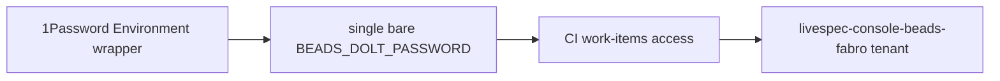

```gherkin
Feature: One bare family secret for work-items access
  As the console and its CI
  I want a single uniform secret convention
  So that work-items access never depends on per-tenant secret variables

  Scenario: The console uses the single bare secret
    Given the 1Password Environment wrapper
    When the console or its docs reference the work-items secret
    Then they use one bare BEADS_DOLT_PASSWORD
    And there is no per-tenant BEADS_DOLT_PASSWORD_<tenant> variable
      and no per-tenant-to-bare mapping
    And the secret is never committed or echoed

  Scenario: CI obtains the secret through the same convention
    Given a CI job that needs work-items access, such as nightly
      chore-opening
    When it authenticates to the Beads tenant
    Then it obtains BEADS_DOLT_PASSWORD through the same convention
```

## Contributor Scenario F -- Implementation language and the unsafe-code ban

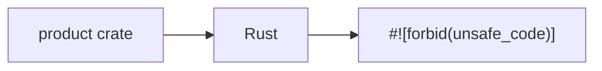

```gherkin
Feature: Rust product code with unsafe forbidden by default
  As the console workspace
  I want the implementation language and memory-safety floor fixed
  So that product code is uniformly Rust and free of unsafe blocks

  Scenario: Product code is Rust and forbids unsafe
    Given a product crate in the workspace
    When it is compiled
    Then its product code is Rust
    And it declares #![forbid(unsafe_code)] absent a future spec
      revision granting a narrow exception
```

## Contributor Scenario G -- Railway-oriented error handling

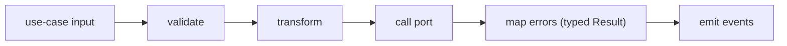

```gherkin
Feature: Typed-Result railway error discipline
  As the domain and application layers
  I want expected failures modeled as values, not panics
  So that error paths are total, typed, and testable

  Scenario: Expected failures are typed Results, panics are bugs
    Given domain or application code handling an expected failure
    When the failure occurs
    Then it is represented with a typed Result value
    And a panic is treated as a bug rather than domain control flow
    And no unwrap or expect is used outside tests and startup wiring

  Scenario: Error types separate rejection from infrastructure failure
    Given a use case that can fail
    When it maps its errors
    Then the error type distinguishes domain rejection from
      infrastructure failure
    And the use case reads as a railway pipeline that validates,
      transforms, calls a port, maps errors, and emits events
```

## Contributor Scenario H -- Domain-driven boundaries are preserved

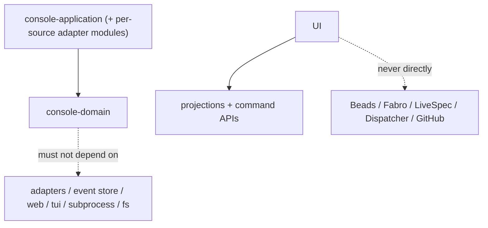

```gherkin
Feature: Bounded-context layering invariants
  As the console workspace
  I want domain, application, adapters, and UI kept in their lanes
  So that the layering that architecture tests enforce holds by design

  Scenario: Contexts own their language and domain stays infra-free
    Given the console bounded contexts
    When their code is structured
    Then each context owns its language, commands, events, invariants,
      and projections
    And domain crates do not depend on adapters, the SQLite event store,
      web server, terminal UI, HTTP, subprocess, or filesystem APIs

  Scenario: Adapters and UI respect their isolation
    Given per-source adapters and the UI crates
    When they are wired
    Then each source adapter sits behind its own per-source port and does
      not depend on another adapter's internals, at whatever packaging
      granularity is in use
    And UI crates talk only to projections and command APIs, never
      directly to Beads, Fabro, LiveSpec, Dispatcher, or GitHub
    And no crate invokes bd or parses Beads-native records; work-item
      state enters only through the orchestrator-CLI port
```

## Contributor Scenario I -- Architecture tests enforce the layering invariants

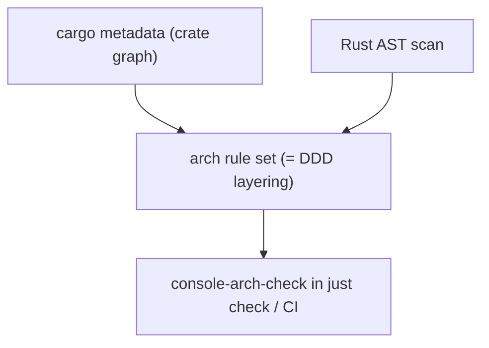

```gherkin
Feature: First-class falsifiable architecture tests
  As the console repository
  I want the layering invariants checked mechanically and falsifiably
  So that a reviewer can name the input that makes each rule fail

  Scenario: A compiled arch check enforces the DDD layering
    Given the console-arch-check first-class compiled check
    When just check and CI run
    Then it enforces the Domain-Driven Design layering invariants as the
      single source of truth, without restating a divergent copy
    And it enforces at least the crate-graph layering, domain's freedom
      from infrastructure, adapter isolation, the UI-to-source rule, the
      unwrap/expect ban, event/command-type placement, and typed-Result
      use cases

  Scenario: Rules are sourced structurally and stated falsifiably
    Given the architecture rule set
    When a rule is evaluated
    Then each rule is stated and checked falsifiably
    And crate-graph dependency rules are enforced from a structured
      crate-graph source such as cargo metadata rather than a text scan
    And source-level rules are checked at the Rust AST level, telling real
      calls and items apart from substrings in comments, strings, and
      identifiers such as unwrap_or
```
