# scenarios.md -- livespec-console-beads-fabro

Behavioral journeys for the console.

## Scenario 1 -- Operator sees one needs-attention inbox

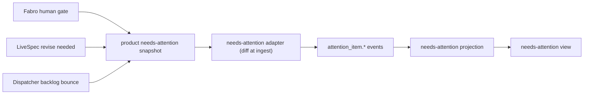

```gherkin
Feature: Unified needs-attention inbox
  As a LiveSpec operator
  I want one place to see work requiring my attention
  So that I do not have to poll LiveSpec, the orchestrator's work-items surface, Dispatcher, Fabro, and GitHub separately

Scenario: Mixed source signals appear as needs-attention items
  Given the product needs-attention snapshot composes a blocked Fabro run with a human gate, pending proposed changes requiring revise, and a non-converging item bounced to `backlog` for re-grooming
  When the needs-attention adapter ingests the snapshot and diffs it into attention_item events
  Then the needs-attention view lists all three items from the attention_item stream
  And each item carries a source reference and next operator action
```

## Scenario 2 -- Factory drain command

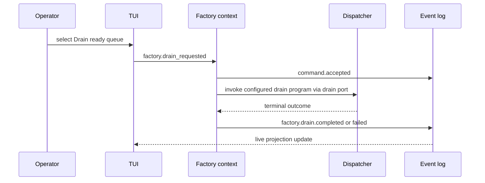

```gherkin
Feature: Factory drain command
  As an operator
  I want to request a bounded factory drain from the console
  So that ready work-items can enter Dispatcher/Fabro without manual command assembly

Scenario: A bounded drain emits command and outcome events
  Given a repo has ready implementation work
  When the operator selects "Drain ready queue" with budget 1 and parallel 1
  Then the console persists a `factory.drain_requested` command
  And the Factory context validates and accepts the command
  And invokes Dispatcher through its port
  And appends started and terminal outcome events
  And the TUI updates live from projections
```

## Scenario 3 -- Pull adapter backfill avoids silent missed data

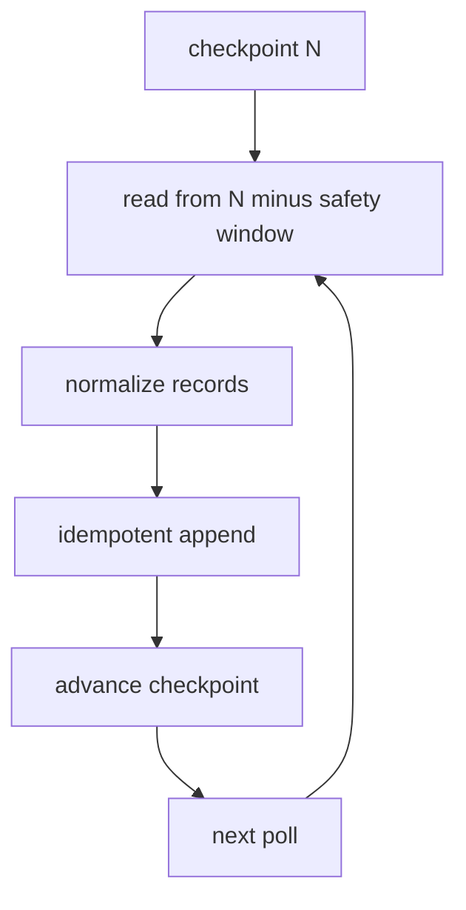

```gherkin
Feature: Checkpointed pull ingestion
  As a console maintainer
  I want every adapter to checkpoint and backfill
  So that polling does not silently miss source activity

Scenario: Adapter replays a reconciliation window idempotently
  Given an adapter has checkpointed source position N
  When it polls again
  Then it reads from N minus its configured safety window
  And emits canonical events with stable source event ids
  And duplicate events are ignored by the event store
  And the checkpoint advances only after durable append
```

## Scenario 4 -- Source cannot prove full transition history

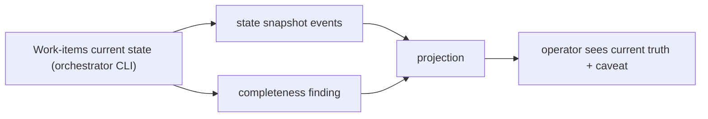

```gherkin
Feature: Honest completeness findings
  As an operator
  I want incomplete source history to be visible
  So that the console never overclaims certainty

Scenario: Work-items current-state snapshot lacks transition history
  Given the Work-items adapter can observe current work-item state through the orchestrator CLI
  And the source cannot prove every historical transition
  When the adapter backfills the repo
  Then it emits state snapshot events
  And emits an ingestion completeness finding
  And the projection shows current truth without pretending full transition history is known
```

## Scenario 5 -- TUI-first operator workflow

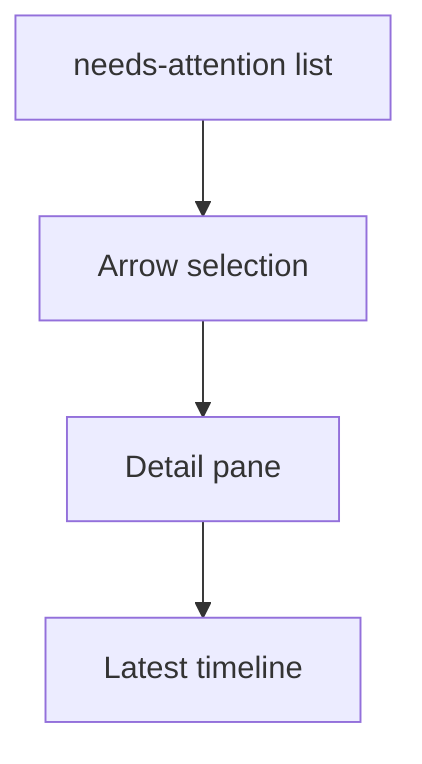

```gherkin
Feature: TUI operator workflow
  As an operator using a terminal
  I want arrow-driven views and detail panes
  So that I can drive common orchestration actions before the GUI exists

Scenario: Operator inspects a lane-derived needs-attention item
  Given a selected needs-attention item is derived from a blocked needs-human work-item lane
  When the operator opens the detail pane
  Then the TUI shows the repo, work item, and latest timeline events
  And no local dismiss command is offered from the needs-attention lens
```

## Scenario 6 -- Policy-rejected command produces no side effect

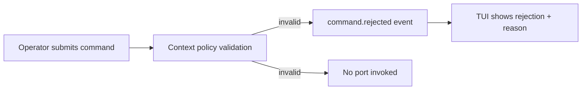

```gherkin
Feature: Policy-rejected command
  As an operator
  I want commands that violate context policy to be rejected without side effects
  So that the console never acts on an invalid request

Scenario: An invalid drain is rejected and nothing is dispatched
  Given a repo has no ready implementation work
  When the operator requests a factory drain
  Then the Factory context validates the command against policy
  And persists a `command.rejected` event carrying the rejection reason
  And no Dispatcher port is invoked
  And the TUI shows the command as rejected with its reason
```

## Scenario 7 -- Crash-gap recovery reconstructs a missing outcome

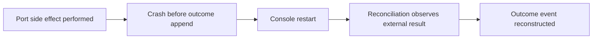

```gherkin
Feature: Crash-gap recovery
  As an operator
  I want the console to recover when it crashes between a side effect and its outcome event
  So that the event log eventually reflects what actually happened

Scenario: Reconciliation reconstructs a missing outcome after a crash
  Given a command's port side effect has been performed
  And the console crashed before appending the outcome event
  When the console restarts and reconciliation runs
  Then it observes the external result through the adapter
  And appends the corresponding outcome event
  And the command status reflects the true outcome
```

## Scenario 8 -- Corrupted projection rebuilds by replay

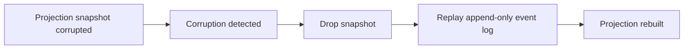

```gherkin
Feature: Snapshot corruption recovery
  As an operator
  I want corrupted read models to rebuild from the event log
  So that projection corruption never loses durable truth

Scenario: A corrupted projection is rebuilt by replay
  Given a projection snapshot is detected as corrupt
  When the console recovers the projection
  Then it drops the corrupt snapshot
  And rebuilds the projection by replaying the append-only event log
  And the rebuilt projection matches the event log
```

## Scenario 9 -- Operator sets a dispatcher policy setting from the console

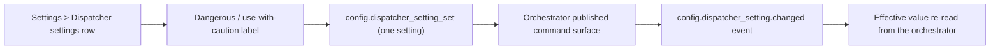

```gherkin
Feature: Dispatcher settings are commanded, recorded, and observed
  As a LiveSpec operator
  I want to set each dispatcher policy setting from the console
  So that I can tune the factory's autonomy one dial at a time, with the orchestrator owning the setting state

Scenario: Setting one dial is an ordinary recorded write with no arming ceremony
  Given a registered repo whose dispatcher settings the console observed from the orchestrator
  When the operator edits the Auto-approve ready row in Settings > Dispatcher settings
  Then the TUI shows a "dangerous / use with caution" label on that row
  And the console persists a `config.dispatcher_setting_set` command carrying that one setting and its value
  And no type-to-confirm modal or other arming ceremony is required
  And the handler effects the write through the orchestrator's published command surface
  And appends a `config.dispatcher_setting.changed` audit event
  And never writes the orchestrator's `.livespec.jsonc` key itself

Scenario: The console holds no setting state of its own
  Given the orchestrator reports the effective value of every dispatcher setting
  When the console renders the Settings view
  Then every value shown is the effective value derived from the orchestrator's published read surface
  And the console persists no console-owned copy of any setting
  And an unreadable orchestrator surface degrades to a named not-observed finding rather than an assumed value

Scenario: A simulated orchestrator port surfaces not-wired rather than fabricating success
  Given the orchestrator command port is simulated or unimplemented
  When the operator edits a dispatcher setting row
  Then the console surfaces a not-wired / not-observed outcome
  And appends no event asserting a setting change it did not achieve
```

## Scenario 10 -- A per-item override beats the global default, except `wip_cap`

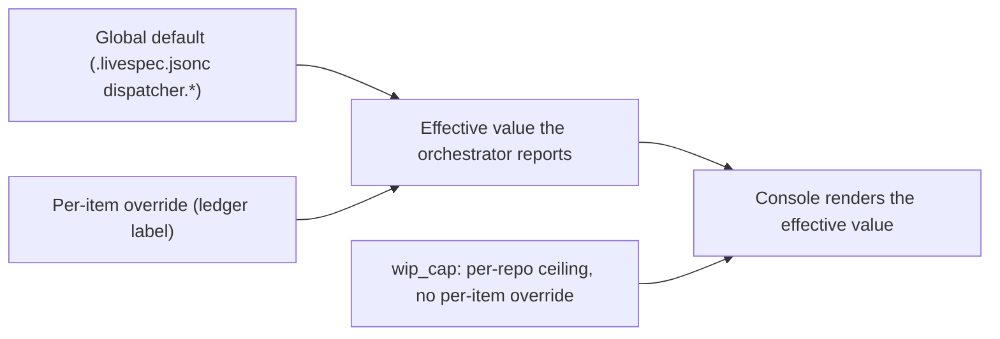

```gherkin
Feature: Per-item override valve
  As a LiveSpec operator
  I want to override a dispatcher setting for one work-item
  So that a single item can depart from the repo-wide default without changing it for everything

Scenario: A per-item override beats the global default for that item
  Given a repo whose global `merge_on_review_cap` default is false
  When the operator sets a per-item `merge_on_review_cap` override of true on one work-item
  Then the console persists a `work_item.set_dispatcher_override_requested` command
  And invokes the orchestrator's published per-setting override action through its port
  And the orchestrator reports that item's effective value as true while every unlabelled item still inherits false
  And the console renders the effective value the orchestrator reports rather than re-deriving the precedence

Scenario: wip_cap admits no per-item override
  Given a work-item selected in the console
  When a `work_item.set_dispatcher_override_requested` command names `wip_cap` as its setting
  Then the handler rejects the command because `wip_cap` is a per-repo concurrency ceiling
  And the TUI offers no per-item override control for `wip_cap`
  And no ledger label is written

Scenario: Each overridable setting has exactly one console command
  Given the five overridable settings are auto_approve_ready, acceptance_mode, merge_on_review_cap, review_fix_cap, and acceptance_rework_cap
  When the operator overrides admission or acceptance policy on a work-item
  Then the console uses the established `work_item.set_admission_requested` and `work_item.set_acceptance_requested` commands
  And a `work_item.set_dispatcher_override_requested` command naming auto_approve_ready or acceptance_mode is rejected
  And the remaining three settings are served by `work_item.set_dispatcher_override_requested`
  And the Work-item Lifecycle vocabulary is therefore eight commands, seven of them mapping 1:1 onto the orchestrator's `drive` action-id surface
```

## Scenario 11 -- Human valve and policy-edit commands map onto the orchestrator surface

The approve and policy-edit scenes below realize the orchestrator's ratified
work-item state semantics (repo
`thewoolleyman/livespec-orchestrator-beads-fabro`, `SPECIFICATION/contracts.md`,
its Work-item state semantics section and its `drive` action-id surface):
approve is the `pending-approval -> ready` transition and a policy edit never
moves an item between states.

```gherkin
Feature: Human valve and policy-edit commands
  As a LiveSpec operator
  I want to approve, accept, reject, and re-policy work-items from the console
  So that the two human valves and the policy dials are one keystroke away, with the orchestrator owning the ledger write

Scenario: Approve routes through the orchestrator's published action surface
  Given a `pending-approval` work-item whose effective admission_policy is manual, shown in needs-attention
  When the operator invokes Approve on it
  Then the console persists a `work_item.approve_requested` command
  And invokes the orchestrator's published action surface with `approve:<work-item-id>` through its port
  And appends the outcome events from the orchestrator result
  And observes the item's lane change on a subsequent work-items poll

Scenario: Reject with mode regroom maps onto the reject action id
  Given an `acceptance` work-item the operator judges wrongly scoped
  When the operator invokes Reject with mode regroom
  Then the console persists a `work_item.reject_requested` command carrying mode regroom
  And invokes the orchestrator's published action surface with `reject:<work-item-id>:regroom`
  And never writes the ledger directly

Scenario: A policy edit never moves an item between states
  Given a work-item whose stored admission_policy is manual
  When the operator invokes set-admission with policy auto
  Then the console persists a `work_item.set_admission_requested` command
  And invokes the orchestrator's published action surface with `set-admission:<work-item-id>:auto`
  And the item's lifecycle state is unchanged
```

## Scenario 12 -- needs-attention snapshot diffed at ingest into attention_item events

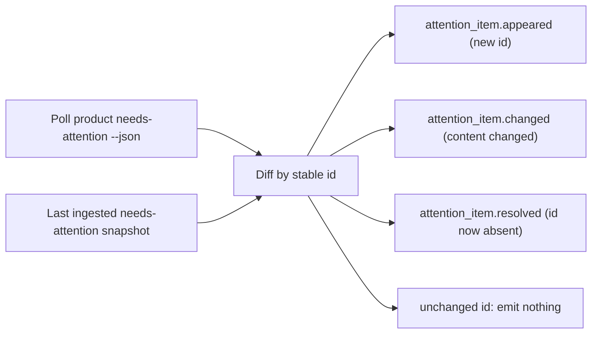

```gherkin
Feature: needs-attention snapshot diffed at ingest
  As a console maintainer
  I want the stateless product needs-attention snapshot turned into durable events at ingest
  So that the event-sourced console can project appeared, changed, and resolved attention items without the source keeping history

Scenario: The needs-attention adapter diffs a point-in-time snapshot into keyed events
  Given the needs-attention adapter has a prior ingested snapshot of the product needs-attention surface
  And the surface is stateless and point-in-time with no transition history
  When the adapter polls the surface and diffs the new snapshot against the prior one by stable id
  Then it emits an attention_item.appeared event for each id not present before
  And an attention_item.changed event for each present id whose composed content changed
  And an attention_item.resolved event for each previously-present id now absent
  And emits nothing for an unchanged id
  And every emitted event is keyed by the item's stable id
```

## Scenario 13 -- Operator distinguishes cockpit-blind from factory-idle

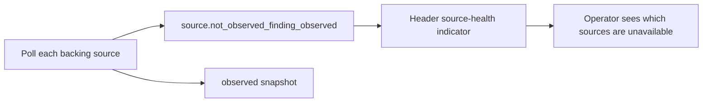

```gherkin
Feature: Source-unavailability is legible in the header
  As an operator
  I want the header to show when backing sources are unavailable
  So that a cockpit-blind screen is never mistaken for an idle factory

Scenario: Unavailable sources are counted and named in the header
  Given one or more backing sources degraded to a not-observed finding this cycle
  When the operator screen is rendered
  Then the header shows how many sources are unavailable
  And the header names which sources are unavailable

Scenario: A healthy cycle shows no phantom unavailability count
  Given every backing source was observed this cycle
  When the operator screen is rendered
  Then the header shows no source-unavailability indicator

Scenario: A normally-launched console against a real tenant shows its reachable sources available
  Given a console launched under the credential wrapper against a real tenant with a non-empty ledger
  And every backing-source binary the console invokes is resolvable and every backing file it reads is present
  When the source poll cycle runs and the operator screen is rendered
  Then each reachable source is counted as available and appears in no unavailability tally
  And the header carries no source-unavailability indicator for a source that was successfully observed

Scenario: A reachable-but-empty source is idle, not unavailable
  Given a backing source the console reaches successfully but which currently holds nothing to report
  And that emptiness is an empty work-item ledger, zero open pull requests, or a factory that has not yet written a dispatch journal
  When the source poll cycle runs
  Then the source is treated as observed-and-idle
  And it is not counted or named among the unavailable sources
  And an idle factory is never dressed as a cockpit-blind screen

Scenario: A recovered source clears from the unavailability tally on its next observation
  Given a source that degraded to a not-observed finding on an earlier cycle
  When a later cycle observes that source successfully
  Then the header no longer counts or names that source as unavailable
  And the unavailability tally reflects the latest poll outcome per source rather than any historical failure

Scenario: Only a genuinely unreachable source is counted, and it is named with a reason
  Given a backing source that cannot be reached this cycle because its binary is unresolvable, its command exits non-zero, or its required file is absent or unreadable
  When the operator screen is rendered
  Then the header counts that source among the unavailable and names it
  And the not-observed finding carries a human-readable reason
  And that reason is durably recorded so the operator can see why the source is unavailable
```

## Scenario 14 -- Settings surface stays in lockstep with the orchestrator's declared keys

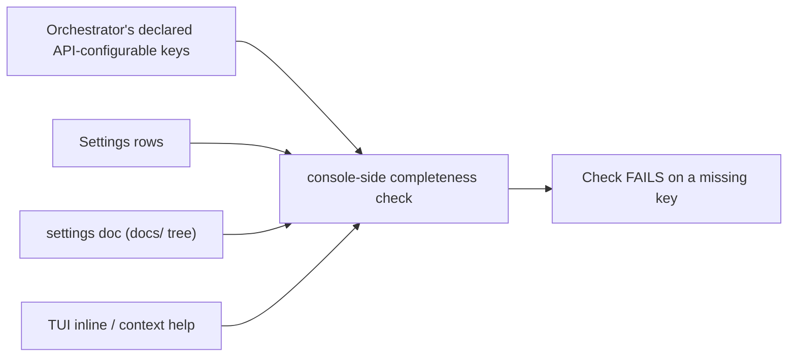

```gherkin
Feature: API-configurable completeness
  As a console maintainer
  I want every orchestrator-declared setting to reach the operator
  So that a key added upstream can never be silently unreachable from the console

Scenario: A declared key missing from the Settings surface fails the check
  Given the orchestrator declares a dispatcher key the console's Settings surface does not render
  When the console-side completeness check runs
  Then the check fails and names the missing key

Scenario: A declared key missing from the settings doc fails the check
  Given the orchestrator declares a dispatcher key that the console's settings doc under `docs/` does not document
  When the console-side completeness check runs
  Then the check fails and names the missing key

Scenario: The check reads the producer and never the other way round
  Given the No-Circular-Dependency Directive forbids the orchestrator reading into the console
  When the completeness check runs
  Then it lives in this consumer repo and reads the orchestrator's declared API-configurable-key surface
  And the console does not hardcode the key list
  And no orchestrator-side check reads into the console
```

## Scenario 15 -- Orchestrator auto-dispositions and escalations reach the operator

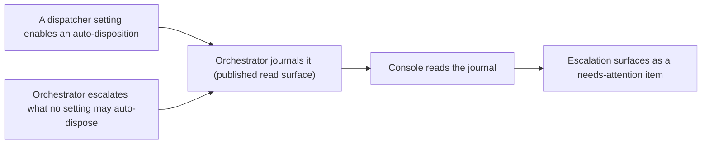

```gherkin
Feature: Auto-dispositions and escalations are observed, never re-derived
  As an operator
  I want every machine disposition and every escalation to be visible in the console
  So that no auto-disposition is silent and no escalation is lost

Scenario: An auto-disposition is read from the orchestrator's journal
  Given a dispatcher setting enabled an auto-approve, an AI auto-accept, an AI-fail auto-rework, a ship-on-cap, or a cap-exceeded escalation
  When the console ingests the orchestrator's published journal read surface
  Then the console reflects that auto-disposition through its own event path
  And attributes it to the setting that governed it

Scenario: An escalation the orchestrator did not dispose reaches the operator
  Given the orchestrator escalated a decision no setting may auto-dispose
  When the console ingests the orchestrator's published journal read surface
  Then the escalation appears as a needs-attention item with its source reference and next operator action
  And the console neither drops, silently defers, nor fabricates the decision
  And the console does not re-derive the escalation from any other source
```

## Scenario 16 -- Factory drain passes the Dispatcher no policy-arming argument

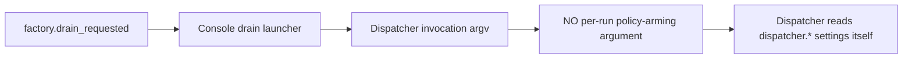

```gherkin
Feature: Dispatch-time policy is never armed per run
  As a LiveSpec operator
  I want the factory-drain launcher to pass no policy flag
  So that dispatch-time policy comes only from the orchestrator-owned settings, and a drain can never be armed behind the settings surface

Scenario: The drain launcher passes no policy-arming argument
  Given a repo whose dispatcher policy settings live in the orchestrator's `.livespec.jsonc`
  When the operator requests a factory drain and the console invokes the Dispatcher through its drain port
  Then the invocation carries no per-run policy-arming argument
  And the Dispatcher reads the `dispatcher.*` settings for itself
  And the console arms no dispatch-time policy of its own

Scenario: A per-run policy flag is not a settings write
  Given the console's settings surface writes exactly one `dispatcher.*` setting per command
  When a drain is launched
  Then no settings write is issued as part of the launch
  And no policy-arming argument is substituted for one
```

## Scenario 17 -- Operator selects a work-item and moves it along the pipeline

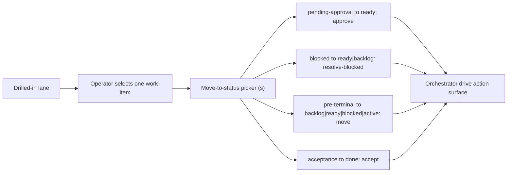

```gherkin
Feature: Individual work-item selection and pipeline status moves
  As a LiveSpec operator
  I want to select one work-item in a lane and move it to a status it may be driven to
  So that I can shepherd a single item along the pipeline, with the orchestrator owning every transition

Scenario: The operator selects an individual work-item in a drilled-in lane
  Given the Lanes view drilled into a lane holding more than one work-item
  When the operator moves the selection within the lane
  Then an individual work-item is selected, not merely the lane
  And the per-item valves act on the selected work-item

Scenario: Moving a pending-approval item to ready routes through approve
  Given a selected `pending-approval` work-item in a drilled-in lane
  When the operator moves it to `ready` from the move-to-status picker
  Then the console persists a `work_item.approve_requested` command
  And invokes the orchestrator's published action surface with `approve:<work-item-id>`
  And never writes the ledger directly

Scenario: Moving a blocked item routes through resolve-blocked
  Given a selected `blocked` work-item
  When the operator moves it to `ready` or `backlog` from the picker
  Then the console persists a `work_item.resolve_blocked_requested` command carrying that target status
  And invokes the orchestrator's published action surface with `resolve-blocked:<work-item-id>:ready|backlog`

Scenario: Moving an item to a pre-terminal status routes through the guarded move action
  Given a selected work-item whose target is not served by a semantic valve
  When the operator moves it to `backlog`, `ready`, `blocked`, or `active`
  Then the console persists a `work_item.move_requested` command carrying that target status
  And invokes the orchestrator's published action surface with `move:<work-item-id>:<target-status>`
  And the orchestrator refuses `done`, `acceptance`, and `pending-approval` as move targets

Scenario: Reaching done requires the acceptance path and the picker never un-ships a done item
  Given a selected work-item
  When the operator opens the move-to-status picker
  Then `done` is offered only for an `acceptance` item and routes through `accept:<work-item-id>`
  And the picker offers no move to `done` for any other source status
  And the picker offers no move out of a `done` work-item
```

## Scenario 18 -- Operator opens pane-specific modal help and exits only with Esc

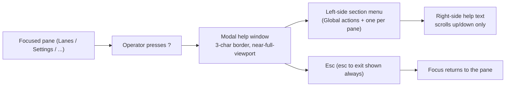

```gherkin
Feature: Navigable, context-specific Help modal
  As a LiveSpec operator
  I want a modal help window whose section matches the pane I am on, with a left menu and a scrollable right pane, dismissed only by Esc
  So that I get contextual guidance in place, without losing my view or leaving help by accident

Scenario: `?` opens Help auto-focused to the focused pane's section
  Given the operator has the Lanes pane focused
  When the operator presses `?`
  Then the Help modal opens auto-focused to the Lanes section
  And pressing `?` with the Settings pane focused opens auto-focused to the Settings section
  And the menu also carries a "Global actions" section

Scenario: The Help modal is a bordered window over the main screen
  Given the Help modal is open
  Then it renders as a window on top of the main screen with a 3-character border on each side and on top and bottom
  And it never renders wider than the viewport

Scenario: The Help modal is a left menu with a right pane scrollable up and down
  Given the Help modal is open
  When the operator navigates the left-side section menu
  Then the right-side help text shows the selected section
  And the right pane scrolls up and down only, never left or right

Scenario: The Help modal is modal, always shows "esc to exit", and exits only on Esc
  Given the Help modal is open
  Then the text "esc to exit" is printed at the bottom at all times
  When the operator presses any key other than Esc
  Then the modal stays open and the underlying view neither switches nor scrolls
  When the operator presses Esc
  Then the modal closes and focus returns to the pane the operator was on
```

## Scenario 19 -- Operator reads context-specific shortcut hints in the Status line

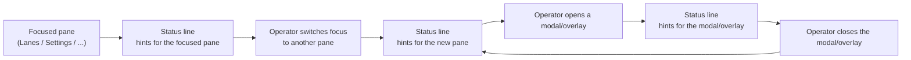

```gherkin
Feature: Context-specific Status-line shortcut hints
  As a LiveSpec operator
  I want the Status line to show the shortcut keys that act in my current context
  So that the actions available on the focused pane or open overlay are always discoverable, never a blank line

Scenario: The Status line shows hints for the focused pane
  Given the operator has the Lanes pane focused
  When the operator screen is rendered
  Then the Status line shows shortcut key hints for the actions available on the Lanes pane
  And the hint line is not empty

Scenario: Switching focus to another pane changes the hints
  Given the operator has the Lanes pane focused and the Status line shows the Lanes hints
  When the operator moves focus to the Settings pane
  Then the Status line shows shortcut key hints for the actions available on the Settings pane
  And those hints differ from the hints shown while the Lanes pane was focused

Scenario: Opening an overlay changes the hints, and closing it restores the pane's hints
  Given the operator has a pane focused and the Status line shows that pane's hints
  When the operator opens a modal or overlay
  Then the Status line shows shortcut key hints for the actions available in that modal or overlay
  When the operator closes the modal or overlay
  Then the Status line again shows the focused pane's hints

Scenario: A context with available actions never shows an empty hint line
  Given a focused pane or open overlay in which shortcut actions are available
  When the operator screen is rendered
  Then the Status line renders a non-empty, context-appropriate set of shortcut key hints
  And it never renders a static or empty hint line where actions are available
```

## Scenario 20 -- Operator focuses and horizontally scrolls the top/header pane on a narrow viewport

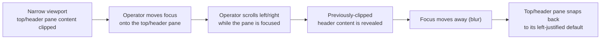

```gherkin
Feature: Focusable, horizontally scrollable top/header pane
  As a LiveSpec operator
  I want to focus the top/header pane and scroll it horizontally on a narrow viewport
  So that header content clipped at the current width is still readable, and the pane returns to its default when I move on

Scenario: The top/header pane joins the focus cycle
  Given the operator is cycling focus across the panes
  When the operator moves focus onto the top/header pane
  Then the top/header pane holds input focus like any other pane

Scenario: Horizontal scroll reveals content clipped at the current viewport width
  Given the viewport is narrow enough that the top/header pane's content is clipped
  And the operator has the top/header pane focused
  When the operator scrolls the top/header pane horizontally
  Then the previously-clipped header content is revealed
  And content beyond the current viewport width becomes reachable by scrolling left and right

Scenario: Moving focus away returns the pane to its left-justified default
  Given the operator has scrolled the focused top/header pane away from its left edge
  When focus moves away from the top/header pane
  Then the top/header pane returns to its default left-justified position

Scenario: A wide-enough viewport needs no horizontal scroll
  Given the viewport is wide enough to show the whole top/header pane
  When the top/header pane is focused
  Then all header content is already visible without horizontal scrolling
```

## Scenario 21 -- Operator sees panes render operational content only, no baked-in documentation prose

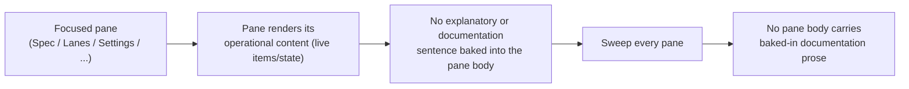

```gherkin
Feature: Panes render operational content only, no baked-in documentation prose
  As a LiveSpec operator
  I want the TUI panes to show only the live operational content I act on, not explanatory documentation sentences
  So that the limited pane space carries the state I need, and any explanation lives in the user documentation where I can read it deliberately

Scenario: A pane renders its operational content without an explanatory documentation sentence
  Given the operator has a pane focused (for example the Spec pane)
  When the pane is rendered
  Then the pane body shows only its operational content -- the live items and state the operator acts on
  And the pane body carries no explanatory or documentation sentence describing what the console is, how a projection is derived, or how a view behaves

Scenario: A sweep of every pane finds no baked-in documentation prose
  Given the console TUI is rendered across all of its panes
  When every pane body is examined
  Then no pane body contains a baked-in sentence describing what the console is, how a projection is derived, or how a view behaves
  And documentation sentences such as "Spec lifecycle status is projected from LiveSpec adapter observations." and "Revise-required events stay visible in the Spec view until resolved." do not appear in any pane body

Scenario: Explanatory content belongs in the user documentation, not the live panes
  Given a genuinely useful explanation of how a view behaves
  When the console is rendered
  Then that explanation does not appear baked into any pane body
  And it belongs in the user documentation instead
```

## Scenario 22 -- User-facing documentation lives in the docs/ tree with the README as a pointer

```mermaid
flowchart LR
  User["User looking for documentation"]
  Readme["Top-level README.md\n(project overview + pointer)"]
  Index["docs/README.md\n(overview + table of contents)"]
  Subs["Sub-documents:\ninstalling / overview-quickstart /\ncli-options / detailed-usage"]
  Pane["detailed-usage: a section per TUI pane"]
  Gate["Settings-surface completeness check"]

  User --> Readme --> Index --> Subs --> Pane
  Gate --> Subs
```

```gherkin
Feature: User-facing documentation lives in the docs/ tree
  As a console user
  I want the user documentation in a browsable docs/ tree rather than one long README
  So that I can find installation, usage, options, and per-pane behavior without scrolling past contributor material

Scenario: The top-level README is a pointer, not the documentation
  Given the repository's top-level README.md
  When a user reads it
  Then it carries the project overview and a link to the docs/ tree's index document
  And it carries no user-facing documentation sections of its own
  And contributor-facing build, development, and quality-gate material may still appear there

Scenario: The docs index is an overview and a table of contents only
  Given the docs/ tree's index document
  When a user reads it
  Then it carries an overview and a table of contents
  And each table-of-contents entry links a sub-document by a relative path
  And the substantive user documentation lives in those linked sub-documents rather than in the index

Scenario: The docs tree carries the four required sub-documents
  Given the docs/ tree's index document
  When a user looks for how to install the console, a general overview and quick start, the environment variables and CLI options and sub-commands, or the detailed behavior of a TUI pane
  Then each of those four subjects is covered by its own linked sub-document
  And the installation sub-document covers both the download-install path and running the console against a repository other than its own
  And the detailed-usage sub-document carries a section per TUI pane

Scenario: The settings doc the completeness check reads is the detailed-usage sub-document
  Given the orchestrator declares an API-configurable dispatcher key
  When the settings-surface completeness check looks for that key in the console's settings doc
  Then it reads `docs/detailed-usage.md`
  And it does not read the top-level README.md
```
