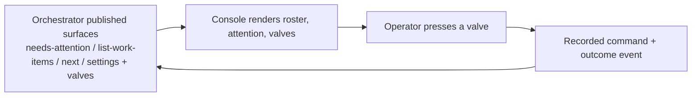

## Proposal: The console is the control-plane surface for the factory loop -- replace the overseer-orthogonality boundary with a no-resident-decider guard

### Target specification files

- SPECIFICATION/spec.md
- SPECIFICATION/scenarios.md

### Summary

Replace the boundary clause that declares `livespec-overseer` an orthogonal mechanism the console MUST NOT be a control surface for (spec.md, the does-not-own bullet naming the foreman/overseer driving layer and `foreman_valve_disposition`, plus the paragraph after it) with a Control-plane surface clause: the console is the operator's control-plane surface for the factory loop, realizing every operator-facing capability the retired overseer roles provided ONLY as rendering of, and configuration through, the orchestrator's published surfaces; it MUST NOT implement those capabilities' semantics locally, MUST NOT host a resident deciding agent, and MUST NOT drive or observe sessions through a terminal multiplexer or screen-scraping transport. Two does-not-own bullets take the overseer bullet's place (the orchestrator's disposition/valve-policy semantics; Fabro workflow definitions and their named variants). One new scenario (Scenario 29) carries the behaviour.

### Motivation

Intent (maintainer, 2026-09-01, via plan `retire-overseer-and-redesign-control-plane-around-console` (console epic livespec-console-beads-fabro-pzbdbo; charter: plan/retire-overseer-and-redesign-control-plane-around-console/research/redesign-brainstorm-and-decisions.md)): retire the livespec-overseer -- its tmux transport and resident LLM seats -- and redesign the fleet's control plane around the console, with the orchestrator as the console's API. The 2026-08-31 investigation of the overseer's five-job report measured that nine of fourteen failures were transport/observation failures (an 8-line pane-scrape window that cannot see a picker, a stale launch profile, an un-clearable ready file, an unset env marker, a 48-char note truncation, a session vanishing with no record, and the shared usage limit that killed every seat including the foreman because it manifests as an interactive prompt), that the deterministic layers held, and that everything which actually landed that day was driven attended, against the ledger and the orchestrator's primitives. Decision D2 of that plan: the console is the control-plane surface; the orchestrator is its API; the orchestrator stays console-unaware. Decision D5: the overseer's capabilities transfer by name into orchestrator primitives the console renders and configures; the resident foreman, grooming and supervisor seats are dropped. As written, spec.md forbids the deliverable: `the console MUST NOT be treated as a control surface for the overseer/foreman layer, and SHOULD NOT gain UI to observe or edit foreman/overseer configuration or state`. That clause was correct while the overseer existed as a peer; with the overseer retired and its capabilities reduced to orchestrator primitives, the clause has no subject left and blocks phase 1 of the plan. The replacement keeps the two properties that made the console trustworthy -- it owns no plane's semantics and it composes only published surfaces -- and adds the one guard the overseer's failure taught: the moment a console component decides on its own initiative, the foreman has been rebuilt inside the console.

### Proposed Changes

In `spec.md` under **The console does not own**, REPLACE the bullet

```diff
-- `livespec-overseer`'s foreman/overseer driving layer, including its own
-  configuration levers (for example `foreman_valve_disposition`)
+- the orchestrator's disposition and valve-policy semantics -- which valves
+  exist, which policy values are legal, and what each one auto-disposes
+- Fabro workflow definitions and their named variants -- which workflow a
+  dispatch runs is orchestrator configuration the console renders and sets,
+  never defines
```

and REPLACE the paragraph that follows the list

```diff
-`livespec-overseer` is an orthogonal, independent mechanism for driving
-factory work: it operates alongside the console, not through it. The
-console MUST NOT be treated as a control surface for the overseer/foreman
-layer, and SHOULD NOT gain UI to observe or edit foreman/overseer
-configuration or state.
+**Control-plane surface.** The console is the operator's control-plane
+surface for the factory loop. Every operator-facing capability the retired
+`livespec-overseer` roles provided -- the roster of plans and their work
+state, attention triage, valve disposition under a stated policy, and
+account rotation on provider limits -- is realized in the console ONLY as
+rendering of, and configuration through, the orchestrator's published
+surfaces (`needs-attention`, `list-work-items`, `next`, the settings and
+valve command surface, and any surface the orchestrator ratifies later).
+The console MUST NOT implement any such capability's semantics locally, and
+where the orchestrator has not published a surface for one, the console
+MUST leave that capability un-built rather than realize it itself.
+
+The console MUST NOT host a resident deciding agent -- a component that selects
+the next action, disposes a valve, or answers a run's question on its own
+initiative -- and MUST NOT drive or observe agent sessions through a
+terminal multiplexer or any screen-scraping transport. It surfaces facts and
+executes the operator's explicit commands, each recorded through the
+command-plus-outcome path. An LLM MAY appear in the console only as an
+operator-invoked assistant whose every effect is such a recorded command.
```

In `scenarios.md`, ADD after Scenario 28:

````markdown
## Scenario 29 -- The console is the control-plane surface, not a deciding agent



```gherkin
Feature: Control-plane surface without a resident decider
  As an operator
  I want the console to render and configure the factory loop through the orchestrator's own surfaces
  So that every decision is mine or the orchestrator's policy, never a hidden agent's

Scenario: An overseer-era capability is rendered from an orchestrator surface
  Given the orchestrator publishes attention items, valve policies, and their command surface
  When the operator opens the console
  Then the roster, attention triage, and valve disposition the retired overseer roles provided are rendered from those surfaces
  And every disposition the console issues is an operator command recorded through the command-plus-outcome path

Scenario: No console component decides on its own initiative
  Given an attention item carrying a valve the operator has not pressed
  When time passes with no operator command
  Then the console issues no valve, selects no next action, and answers no question
  And the item remains until the orchestrator disposes it under its own policy or the operator acts

Scenario: A capability with no published orchestrator surface stays un-built
  Given the orchestrator has not published a surface for a capability the overseer once provided
  When the operator looks for that capability in the console
  Then the console offers no local realization of it
```
````

Behaviour introduced here MUST be carried by Scenario 29 and its test registration in `tests/heading-coverage.json` at revise time; the prose above only augments it.

## Proposal: A factory run never awaits a human -- needs-human is a ledger valve the console renders, not a Fabro human gate it attaches to

### Target specification files

- SPECIFICATION/spec.md
- SPECIFICATION/contracts.md
- SPECIFICATION/scenarios.md

### Summary

Retire every clause that models a Fabro run parked on a human gate the operator attaches to, and replace it with the orchestrator's ratified v093 shape: a needs-human outcome TERMINATES the run at a `needs_human` node, the tree is preserved on `refs/heads/needs-human/<run id>`, and the decision rests in the ledger as `blocked / needs-human` with the `resolve-blocked:<id>:ready` valve. Amends the operator question list and the Factory bounded context in spec.md, the Fabro adapter's event list and a new `Needs-human as a ledger valve` subsection in contracts.md (attention-projection-sourced valves, no attach handoff, run id from dispatch metadata, an orphaned-factory-runs lane from `reconcile-runs`, fork conformance), Scenario 1's human-gate wording, and adds one Gherkin scenario to Scenario 15.

### Motivation

Intent (maintainer, 2026-09-01, via plan `retire-overseer-and-redesign-control-plane-around-console` (console epic livespec-console-beads-fabro-pzbdbo; charter: plan/retire-overseer-and-redesign-control-plane-around-console/research/redesign-brainstorm-and-decisions.md)): retire the livespec-overseer -- its tmux transport and resident LLM seats -- and redesign the fleet's control plane around the console, with the orchestrator as the console's API. The 2026-08-31 investigation of the overseer's five-job report measured that nine of fourteen failures were transport/observation failures (an 8-line pane-scrape window that cannot see a picker, a stale launch profile, an un-clearable ready file, an unset env marker, a 48-char note truncation, a session vanishing with no record, and the shared usage limit that killed every seat including the foreman because it manifests as an interactive prompt), that the deterministic layers held, and that everything which actually landed that day was driven attended, against the ledger and the orchestrator's primitives. Decision D2 of that plan: the console is the control-plane surface; the orchestrator is its API; the orchestrator stays console-unaware. Decision D5: the overseer's capabilities transfer by name into orchestrator primitives the console renders and configures; the resident foreman, grooming and supervisor seats are dropped. The orchestrator ratified `A factory run never awaits a human` (its contracts.md, Scenarios 103-106; releases 0.110-0.114, spec v093): the in-loop `escalate` interview gate is gone, and the item rests at `blocked / needs-human` in the ledger -- there is no run to `fabro attach` to. The console spec still says `Which Fabro runs are blocked on human input?`, models Fabro as `run execution + human gates`, lists `human gate observation` under the Factory bounded context, has the Fabro adapter emit `human-gate` events, and seeds Scenario 1 with `a blocked Fabro run with a human gate`. The console's implementation follows the spec: `build_attention_detail` renders `fabro attach <run>`, `parse_fabro_observation` hardcodes the HumanGate state for every observed run, and the run id is found by scanning console events backwards -- the exact three defects the orchestrator's cross-tenant ASK `livespec-console-beads-fabro-h7jp` names. This is the spec half of that ASK; -h7jp remains the implementation item. Decision D3 of the plan goes the same direction one step further (consent as interview questions), and the plan's section 11 records that the console's own workflow fork still runs `escalate`, so the fork's conformance is named as an obligation rather than left implicit.

### Proposed Changes

In `spec.md`, under the operator questions near the top:

```diff
-- Which Fabro runs are blocked on human input?
+- Which work rests at `blocked / needs-human` awaiting my decision?
```

In the plane diagram:

```diff
-    Fabro["Fabro\n/run execution + human gates"]
+    Fabro["Fabro\n/run execution + needs-human terminal"]
```

Under **Bounded Contexts**, the Factory context:

```diff
-- **Factory** -- Dispatcher/Fabro queue drains, selected item dispatch,
-  factory pause/resume, human gate observation.
+- **Factory** -- Dispatcher/Fabro queue drains, selected item dispatch,
+  factory pause/resume, needs-human terminal observation, orphaned-run
+  reconciliation.
```

In `contracts.md` under **Initial Adapters**:

```diff
-- **Fabro adapter** -- reads Fabro API/SSE or `fabro ps` / run details and
-  emits run, blocked, human-gate, terminal, and run-link events.
+- **Fabro adapter** -- reads Fabro API/SSE or `fabro ps` / run details and
+  emits run, blocked, terminal (including the `needs_human` terminal), and
+  run-link events. It MUST read each observed run's status kind and MUST
+  NOT synthesize a human-gate state for any run.
```

In `contracts.md`, ADD after the paragraph `The orchestrator journals every auto-disposition ... MUST NOT re-derive an escalation from any other source.`:

```markdown
### Needs-human as a ledger valve

The orchestrator's implement workflow carries no in-loop human gate (the orchestrator's `SPECIFICATION/contracts.md`
§"A factory run never awaits a human", Scenarios 103-106): a
needs-human outcome terminates the run at a `needs_human` node, preserves the
run's tree on `refs/heads/needs-human/<run id>`, and rests the work-item at
`blocked / needs-human`. The console MUST render such an item with the valves
the orchestrator's attention projection advertises for it -- the
`resolve-blocked:<id>:ready` valve and the rework route -- sourced from
`needs-attention --json` / `list-work-items --json`, never derived locally.
The console MUST NOT render, copy, or execute an attach handoff to a factory
run for a needs-human item; there is no run to attach to. The console MUST
read a dispatched item's run id and factory from the item's
`dispatch_fabro_run_id` and `dispatch_factory` metadata, not by scanning
console events. The console MUST render an orphaned-factory-runs lane fed by
the orchestrator's `reconcile-runs --dry-run --json` projection, carrying run
id, factory, status kind, work-item id, work-item status, orphan reason, and
remedy command, and MUST NOT infer orphan or gate state from an observation
alone. The console's bundled workflow fork MUST conform to the same contract
-- it MUST NOT carry an in-loop `escalate` human gate -- so that a console
adopter's runs terminate the way the orchestrator's do.
```

In `scenarios.md`, Scenario 1:

```diff
-  Fabro["Fabro human gate"]
+  Fabro["Fabro needs-human terminal (ledger valve)"]
...
-  Given the product needs-attention snapshot composes a blocked Fabro run with a human gate, pending proposed changes requiring revise, and a non-converging item bounced to `backlog` for re-grooming
+  Given the product needs-attention snapshot composes a work-item blocked at needs-human, pending proposed changes requiring revise, and a non-converging item bounced to `backlog` for re-grooming
```

In `scenarios.md`, Scenario 15, ADD a third Gherkin scenario:

```gherkin
Scenario: A needs-human terminal reaches the operator as a ledger valve
  Given a factory run ended at the needs_human terminal and its work-item rests at blocked / needs-human
  When the console ingests the orchestrator's attention projection
  Then the item appears as a needs-attention item carrying the resolve-blocked valve and the rework route
  And the console offers no attach command for it
  And the run's id and factory are read from the item's dispatch metadata
```

The behaviour is carried by the amended Scenario 1 and Scenario 15 and their test registrations; `livespec-console-beads-fabro-h7jp` is the implementation item that closes them.

## Proposal: Run questions are an orchestrator-published attention kind -- the console adds no question semantics of its own

### Target specification files

- SPECIFICATION/spec.md

### Summary

Add one boundary-level sentence to the `needs-attention item` terminology entry: a factory run's pending questions (permission requests, user-input requests, interview questions) are an orchestrator-published attention kind; when the orchestrator ratifies and publishes them, the console's obligations are exactly the generic attention-item obligations already specified, and the console MUST NOT define question semantics, infer a question from a run's transcript, or answer one from any source other than an operator command routed through the orchestrator's published surface. The wire form is deliberately left to the orchestrator; this proposal binds no behaviour until that surface exists.

### Motivation

Intent (maintainer, 2026-09-01, via plan `retire-overseer-and-redesign-control-plane-around-console` (console epic livespec-console-beads-fabro-pzbdbo; charter: plan/retire-overseer-and-redesign-control-plane-around-console/research/redesign-brainstorm-and-decisions.md)): retire the livespec-overseer -- its tmux transport and resident LLM seats -- and redesign the fleet's control plane around the console, with the orchestrator as the console's API. The 2026-08-31 investigation of the overseer's five-job report measured that nine of fourteen failures were transport/observation failures (an 8-line pane-scrape window that cannot see a picker, a stale launch profile, an un-clearable ready file, an unset env marker, a 48-char note truncation, a session vanishing with no record, and the shared usage limit that killed every seat including the foreman because it manifests as an interactive prompt), that the deterministic layers held, and that everything which actually landed that day was driven attended, against the ledger and the orchestrator's primitives. Decision D2 of that plan: the console is the control-plane surface; the orchestrator is its API; the orchestrator stays console-unaware. Decision D5: the overseer's capabilities transfer by name into orchestrator primitives the console renders and configures; the resident foreman, grooming and supervisor seats are dropped. Decision D3 of the plan makes every consent dialogue -- revise accept/reject, per-gap consent, panel disposition, and the ACP permission and user-input requests a parked node raises -- a Fabro interview question surfaced through the orchestrator's `needs-attention` and answered from the console (or auto-answered where policy is delegated). That kills the picker-stall class by construction rather than by scraping. The orchestrator has not yet ratified the surface (it is item b3 on the plan's critical path), so writing the wire form into the console spec now would have the console assert a contract its API has not ratified -- the fork-drift class in spec form. The maintainer chose (2026-09-01) to record only the boundary: questions are the orchestrator's attention kind, and the console adds nothing of its own. The full contract follows in a phase-2 propose-change once the orchestrator publishes the surface.

### Proposed Changes

In `spec.md`, under **Terminology**, APPEND to the **needs-attention item** entry (after `Source-health/telemetry findings are an observability concern (deferred), not needs-attention items.`):

```markdown
A factory run's pending questions -- permission requests, user-input
requests, interview questions -- are an orchestrator-published attention
kind. When the orchestrator ratifies and publishes them through its attention
surface, the console's obligations for them are exactly the generic
attention-item obligations above: render the source reference and next
operator action, and issue the answer only through the orchestrator's
published command surface. The console MUST NOT define question semantics of
its own, MUST NOT infer a question from a run's transcript or output, and MUST
NOT answer a question from any source other than an operator command routed
through that surface. The wire form of the question surface is the
orchestrator's to ratify; until it is published, this entry binds no console
behaviour.
```

No new scenario: the entry introduces no behaviour beyond what Scenario 1, Scenario 15, and Scenario 29 already carry (render attention items with source reference and next operator action; issue commands only through the published surface; decide nothing on the console's own initiative).
