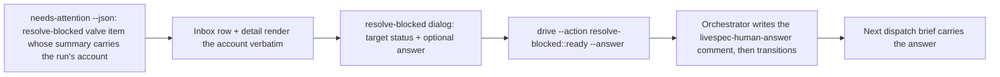

## Proposal: Render the orchestrator's needs-human account and carry the operator's answer through the resolve-blocked valve

### Target specification files

- SPECIFICATION/contracts.md

### Summary

Extend §"Needs-human as a ledger valve" so the console renders the run's account that the orchestrator's attention projection now carries in the valve item's summary (run, factory, why, what it reported, preserved ref, available actions), and extend the resolve-blocked command clause so the persisted `work_item.resolve_blocked_requested` command may carry an optional operator `answer` that the console passes to the orchestrator as `--answer`, rendering a refusal verbatim. No new attention kind; no attach route.

### Motivation

Orchestrator b3 landed on 2026-09-06 as two slices, and the console's consume of it is the console-owned clause the orchestrator's regroom record named for this plan (retire-overseer-and-redesign-control-plane-around-console, epic livespec-console-beads-fabro-pzbdbo, child pzbdbo.14). b3.S1 (bd-ib-aqith2, orchestrator PR #2168): `needs-attention --json` ENRICHES the existing `resolve-blocked:<id>:ready` valve item for a work-item resting at `blocked / needs-human` with the terminated run's own account — the fabro run id, the factory name and server, that it terminated at the needs_human node and routed the decision to this valve, WHY (the engine's reason), what it REPORTED (the run's prompt), whether the tree is preserved and on which ref, and the available actions (`resolve-blocked:<id>:ready`, `resolve-blocked:<id>:backlog`, or leave blocked). It introduces NO new attention kind, no attach route and no resume route: the enrichment is fail-soft, so an unreachable factory costs the account and never the valve. b3.S2 (bd-ib-uuohty, orchestrator PR #2200): `drive --action resolve-blocked:<id>:ready|backlog` accepts an optional `--answer`; before the transition the answer is poison-preflighted with the shared template-opener detector (a poisoned answer is REFUSED with nothing written) and then written as a ledger comment on the item whose body opens with the stable marker `livespec-human-answer (<invoker> via <source>, <at>, <action-id>):` followed by the answer verbatim; the next dispatch's goal brief renders that comment, so the answer reaches the FUTURE run rather than the terminated one. Until now the console's needs-human item showed a title and two bare valves — a decision with nothing to decide on (the maintainer's 2026-08-31 dogfooding transcript: 'dispatch menu item says not available' is the same class of blind verb). The console CONSUMES this surface (charter D2, the 2026-09-02 never-work-around ruling): it renders what the projection carries and it invokes the orchestrator's published action surface with the governed argv; it MUST NOT read the factory itself, MUST NOT synthesize the account, and MUST NOT offer an attach or resume command.

### Proposed Changes

1. In §"Needs-human as a ledger valve", after the sentence ending `sourced from `needs-attention --json` / `list-work-items --json`, never derived locally.`, insert:

`The projection's valve item for such an item carries, in its `summary`, the terminated run's ACCOUNT as the orchestrator composed it: the fabro run id, the factory name and server, that the run terminated at the needs_human node and routed the decision to this valve, why (the engine's reason), what the run reported (its prompt), whether the tree is preserved and on which ref, and the available actions. The console MUST render that summary verbatim on the item's inbox row and in its drilled-in detail, MUST NOT truncate the reason or the prompt to fit a row (a row MAY elide with an indicator that the detail holds the whole text), and MUST NOT compose, augment, or re-derive any part of the account itself -- in particular it MUST NOT inspect the factory, read the run, or scan console events to fill a field the projection left out. The account is fail-soft on the orchestrator's side: when the projection carries only the item's title, the console renders exactly that and the valves, and reports nothing about the run.`

2. In the same section, after the sentence `The console MUST NOT render, copy, or execute an attach handoff to a factory run for a needs-human item; there is no run to attach to.`, insert:

`The console's resolve-blocked dialog for such an item MUST offer an optional free-text ANSWER beside the target-status choice. An answer, when given, travels with the persisted command and is passed to the orchestrator's published action surface as that action's `--answer` argument; the orchestrator writes it as a ledger comment on the item (opening with the marker `livespec-human-answer` and the invoker, timestamp and action id) BEFORE the transition, and the next dispatch's brief carries it, so the answer reaches the future run. The console MUST NOT write that comment itself, MUST NOT edit or reword the operator's text, and MUST surface the orchestrator's refusal of a poisoned answer verbatim as the command's outcome, leaving the item blocked. After a successful resolve, the item's detail MUST show the answer comment as the projection or context surface returns it.`

3. In §"Commands" (the action-id mapping clause), change `work_item.resolve_blocked_requested` (payload `target_status` in {ready, backlog}) -> `resolve-blocked:<work-item-id>:ready|backlog`` to `work_item.resolve_blocked_requested` (payload `target_status` in {ready, backlog}; optional `answer`, a non-empty string) -> `resolve-blocked:<work-item-id>:ready|backlog`, with `--answer <answer>` appended to the orchestrator invocation when `answer` is present`.

4. Unchanged and reaffirmed: no attach or resume command for a needs-human item; run id and factory are read from `dispatch_fabro_run_id` / `dispatch_factory`; the orphaned-factory-runs lane is fed only by `reconcile-runs --dry-run --json`.

## Proposal: Scenario 32 -- The needs-human account is rendered and the operator's answer rides the resolve-blocked valve

### Target specification files

- SPECIFICATION/scenarios.md

### Summary

Add Scenario 32 after Scenario 31: the inbox row and detail render the orchestrator-composed account of the terminated run; the resolve-blocked dialog carries an optional answer as `--answer`; a poisoned answer's refusal is shown verbatim and the item stays blocked; a projection with no account renders title and valves only.

### Motivation

Orchestrator b3 landed on 2026-09-06 as two slices, and the console's consume of it is the console-owned clause the orchestrator's regroom record named for this plan (retire-overseer-and-redesign-control-plane-around-console, epic livespec-console-beads-fabro-pzbdbo, child pzbdbo.14). b3.S1 (bd-ib-aqith2, orchestrator PR #2168): `needs-attention --json` ENRICHES the existing `resolve-blocked:<id>:ready` valve item for a work-item resting at `blocked / needs-human` with the terminated run's own account — the fabro run id, the factory name and server, that it terminated at the needs_human node and routed the decision to this valve, WHY (the engine's reason), what it REPORTED (the run's prompt), whether the tree is preserved and on which ref, and the available actions (`resolve-blocked:<id>:ready`, `resolve-blocked:<id>:backlog`, or leave blocked). It introduces NO new attention kind, no attach route and no resume route: the enrichment is fail-soft, so an unreachable factory costs the account and never the valve. b3.S2 (bd-ib-uuohty, orchestrator PR #2200): `drive --action resolve-blocked:<id>:ready|backlog` accepts an optional `--answer`; before the transition the answer is poison-preflighted with the shared template-opener detector (a poisoned answer is REFUSED with nothing written) and then written as a ledger comment on the item whose body opens with the stable marker `livespec-human-answer (<invoker> via <source>, <at>, <action-id>):` followed by the answer verbatim; the next dispatch's goal brief renders that comment, so the answer reaches the FUTURE run rather than the terminated one. Until now the console's needs-human item showed a title and two bare valves — a decision with nothing to decide on (the maintainer's 2026-08-31 dogfooding transcript: 'dispatch menu item says not available' is the same class of blind verb). The console CONSUMES this surface (charter D2, the 2026-09-02 never-work-around ruling): it renders what the projection carries and it invokes the orchestrator's published action surface with the governed argv; it MUST NOT read the factory itself, MUST NOT synthesize the account, and MUST NOT offer an attach or resume command.

### Proposed Changes

Append after Scenario 31:

## Scenario 32 -- The needs-human account is rendered and the operator's answer rides the resolve-blocked valve



```gherkin
Feature: The console shows why a run gave up and lets the operator answer through the valve
  As an operator
  I want to read the terminated run's own account on the needs-human item and answer it where I resolve it
  So that the decision is informed and the answer reaches the next run, with the orchestrator owning every write

Scenario: The run's account is rendered verbatim on the row and in the detail
  Given a work-item resting at blocked / needs-human whose projected resolve-blocked valve item carries the run id, factory, why, what it reported, the preserved ref and the available actions in its summary
  When the console ingests the attention projection
  Then the inbox row renders that summary, eliding with an indicator only where the row cannot hold it
  And the drilled-in detail renders the whole summary
  And the console composes no part of the account from the factory or from console events

Scenario: An answer rides the resolve-blocked valve as --answer
  Given the operator opens resolve-blocked on that item, chooses ready, and types an answer
  When the operator confirms
  Then the console persists a work_item.resolve_blocked_requested command carrying target_status ready and the answer
  And invokes the orchestrator's published action surface with resolve-blocked:<work-item-id>:ready and --answer followed by the answer verbatim
  And never writes the ledger comment itself
  And the item's detail shows the livespec-human-answer comment as the projection returns it

Scenario: A poisoned answer is refused and the item stays blocked
  Given an answer the orchestrator's template-opener preflight refuses
  When the console invokes the action
  Then the command outcome shows the orchestrator's refusal verbatim
  And no comment and no transition are observed on the item

Scenario: A projection with no account renders title and valves only
  Given a needs-human item whose projected valve item carries only the item's title
  When the console renders it
  Then the row and detail show the title and the resolve-blocked and rework valves
  And nothing about the run is asserted
```

Register Scenario 32 in tests/heading-coverage.json as TODO until its tests land (the impl follow-up flips it).
