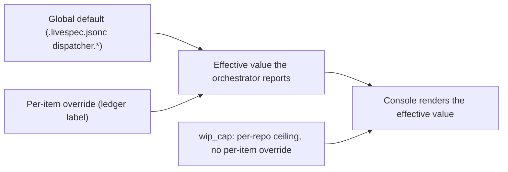
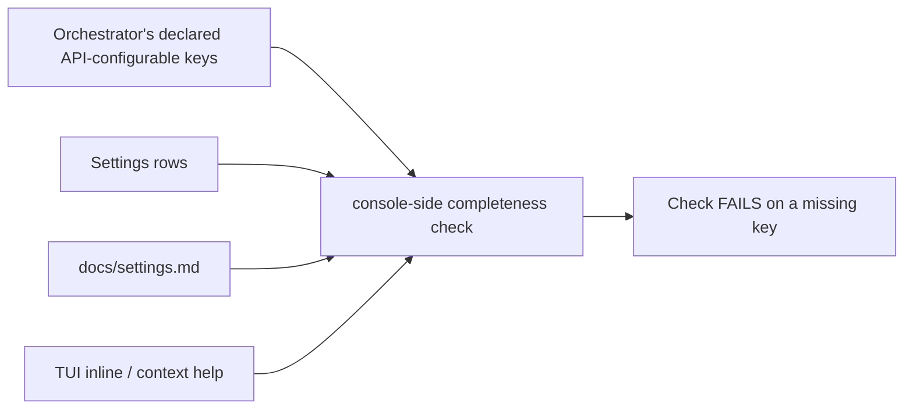
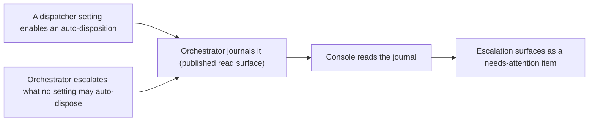

## Proposal: Retire Full Autonomous Mode; re-baseline the console onto the six orchestrator-owned dispatcher policy settings

### Target specification files

- SPECIFICATION/spec.md
- SPECIFICATION/contracts.md
- SPECIFICATION/constraints.md
- SPECIFICATION/scenarios.md
- tests/heading-coverage.json
- crates/console-spec-check/src/tests.rs

### Summary

Retire the console's **Full Autonomous Mode** contract surface -- the three `## ` sections (`spec.md` -> Full Autonomous Mode, `contracts.md` -> Autonomous Mode, `constraints.md` -> Autonomous-Mode Safety), the three `*autonomous_mode*` command names, the TUI autonomous-mode toggle with its type-to-confirm arming ceremony, and Scenarios 9 and 10 -- and re-baseline the console onto the **six independent `dispatcher.*` policy settings** the orchestrator ratified at its spec v034. The console **COMMANDS and OBSERVES** those settings and **holds no setting state of its own**: the orchestrator owns the `.livespec.jsonc` keys and the per-item ledger labels. Adds the per-setting write command; the per-item override valve (every setting EXCEPT `wip_cap`), which grows the Work-item Lifecycle vocabulary from five commands to **six**; the **factory-drain launcher argv** contract (the drain MUST pass the Dispatcher no per-run policy-arming argument); the consumer-side mechanical API-to-Settings-to-docs completeness check; and the rule that enabling a dangerous setting is an ORDINARY recorded settings write with no arming ceremony. Five new scenarios (9, 10, 14, 15, 16) bind every added clause; the retired clauses' scenarios are removed.

### Motivation

**Design record (recorded maintainer intent):** repo `thewoolleyman/livespec`, `plan/autonomous-mode/handoff.md` -- THE RE-LOCKED DESIGN. The sibling orchestrator repo `thewoolleyman/livespec-orchestrator-beads-fabro` ratified that design as its spec **v034**, which RETIRED "Full autonomous mode" outright and replaced it with six independent, orthogonal `dispatcher.*` policy settings, each a global default overridable per work-item by a ledger label -- except `wip_cap`, a per-repo concurrency ceiling for which a per-item value is structurally meaningless.

| Setting | Default | Per-item override? |
|---|---|---|
| `auto_approve_ready` | `false` | yes |
| `merge_on_review_cap` | `false` (escalate, NOT ship) | yes |
| `acceptance_mode` | `ai-then-human` | yes |
| `review_fix_cap` (inner, pre-merge) | `3` | yes |
| `acceptance_rework_cap` (outer, post-merge) | `2` | yes |
| `wip_cap` | `5` | **no** |

THIS repo's console spec still contracts the RETIRED mode. Left as-is it is not merely stale but **actively wrong**: it requires a `config.autonomous_mode_set` command writing a `dispatcher.autonomous_mode` key the orchestrator no longer reads, and a type-the-repo-name arming ceremony the orchestrator's ratified "Control surface and audit" section explicitly retires ("Enabling an individual dangerous setting is an ordinary Settings write, recorded like any other; it carries no type-the-repo-name arming ceremony").

The orchestrator's ratified text names **THREE** console surfaces that follow from the ownership split, and says *"the console MUST carry all three"*: (1) the per-setting write commands, (2) **the factory-drain launcher argv** (*"The console's factory-drain path invokes the Dispatcher `loop` with NO per-run policy flag … The launcher MUST NOT pass a policy-arming argument"*), and (3) ordinary recorded Settings writes. This proposal contracts all three. Surface (2) is a **distinct** obligation, not a corollary of the settings clauses: a per-run arming flag writes no setting, so no settings clause constrains it. The shipped code was already fixed, but the spec is what binds FUTURE code -- without this clause nothing would forbid reintroducing a policy-arming drain argument.

The console's ownership split is the orchestrator's ratified text, quoted: *"The orchestrator OWNS the setting state -- the `.livespec.jsonc` keys and the per-item ledger labels; the console only commands and observes, and holds no setting state of its own."* Today the console violates this: it writes `.livespec.jsonc` **directly** through `LivespecJsoncArmingPort` (`crates/console-application/src/lib.rs`). That port is non-conformant under the new contract and is deleted by the code child that follows this spec change; this proposal contracts the conformant END STATE, not the shipped one.

The completeness check's placement is forced by the **No-Circular-Dependency Directive**: a foundational/upstream repo must never read INTO a downstream consumer, so the check lives on the CONSUMER side (this repo), reading the orchestrator's declared key surface. The orchestrator's own ratified "API-configurable completeness" section says the same.

### Proposed Changes

Every replace-target below was verified to occur **verbatim, exactly once** in the live file at console `master` (`f48e0b7`) by mechanical string match. The whole change was then applied to a scratch worktree and validated: `just check` exits **0**, with `console-spec-check` reporting **behavioral coverage clean (0 unlinked, 0 untested)**.

#### A. `SPECIFICATION/spec.md`

**A.1 -- AMEND the `## Bounded Contexts` Configuration bullet** (it names the retired mode as a console-owned policy).

REPLACE:

```text
- **Configuration** -- registered repos, source endpoints, notification
  policy, adapter enablement, and autonomous-mode policy.
```

WITH:

```text
- **Configuration** -- registered repos, source endpoints, notification
  policy, adapter enablement, and the orchestrator's dispatcher policy
  settings.
```

**A.2 -- AMEND the `## Bounded Contexts` Work-item Lifecycle bullet.** This bullet enumerates the context's commands; the per-item override is a sixth member.

REPLACE:

```text
- **Work-item Lifecycle** -- the human-valve commands (approve / accept /
  reject) and the policy-edit commands (set-admission / set-acceptance),
  issued through the orchestrator's published `drive` action surface;
  observes the resulting lane transitions.
```

WITH:

```text
- **Work-item Lifecycle** -- the human-valve commands (approve / accept /
  reject) and the policy-edit commands (set-admission / set-acceptance),
  issued through the orchestrator's published `drive` action surface, plus
  the per-item dispatcher-setting override command, issued through the
  orchestrator's published per-setting override action; observes the
  resulting lane transitions.
```

**A.3 -- RETIRE the entire H2 section `## Full Autonomous Mode`** (from the heading through "...the console only enables, observes, and reflects it.") and REPLACE it with `## Dispatcher Policy Settings`. Its surviving substance is re-expressed: the plane-owns-the-decision rule becomes the orchestrator-owns-the-setting-state rule; the truly-unresolvable escalation floor becomes the escalation-surfacing rule; the "dangerous" labelling survives, but the arming ceremony does not.

REPLACEMENT (verbatim; line breaks are load-bearing -- `console-spec-check` derives each clause's gap-id from the **line** text, so re-wrapping this prose changes the gap-ids the co-edit in E pins):

```text
## Dispatcher Policy Settings

The Dispatcher's routine dispositions are governed by six orchestrator-owned
`dispatcher.*` policy settings -- `auto_approve_ready`, `merge_on_review_cap`,
`acceptance_mode`, `review_fix_cap`, `acceptance_rework_cap`, and `wip_cap`
(the ratified set: repo `thewoolleyman/livespec-orchestrator-beads-fabro`,
`SPECIFICATION/contracts.md`, its Dispatcher policy settings section; design
record: repo `thewoolleyman/livespec`, `plan/autonomous-mode/handoff.md`).
They are independent and orthogonal: no setting implies another, and there is
no master switch that arms several at once.

The orchestrator OWNS the setting state: the `dispatcher.*` keys in the repo's
`.livespec.jsonc` for the global defaults, and the per-item ledger labels for
the overrides. The console COMMANDS and OBSERVES those settings and holds NO
setting state of its own. It MUST derive every effective value it renders from
the orchestrator's published read surface, and MUST issue every write through
the orchestrator's published command surface; it MUST NOT write the
orchestrator's `.livespec.jsonc` keys or the per-item ledger labels itself.
Consistent with the Scope Boundary above, the console never owns the
orchestrator's policy semantics.

Five of the six settings admit a **per-item override**, which the console lets
the operator set against a single work-item. `wip_cap` is the sole exception:
it is a per-repo concurrency ceiling, so a per-item value is structurally
meaningless, and the console MUST NOT offer a per-item override for it. Where
an override exists the per-item value beats the global default, and an item
carrying no override inherits the global; the console renders the effective
value the orchestrator reports and MUST NOT re-derive that precedence itself.

Dispatch-time policy is read by the Dispatcher from those settings, never
armed per run by the console: the console's factory-drain path MUST invoke the
Dispatcher with no per-run policy-arming argument.

A setting whose non-default value lets the factory act without a human is
**dangerous**, and the console MUST label it "dangerous / use with caution"
wherever it is presented in any UI surface (TUI and future GUI/API). Enabling
one is nonetheless an ordinary recorded settings write: like every operator
command it MUST be recorded through the same command-plus-outcome-event path,
and the console MUST NOT gate it behind a type-the-repo-name acknowledgement
or any other arming ceremony. Every setting is revocable at any time by
writing it back.

The orchestrator journals every auto-disposition a setting enables -- an
auto-approve, an AI auto-accept, an AI-fail auto-rework, a ship-on-cap, or a
cap-exceeded escalation -- and escalates to a human every decision no setting
may auto-dispose. The console MUST read those auto-dispositions and
escalations from the orchestrator's published journal read surface, MUST
surface each escalation as a needs-attention item carrying its source
reference and next operator action, and MUST NOT drop, silently defer, or
fabricate a decision the orchestrator did not dispose.

The wire form of the settings surface -- the per-setting write command, the
per-item override command, the factory-drain launcher argv, and the mechanical
completeness check -- is in `contracts.md` -> Dispatcher Policy Settings; the
operator-observable safety constraints are in `constraints.md` ->
Dispatcher-Settings Safety.
```

#### B. `SPECIFICATION/contracts.md`

**B.1 -- AMEND the `## Command Handling` "Initial commands" list**: drop the three `*autonomous_mode*` names, add the two successor commands.

REPLACE:

```text
- `work_item.set_admission_requested`
- `work_item.set_acceptance_requested`
- `config.autonomous_mode_set`
- `factory.autonomous_mode_enable_requested`
- `factory.autonomous_mode_disable_requested`
```

WITH:

```text
- `work_item.set_admission_requested`
- `work_item.set_acceptance_requested`
- `work_item.set_dispatcher_override_requested`
- `config.dispatcher_setting_set`
```

**B.2 -- AMEND the "five `work_item.*` commands" paragraph to SIX.** After B.1 the list carries six `work_item.*` entries and B.3 assigns the new command to the SAME bounded context, so the vocabulary genuinely becomes six. Leaving the sentence at "five" would ratify a spec that contradicts itself six lines apart. The distinction it draws is still true and is preserved explicitly: exactly FIVE map 1:1 onto the orchestrator's published `drive` action-id surface; the sixth maps onto the per-setting override action instead.

REPLACE:

```text
The five `work_item.*` commands are the Work-item Lifecycle context's
vocabulary. Each maps 1:1 onto the orchestrator's published `drive`
action-id surface, and the console MUST issue them ONLY through that surface --
it never writes the ledger directly: `work_item.approve_requested` ->
`approve:<work-item-id>`; `work_item.accept_requested` ->
`accept:<work-item-id>`; `work_item.reject_requested` (payload `mode` in
{rework, regroom}) -> `reject:<work-item-id>:rework|regroom`;
`work_item.set_admission_requested` (payload `policy` in {auto, manual}) ->
`set-admission:<work-item-id>:<policy>`; `work_item.set_acceptance_requested`
(payload `policy` in {ai-only, human-only, ai-then-human}) ->
`set-acceptance:<work-item-id>:<policy>`. Approve is the human approval act --
the `pending-approval -> ready` transition -- and a policy edit never moves an
item between states (the no-surprise-transitions rule); these semantics and the
two policy-edit action ids are the orchestrator's ratified contract (repo
`thewoolleyman/livespec-orchestrator-beads-fabro`, `SPECIFICATION/contracts.md`,
its Work-item state semantics section and its `drive` action-id surface).
```

WITH:

```text
Six `work_item.*` commands form the Work-item Lifecycle context's vocabulary.
FIVE of them -- the human-valve and policy-edit commands -- each map 1:1 onto
the orchestrator's published `drive` action-id surface, and the console MUST
issue those five ONLY through that surface -- it never writes the ledger
directly: `work_item.approve_requested` ->
`approve:<work-item-id>`; `work_item.accept_requested` ->
`accept:<work-item-id>`; `work_item.reject_requested` (payload `mode` in
{rework, regroom}) -> `reject:<work-item-id>:rework|regroom`;
`work_item.set_admission_requested` (payload `policy` in {auto, manual}) ->
`set-admission:<work-item-id>:<policy>`; `work_item.set_acceptance_requested`
(payload `policy` in {ai-only, human-only, ai-then-human}) ->
`set-acceptance:<work-item-id>:<policy>`. Approve is the human approval act --
the `pending-approval -> ready` transition -- and a policy edit never moves an
item between states (the no-surprise-transitions rule); these semantics and the
two policy-edit action ids are the orchestrator's ratified contract (repo
`thewoolleyman/livespec-orchestrator-beads-fabro`, `SPECIFICATION/contracts.md`,
its Work-item state semantics section and its `drive` action-id surface). The
SIXTH command, `work_item.set_dispatcher_override_requested`, is not a `drive`
action-id command: it maps onto the orchestrator's published per-setting
override action (Dispatcher Policy Settings below), and the console MUST issue
it ONLY through that surface, never writing the ledger label directly.
```

**B.3 -- RETIRE the entire H2 section `## Autonomous Mode`** (from the heading through "...and MUST NOT fabricate success.") and REPLACE it with `## Dispatcher Policy Settings`, carrying two new H3s: `### Factory-drain launcher argv` and `### Settings-surface completeness`.

REPLACEMENT (verbatim; line breaks load-bearing, as in A.3):

```text
## Dispatcher Policy Settings

The console holds NO dispatcher-setting state of its own (see `spec.md` ->
Dispatcher Policy Settings). The single persistent record of each setting is
the orchestrator's own: the `dispatcher.*` keys in the repo's
`.livespec.jsonc` for the six global defaults, and the per-item ledger labels
for the overrides (repo `thewoolleyman/livespec-orchestrator-beads-fabro`,
`SPECIFICATION/contracts.md`, its Dispatcher policy settings section). The
console's Configuration context MUST derive each effective value by reading
the orchestrator's published read surface, and MUST NOT persist a second,
console-owned copy of any setting; an unreadable surface MUST degrade to a
named not-observed finding rather than an assumed value.

The six settings the console commands and observes are `auto_approve_ready`,
`merge_on_review_cap`, `acceptance_mode`, `review_fix_cap`,
`acceptance_rework_cap`, and `wip_cap`. The console MUST NOT hardcode that
list: it MUST read the orchestrator's published declaration of its
API-configurable keys, so a key the orchestrator adds needs no console spec
change to appear.

Settings are changed only through commands and recorded only through events:

- `config.dispatcher_setting_set` (context `configuration`) carries
  `{ "repo": "<repo-id>", "setting": "<dispatcher-key>", "value": <json> }`
  and sets ONE global default. It is a per-setting write: a single command
  MUST NOT change more than one setting, and the console MUST NOT offer an
  arming command that flips several settings at once. On acceptance the
  handler MUST effect the change through the orchestrator's published command
  surface and MUST append the audit event below, rather than writing the
  orchestrator's `.livespec.jsonc` itself.
- `work_item.set_dispatcher_override_requested` (context `work_item`) carries
  `{ "work_item_id": "<id>", "setting": "<dispatcher-key>", "value": <json> }`
  and sets, or with a null `value` clears, ONE per-item override. The handler
  MUST reject the command when `setting` is `wip_cap`, a per-repo concurrency
  ceiling that admits no per-item override. It MUST also reject
  `auto_approve_ready` and `acceptance_mode`, whose per-item overrides are the
  established `work_item.set_admission_requested` and
  `work_item.set_acceptance_requested` commands above, so that each
  overridable setting has exactly one console command; this command therefore
  serves `merge_on_review_cap`, `review_fix_cap`, and `acceptance_rework_cap`.
  It maps onto the orchestrator's published per-setting override action for
  that key, and the console MUST NOT write the ledger label directly.
- `config.dispatcher_setting.changed` and
  `work_item.dispatcher_override.changed` (contexts `configuration` and
  `work_item`) are the durable audit facts, each carrying the target repo or
  work-item id, the setting, its previous and new values, the requesting
  actor, and `occurred_at`.

Enabling a dangerous setting is an ordinary recorded settings write. It MUST
be recorded through the same command-plus-outcome-event path as any other
operator command, and its handler MUST NOT require a type-the-repo-name
acknowledgement or any other arming ceremony as a precondition of the write.

Both commands obey the honesty rule in Command Handling: a simulated or
unimplemented orchestrator port MUST surface a not-wired / not-observed
outcome (for example `config.dispatcher_setting.not_wired`) and MUST NOT
fabricate success.

The orchestrator journals every auto-disposition a setting enables and
escalates every decision no setting may auto-dispose. The console MUST read
both from the orchestrator's published journal read surface and MUST surface
each escalation as a needs-attention item; it MUST NOT re-derive an
escalation from any other source.

### Factory-drain launcher argv

Dispatch-time policy is NOT armed per run. The Dispatcher reads the
orchestrator-owned `dispatcher.*` settings for itself, so there is no per-run
policy flag to pass and its argument parser recognizes none. The console's
factory-drain path MUST therefore invoke the Dispatcher with NO policy-arming
argument; passing one would send an unrecognized argument and the run would
fail. This is a distinct obligation from the settings writes above: a per-run
flag writes no setting, so no settings clause constrains it.

### Settings-surface completeness

Every key the orchestrator declares as API-configurable MUST appear, in
lockstep, in three places: a row under the console's Settings surface, the
TUI's inline / context help for that row, and the console's settings doc
(`docs/settings.md`). A mechanical completeness check MUST fail when a
declared key is missing from the Settings surface or from the settings doc.

That check lives HERE, on the consumer side: it reads the orchestrator's
declared API-configurable-key surface and compares it against the console's
own Settings rows and settings doc. Per the No-Circular-Dependency Directive
the orchestrator MUST NOT read into the console, so this check MUST NOT be
placed upstream -- a foundational plane never reads into its consumer.
```

**B.4 -- AMEND the `## TUI Contract` "Required TUI views" list** -- add `Settings` as a first-class view (the maintainer-approved UX).

REPLACE:

```text
Required TUI views:

- needs-attention
- Spec
- Lanes
- Events
- Repos
```

WITH:

```text
Required TUI views:

- needs-attention
- Spec
- Lanes
- Events
- Repos
- Settings
```

**B.5 -- RETIRE the `## TUI Contract` autonomous-mode toggle paragraph** and REPLACE it with the Settings surface. **This paragraph is the load-bearing carrier of the retired type-to-confirm arming ceremony, and it also cross-references the DELETED heading `spec.md` -> Full Autonomous Mode -- a dangling reference if left.**

REPLACE:

```text
The TUI MUST expose an autonomous-mode toggle for the selected repo (see
`spec.md` -> Full Autonomous Mode). The toggle MUST render a "dangerous /
use with caution" label; enabling it MUST require an explicit
type-to-confirm modal before the console submits a
`config.autonomous_mode_set` command carrying `confirmed: true`, while
disabling it MUST NOT require confirmation. The header mode indicator
(fleet, mode, ingestion, Fabro summary) MUST reflect whether autonomous
mode is active for the selected repo.
```

WITH:

```text
The `Settings` view is the dispatcher-settings surface. It MUST offer a
`Dispatcher settings` sub-menu rendering one row per orchestrator-declared
setting -- Auto-approve ready, Merge on review cap, Acceptance mode, Review
fix cap, Acceptance rework cap, and WIP cap -- each row showing the effective
value the console observed and carrying context-specific inline help. A row
whose non-default value lets the factory act without a human MUST render a
"dangerous / use with caution" label. Editing a row MUST submit a
`config.dispatcher_setting_set` command for that one setting, and MUST NOT
require a type-to-confirm modal or any other arming ceremony. The header
indicator (fleet, dispatcher settings, ingestion, Fabro summary) MUST reflect
the effective dispatcher settings for the selected repo.
```

**B.6 -- AMEND the `## TUI Contract` "five human-valve and policy-edit commands" clause to SIX.** The per-item override is, in plain language, a policy edit driven from the TUI against the selected work-item; this clause is its natural home, so the per-item-override TUI obligation is stated HERE and is deliberately NOT restated in B.5 (that would duplicate it within one section).

REPLACE:

```text
The TUI MUST let the operator drive each of the five human-valve and
policy-edit commands -- approve, accept, reject, set-admission, and
set-acceptance -- against the selected work-item, each routed through the
shared orchestrator action port rather than any direct ledger write, and a
destructive reject gated behind an explicit confirmation step before the
command is submitted.
```

WITH:

```text
The TUI MUST let the operator drive each of the six Work-item Lifecycle
commands against the selected work-item -- the five human-valve and
policy-edit commands (approve, accept, reject, set-admission, set-acceptance)
plus the per-item dispatcher-setting override -- each routed through the
shared orchestrator action port rather than any direct ledger write, and a
destructive reject gated behind an explicit confirmation step before the
command is submitted. The override control MUST NOT be offered for `wip_cap`.
```

**B.7 -- AMEND the `## TUI Contract` default-screen mermaid diagram** so its Header and Left-navigation labels stop naming the retired mode. (Inside a fenced block, so no clause / gap-id impact.)

REPLACE:

```text
    Header["Header: fleet, mode, ingestion, Fabro summary"]
    Left["Left navigation\nneeds-attention / Spec / Lanes / Events / Repos"]
```

WITH:

```text
    Header["Header: fleet, dispatcher settings, ingestion, Fabro summary"]
    Left["Left navigation\nneeds-attention / Spec / Lanes / Events / Repos / Settings"]
```

#### C. `SPECIFICATION/constraints.md`

**C.1 -- RETIRE the entire H2 section `## Autonomous-Mode Safety`** (from the heading through "...published command surface." at end of file) and REPLACE it with `## Dispatcher-Settings Safety`, re-expressing each surviving operator-observable rail for the new model and adding the drain-argv rail.

REPLACEMENT (verbatim; line breaks load-bearing):

```text
## Dispatcher-Settings Safety

These constraints govern the operator-observable safety of the console's
dispatcher-settings surface (`spec.md` -> Dispatcher Policy Settings); its
wire form is in `contracts.md` -> Dispatcher Policy Settings.

- The console MUST hold no dispatcher-setting state of its own; it MUST derive
  every effective value from the orchestrator's published read surface, and
  MUST NOT write the orchestrator's `.livespec.jsonc` keys or the per-item
  ledger labels directly.
- A settings write MUST change exactly one setting; the console MUST NOT offer
  a command that arms several settings at once.
- Enabling a dangerous setting MUST be an ordinary recorded settings write: it
  MUST emit a durable audit event, and it MUST NOT be gated behind a
  type-the-repo-name acknowledgement or any other arming ceremony.
- The console MUST NOT offer a per-item override for `wip_cap`, a per-repo
  concurrency ceiling that admits none; for every other setting the console
  MUST render the effective value the orchestrator reports rather than one it
  re-derived from the global default.
- The console MUST NOT arm dispatch-time policy per run; the factory-drain
  path MUST pass the Dispatcher no policy-arming argument, leaving the
  Dispatcher to read the orchestrator-owned settings itself.
- The console MUST surface every orchestrator escalation as a needs-attention
  item, and MUST NOT drop, silently defer, or fabricate a decision the
  orchestrator did not dispose.
- Every settings write the console issues MUST be recorded through the same
  command-plus-outcome-event path as an operator-issued command; no console
  side effect MUST occur without an auditable command and outcome.
- The console MUST NOT reach around the orchestrator to write a setting the
  orchestrator owns; it MUST issue every write through the orchestrator's
  published command surface.
```

#### D. `SPECIFICATION/scenarios.md`

The `console-spec-check` gate (`crates/console-spec-check/src/lib.rs`) binds EVERY `MUST` / `MUST NOT` / `SHOULD` / `SHOULD NOT` clause in `spec.md`, `contracts.md`, and `constraints.md` to a live `scenarios.md` H2. So retiring a clause REQUIRES removing its scenario, and adding a clause REQUIRES adding one.

**D.1 -- REMOVE Scenarios 9 and 10 and REPLACE them in place** (`## Scenario 9 -- Enabling full autonomous mode is guarded and audited` and `## Scenario 10 -- Autonomous mode resolves the decidable and escalates the rest`, each with its mermaid + gherkin block). They scenario-ize the retired clauses and cannot survive them. The two replacements occupy the same slots, so numbering stays contiguous.

REPLACEMENT for both (verbatim; the scenario H2 NAMES are pinned by the gap-id co-edit in E and MUST land byte-for-byte -- **including the literal backticks around `wip_cap` in the Scenario 10 heading**):

~~~text
## Scenario 9 -- Operator sets a dispatcher policy setting from the console


```gherkin
Feature: Dispatcher settings are commanded, recorded, and observed
  As a LiveSpec operator
  I want to set each dispatcher policy setting from the console
  So that I can tune the factory's autonomy one dial at a time, with the orchestrator owning the setting state

Scenario: Setting one dial is an ordinary recorded write with no arming ceremony
  Given a registered repo whose dispatcher settings the console observed from the orchestrator
  When the operator edits the Auto-approve ready row in Settings > Dispatcher settings
  Then the TUI shows a "dangerous / use with caution" label on that row
  And the console persists a `config.dispatcher_setting_set` command carrying that one setting and its value
  And no type-to-confirm modal or other arming ceremony is required
  And the handler effects the write through the orchestrator's published command surface
  And appends a `config.dispatcher_setting.changed` audit event
  And never writes the orchestrator's `.livespec.jsonc` key itself

Scenario: The console holds no setting state of its own
  Given the orchestrator reports the effective value of every dispatcher setting
  When the console renders the Settings view
  Then every value shown is the effective value derived from the orchestrator's published read surface
  And the console persists no console-owned copy of any setting
  And an unreadable orchestrator surface degrades to a named not-observed finding rather than an assumed value

Scenario: A simulated orchestrator port surfaces not-wired rather than fabricating success
  Given the orchestrator command port is simulated or unimplemented
  When the operator edits a dispatcher setting row
  Then the console surfaces a not-wired / not-observed outcome
  And appends no event asserting a setting change it did not achieve
```

## Scenario 10 -- A per-item override beats the global default, except `wip_cap`



```gherkin
Feature: Per-item override valve
  As a LiveSpec operator
  I want to override a dispatcher setting for one work-item
  So that a single item can depart from the repo-wide default without changing it for everything

Scenario: A per-item override beats the global default for that item
  Given a repo whose global `merge_on_review_cap` default is false
  When the operator sets a per-item `merge_on_review_cap` override of true on one work-item
  Then the console persists a `work_item.set_dispatcher_override_requested` command
  And invokes the orchestrator's published per-setting override action through its port
  And the orchestrator reports that item's effective value as true while every unlabelled item still inherits false
  And the console renders the effective value the orchestrator reports rather than re-deriving the precedence

Scenario: wip_cap admits no per-item override
  Given a work-item selected in the console
  When a `work_item.set_dispatcher_override_requested` command names `wip_cap` as its setting
  Then the handler rejects the command because `wip_cap` is a per-repo concurrency ceiling
  And the TUI offers no per-item override control for `wip_cap`
  And no ledger label is written

Scenario: Each overridable setting has exactly one console command
  Given the five overridable settings are auto_approve_ready, acceptance_mode, merge_on_review_cap, review_fix_cap, and acceptance_rework_cap
  When the operator overrides admission or acceptance policy on a work-item
  Then the console uses the established `work_item.set_admission_requested` and `work_item.set_acceptance_requested` commands
  And a `work_item.set_dispatcher_override_requested` command naming auto_approve_ready or acceptance_mode is rejected
  And the remaining three settings are served by `work_item.set_dispatcher_override_requested`
  And the Work-item Lifecycle vocabulary is therefore six commands, five of them mapping 1:1 onto the orchestrator's `drive` action-id surface
```
~~~

**D.2 -- APPEND three new scenarios after Scenario 13** (end of file).

Scenario 16 is why the drain-argv clause earns its own scenario rather than binding to Scenario 2's entry: Scenario 2's registered test exercises a drain end-to-end but asserts nothing about the invocation argv, so binding the new clause there would satisfy the gate while claiming coverage that does not exist. Scenario 16 carries `test: "TODO"` and declares the pending tier honestly.

REPLACEMENT (verbatim; append after the Scenario 13 gherkin block, which ends the file):

~~~text
## Scenario 14 -- Settings surface stays in lockstep with the orchestrator's declared keys



```gherkin
Feature: API-configurable completeness
  As a console maintainer
  I want every orchestrator-declared setting to reach the operator
  So that a key added upstream can never be silently unreachable from the console

Scenario: A declared key missing from the Settings surface fails the check
  Given the orchestrator declares a dispatcher key the console's Settings surface does not render
  When the console-side completeness check runs
  Then the check fails and names the missing key

Scenario: A declared key missing from the settings doc fails the check
  Given the orchestrator declares a dispatcher key that `docs/settings.md` does not document
  When the console-side completeness check runs
  Then the check fails and names the missing key

Scenario: The check reads the producer and never the other way round
  Given the No-Circular-Dependency Directive forbids the orchestrator reading into the console
  When the completeness check runs
  Then it lives in this consumer repo and reads the orchestrator's declared API-configurable-key surface
  And the console does not hardcode the key list
  And no orchestrator-side check reads into the console
```

## Scenario 15 -- Orchestrator auto-dispositions and escalations reach the operator



```gherkin
Feature: Auto-dispositions and escalations are observed, never re-derived
  As an operator
  I want every machine disposition and every escalation to be visible in the console
  So that no auto-disposition is silent and no escalation is lost

Scenario: An auto-disposition is read from the orchestrator's journal
  Given a dispatcher setting enabled an auto-approve, an AI auto-accept, an AI-fail auto-rework, a ship-on-cap, or a cap-exceeded escalation
  When the console ingests the orchestrator's published journal read surface
  Then the console reflects that auto-disposition through its own event path
  And attributes it to the setting that governed it

Scenario: An escalation the orchestrator did not dispose reaches the operator
  Given the orchestrator escalated a decision no setting may auto-dispose
  When the console ingests the orchestrator's published journal read surface
  Then the escalation appears as a needs-attention item with its source reference and next operator action
  And the console neither drops, silently defers, nor fabricates the decision
  And the console does not re-derive the escalation from any other source
```

## Scenario 16 -- Factory drain passes the Dispatcher no policy-arming argument


```gherkin
Feature: Dispatch-time policy is never armed per run
  As a LiveSpec operator
  I want the factory-drain launcher to pass no policy flag
  So that dispatch-time policy comes only from the orchestrator-owned settings, and a drain can never be armed behind the settings surface

Scenario: The drain launcher passes no policy-arming argument
  Given a repo whose dispatcher policy settings live in the orchestrator's `.livespec.jsonc`
  When the operator requests a factory drain and the console invokes the Dispatcher through its drain port
  Then the invocation carries no per-run policy-arming argument
  And the Dispatcher reads the `dispatcher.*` settings for itself
  And the console arms no dispatch-time policy of its own

Scenario: A per-run policy flag is not a settings write
  Given the console's settings surface writes exactly one `dispatcher.*` setting per command
  When a drain is launched
  Then no settings write is issued as part of the launch
  And no policy-arming argument is substituted for one
```
~~~

#### E. `tests/heading-coverage.json` (CO-EDIT -- REQUIRED, atomic with the accept)

Per the revise co-edit discipline, `tests/heading-coverage.json` MUST be updated in the SAME revise commit. In the revise payload its `resulting_files[]` path MUST be spelled **`../tests/heading-coverage.json`** (the wrapper joins `spec_target / path`, and `--spec-target` is the `SPECIFICATION/` tree; a bare `tests/heading-coverage.json` would wrongly resolve to `SPECIFICATION/tests/heading-coverage.json`).

**BACKTICK FOOTGUN -- read before writing the JSON.** The Scenario 10 H2 contains a LITERAL backtick pair around `wip_cap`. The registry's `scenario` string MUST carry those literal backticks, or the clause->scenario link does not resolve and the accept commit fails the gate. In JSON the value is exactly:

```json
"scenario": "Scenario 10 -- A per-item override beats the global default, except `wip_cap`"
```

Backticks are NOT JSON escapes and MUST NOT be escaped or stripped.

This registry is **scenario-keyed** in this repo (entries carry `scenario` / `scenario_file` / `test` / `reason` / `clauses[]`), NOT heading-keyed as in livespec core. Each `clauses[]` element is `{"gap_id": "<id>", "scenario": "<the entry's own scenario name>"}`. The co-edit has three parts.

**E.1 -- REMOVE 2 entries.** `Scenario 9 -- Enabling full autonomous mode is guarded and audited` (18 clauses) and `Scenario 10 -- Autonomous mode resolves the decidable and escalates the rest` (17 clauses). Their 35 clause gap-ids die with the retired clauses.

**E.2 -- AMEND the existing `Scenario 11` entry in place.** B.2 and B.6 REWORD two clause lines that Scenario 11's entry already binds, so their gap-ids change. Keep its `test`; drop the two dead ids, add the reworded one:

- **DROP** `gap-zs4i5kyr` (the old Command Handling "console MUST issue them ONLY through that surface" line, reworded by B.2) and `gap-k4foxdbq` (the old TUI "drive each of the five human-valve" line, reworded by B.6).
- **KEEP** `gap-7hcn45eu` (the Command Handling honesty-rule line -- B.2's replace-target ends before it, so it is untouched).
- **ADD** `gap-ynlyhqcv` -- B.2's reworded five-map-1:1-onto-`drive` line. It stays on Scenario 11, which its three built tests still fully cover.
- The reworded TUI clause (`gap-3htwrn56`) does **NOT** return to Scenario 11. It now names SIX commands, and the sixth (override) scene has no test, while Scenario 11's `reason` asserts it is *fully covered* by three built tests. Binding it there would fabricate coverage. It binds to Scenario 10 (E.3), whose `test: "TODO"` declares the pending tier honestly. Extend Scenario 11's `reason` to record this rebinding.

**E.3 -- ADD 5 entries** (`scenario_file: scenarios.md`, `test: "TODO"` + a `reason` naming the pending top-of-pyramid / integration tier -- the gate accepts a `TODO` only when its `reason` acknowledges that tier), binding the remaining new gap-ids. Entry count goes **22 -> 25**.

The exact gap-ids, harvested by running the real `console-spec-check` binary against the applied change (NOT hand-derived) -- **58** newly-bound clauses in total (57 across the five new entries plus `gap-ynlyhqcv` on Scenario 11):

`Scenario 9 -- Operator sets a dispatcher policy setting from the console` -- **30** clauses:

```text
gap-mrb6qt3j  gap-zzj6x5wp  gap-xf6id2f2  gap-i3ypmoz6  gap-rtoyduos  gap-cyyevbtp
gap-z6errbm6  gap-acibjyuw  gap-ihvvtnr4  gap-hz7dbvls  gap-dayqffnt  gap-ih7hpoyh
gap-xol76tyx  gap-xefflyiy  gap-nekc3fo7  gap-lrmpoqgc  gap-gbxhbvh6  gap-miiy3rcc
gap-r4n3sljc  gap-xwwcbmms  gap-eoe6ihj2  gap-3o7imlnk  gap-bg7ur253  gap-bs4rorjt
gap-oustmuv6  gap-p52alykh  gap-5cjdnlb4  gap-yyevgtzl  gap-vmx3esw4  gap-vdunlnsq
```

`Scenario 10 -- A per-item override beats the global default, except \`wip_cap\`` -- **10** clauses:

```text
gap-6i3hqmed  gap-43ukcnwy  gap-j4myhnt3  gap-xudwpvfd  gap-i77hwadv
gap-lujqie6j  gap-3htwrn56  gap-cfmnxsdp  gap-6mqderrp  gap-xdltweos
```

`Scenario 14 -- Settings surface stays in lockstep with the orchestrator's declared keys` -- **5** clauses:

```text
gap-u5dlygw2  gap-qgh3bive  gap-qjcrfd64  gap-yfezurch  gap-di4d5msq
```

`Scenario 15 -- Orchestrator auto-dispositions and escalations reach the operator` -- **8** clauses:

```text
gap-34qvabhn  gap-h5nbb7fk  gap-dumhd5mg  gap-cr2zwgfl
gap-4c2sd2bd  gap-n7i5m6ya  gap-pibyrz3e  gap-gi26n6eq
```

`Scenario 16 -- Factory drain passes the Dispatcher no policy-arming argument` -- **4** clauses:

```text
gap-xgf6bv6m  gap-zsdfhxxn  gap-pictmulm  gap-qpuhrnoh
```

A gap-id is a pure function of (`spec_file`, `heading_path`, `line_text`) -- the **line**, not the sentence. So **any re-wrapping of the prose in A.3 / B.2 / B.3 / B.5 / B.6 / C.1 invalidates these ids**, and the revise pass must then re-harvest them by re-running `just check-behavior-coverage` and reading the reported ids. Landing the replacement text byte-for-byte keeps them valid as listed.

The two retired Rust tests (`scenario_9_autonomous_mode.rs`, `scenario_10_autonomous_run.rs`) still COMPILE and PASS after the accept -- they exercise the shipped autonomous-mode code, which this spec change does not delete. Removing their registry entries breaks nothing; the code child that follows deletes both the code and the tests.

#### F. `crates/console-spec-check/src/tests.rs` (CO-EDIT -- REQUIRED, atomic with the accept)

**This second co-edit is easy to miss and WILL fail the accept if omitted.** The test `extract_rules_matches_real_spec_ground_truth` pins the live spec's per-file normative-clause counts. This change moves them, so the accept must refresh them in the SAME commit (the same lockstep the v017 C1 revision performed at `8aa5d54`, and that the v018 proposal recorded).

REPLACE the pinned counts and the total WITH:

| File | Before | After |
|---|---|---|
| `spec.md` | 15 | 15 (net unchanged: the retired section's clauses are replaced 1-for-1 plus the drain sentence) |
| `contracts.md` | 39 | **57** |
| `constraints.md` | 19 | **22** |
| `non-functional-requirements.md` | 52 | 52 (unchanged) |
| **total** | **125** | **146** |

These are MEASURED against the applied change, not predicted. Extend the ground-truth comment above the counts with the W2 line, matching the existing convention of recording each revision's delta. In the revise payload spell this path **`../crates/console-spec-check/src/tests.rs`** (same `spec_target / path` join rule as E).

### Verification performed

The complete change -- A through F -- was applied to a scratch worktree at console `master` (`f48e0b7`) and validated, then reverted:

1. **Replacement-target fidelity.** All 13 replace-targets matched **verbatim, exactly once** by mechanical string count (a match count other than 1 aborted the run). Line anchors from any earlier commit were NOT trusted.
2. **`console-spec-check`**: `behavioral coverage clean (0 unlinked, 0 untested)`. The 58 gap-ids in E are the binary's own reported ids, not hand-derived.
3. **Full `just check`: EXIT 0** -- including `check-doctor-static` (which would surface any dangling cross-reference to a deleted heading), `check-clippy`, `check-test`, `check-nextest`, `check-coverage`, and `check-arch`.
4. **Drift sweep** by reading, not only grepping, across `spec.md`, `contracts.md`, `constraints.md`, and `scenarios.md`. After the change, ZERO references to the retired mode remain in the four operator-facing spec files.

This proposal is inert and changes no behavior.

### Flagged for the maintainer at accept

Two consequences of this design that are NOT blockers and are NOT being changed here, but should be decided knowingly at accept rather than discovered later:

1. **Clear-to-inherit asymmetry.** `work_item.set_dispatcher_override_requested` clears a per-item override with a null `value`, restoring inherit-from-global. The established `set-admission:` / `set-acceptance:` action ids offer no label REMOVAL, so two of the five overridable settings (`auto_approve_ready`, `acceptance_mode`) can never be un-overridden back to inherit-global FROM THE CONSOLE once set. The orchestrator's ratified text does not require clearability, so this conforms -- but it is an asymmetry in the override valve, and closing it would need an orchestrator-side action-id addition, not a console change.

2. **A semantic change, not a rename.** The retired contract said *"an absent key MUST be treated as disabled"* -- the console assumed a safe value when the orchestrator key was missing. The replacement says an unreadable surface MUST degrade to a **named not-observed finding** rather than an assumed value. This is correct under the ownership split (the console no longer owns the setting, so it must not invent one) and it matches the console's existing honesty rule, but it is a behavior change: the console now reports "I could not read this" where it previously reported "disabled".

### Notes for the revise pass

- **One coherent change.** The retirement and the replacement are inseparable -- a single revise decision on the `console-dispatcher-settings-rebaseline` topic. Accepting only the retirement would leave 35 clauses unlinked and the gate red.
- **`resulting_files[]` MUST carry SIX paths**: the four spec files, plus `../tests/heading-coverage.json` (E) and `../crates/console-spec-check/src/tests.rs` (F). Omitting either co-edit fails `just check` at the revise commit.
- **The recurring error class in this design is a blanket claim falsified by a per-item label or a non-default value.** Every universal statement here was checked against it. `wip_cap` is the ONE setting with no per-item override, so a blanket "every setting is per-item overridable" is FALSE and is never written; the spec says "five of the six".
- **Command-vocabulary shape (reviewed and upheld).** One parameterized global-write command plus one parameterized per-item-override command (rather than six of each) keeps the surface from drifting every time the orchestrator adds a key -- which is exactly what the completeness check in B.3 forbids. The two established `set_admission` / `set_acceptance` commands are retained unchanged as the per-item override for `auto_approve_ready` / `acceptance_mode`, because they already map 1:1 onto the orchestrator's published `drive` action-id surface; the new override command therefore rejects those two keys, so each overridable setting has exactly ONE console command. Every setting maps to exactly one command, and no overridable setting maps to none.
- **`docs/settings.md` does not exist yet** -- there is no `docs/` directory in this repo. The settings doc is created by the code child that implements the Settings surface; naming the path here is what makes the completeness check in B.3 mechanically decidable.
- The exact per-item label strings, the orchestrator's declared-key transport, and the completeness check's internals are implementation mechanism (architecture-not-mechanism): this spec fixes the ownership split, the command contract, the override valve and its one exception, the drain-argv prohibition, the no-ceremony rule, and the check's consumer-side placement -- not the wire encoding.
