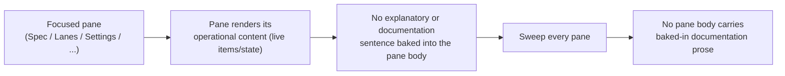

## Proposal: Panes render operational content only, no baked-in documentation prose

### Target specification files

- SPECIFICATION/contracts.md
- SPECIFICATION/scenarios.md
- tests/heading-coverage.json

### Summary

The console TUI's pane bodies MUST render operational content only — the live
data and state an operator acts on — and MUST NOT carry baked-in explanatory or
documentation prose describing what the console is, how a projection is derived,
or how a view behaves; any such explanation belongs in the user documentation,
not the live panes. Today several panes render useless explanatory sentences
INSIDE the pane body, wasting the limited pane space. Adds a §"TUI Contract"
clause, a new Scenario 21, and the tests/heading-coverage.json co-edit
registering the new scenario.

### Motivation

The console TUI currently bakes explanatory documentation sentences into its
pane BODIES — for example "Spec lifecycle status is projected from LiveSpec
adapter observations." and "Revise-required events stay visible in the Spec view
until resolved." These sentences describe what the console is or how a
projection is derived; they are documentation, not operational content, and they
consume the limited pane space an operator needs for the live data and state
they are actually acting on. A pane body should carry OPERATIONAL content only —
the live items and state — and any genuinely-useful explanation belongs in the
user documentation, where an operator can read it deliberately, not baked into
the running panes. Capturing this spec-first with a scenario and a declared impl
commitment before implementation, per the livespec workflow. The behavior (pane
bodies render operational content only and carry no baked-in explanatory or
documentation prose) is specified; the exact sentences removed and the exact
operational content each pane renders are left as an implementation detail. The
RELOCATION of the removed explanation into the user documentation tree is a
SEPARATE deliverable (B6) and is out of scope here; this change specifies only
the constraint that pane bodies carry no baked-in documentation prose.

### Proposed Changes

--- CHANGE 1: SPECIFICATION/contracts.md, §"TUI Contract" ---
ADD the following as a new paragraph, inserted immediately AFTER the existing top/header-pane focus + horizontal-scroll paragraph (the B3 clause, which ends "...and snaps back to its left-justified default on blur.") and BEFORE the paragraph beginning "The TUI MUST let the operator drive each of the eight Work-item Lifecycle commands against the selected work-item". The B3 anchor paragraph reads verbatim:

"The TUI's top/header pane MUST be focusable within the pane focus cycle: the operator MUST be able to move focus onto it as onto any other pane. While the top/header pane holds focus, it MUST support HORIZONTAL scrolling to reveal content clipped at the current viewport width — content cut off on a narrow viewport MUST become reachable by scrolling the pane left and right while it is focused. When focus moves away from the top/header pane (on blur), the pane MUST return to its default left-justified position rather than remaining mid-scroll. The specific key bindings, scroll step, and column counts are an implementation detail; the contract is that the top/header pane joins the focus cycle, scrolls horizontally to reveal clipped content while focused, and snaps back to its left-justified default on blur."

Verbatim text to add (a SINGLE unwrapped physical line — see the ground-truth note under CHANGE 3):

"The TUI's pane bodies MUST render operational content only — the live data and state an operator acts on — and MUST NOT carry baked-in explanatory or documentation prose describing what the console is, how a projection is derived, or how a view behaves; any such explanation belongs in the user documentation, not the live panes. What operational content each pane renders is an implementation detail; the contract is that a pane body carries operational content only, with no explanatory or documentation sentences baked into it."

--- CHANGE 2: SPECIFICATION/scenarios.md ---
APPEND a new scenario section after Scenario 20 (which ends at end-of-file, with the closing ` ``` ` fence of its gherkin block). Verbatim:

## Scenario 21 -- Operator sees panes render operational content only, no baked-in documentation prose



```gherkin
Feature: Panes render operational content only, no baked-in documentation prose
  As a LiveSpec operator
  I want the TUI panes to show only the live operational content I act on, not explanatory documentation sentences
  So that the limited pane space carries the state I need, and any explanation lives in the user documentation where I can read it deliberately

Scenario: A pane renders its operational content without an explanatory documentation sentence
  Given the operator has a pane focused (for example the Spec pane)
  When the pane is rendered
  Then the pane body shows only its operational content -- the live items and state the operator acts on
  And the pane body carries no explanatory or documentation sentence describing what the console is or how the view is derived

Scenario: A sweep of every pane finds no baked-in documentation prose
  Given the console TUI is rendered across all of its panes
  When every pane body is examined
  Then no pane body contains a baked-in explanatory or documentation sentence
  And documentation sentences such as "Spec lifecycle status is projected from LiveSpec adapter observations." and "Revise-required events stay visible in the Spec view until resolved." do not appear in any pane body

Scenario: Explanatory content belongs in the user documentation, not the live panes
  Given a genuinely useful explanation of how a view behaves
  When the console is rendered
  Then that explanation does not appear baked into any pane body
  And it belongs in the user documentation instead
```

--- CHANGE 3: tests/heading-coverage.json (co-edit performed at REVISE time, described here) ---
At revise/accept time, when Scenario 21 becomes a live `## ` heading in scenarios.md, add a coverage entry for it so console-spec-check (which requires every live scenario to carry a non-empty test registration) stays green. Following the file's existing `test: "TODO"` pattern (e.g. the Scenario 20 entry), append this entry (path spelled `../tests/heading-coverage.json` in the revise `resulting_files[]` so the wrapper's `spec_target / path` join resolves it to the project-root file `tests/heading-coverage.json`):

{
  "scenario": "Scenario 21 -- Operator sees panes render operational content only, no baked-in documentation prose",
  "scenario_file": "scenarios.md",
  "test": "TODO",
  "reason": "Pending top-of-pyramid acceptance test for panes rendering operational content only with no baked-in documentation prose: a pane renders its operational content (live items/state) without any explanatory documentation sentence; a sweep of every pane finds no baked-in documentation prose (for example the sentences 'Spec lifecycle status is projected from LiveSpec adapter observations.' and 'Revise-required events stay visible in the Spec view until resolved.' do not appear in any pane body); and explanatory content belongs in the user documentation, not the live panes. Tier: top-of-pyramid acceptance, under crates/console-cli/tests/. Owed by the tui-panes-no-doc-prose impl follow-up; the new §\"TUI Contract\" panes-operational-content-only clause binds here.",
  "clauses": []
}

NOTE — lockstep co-edits the REVISE step MUST perform (this repo's `check-behavior-coverage` + `console-spec-check` ground-truth gates fail the MOMENT the new MUST/MUST-NOT clause lands at revise time, NOT at impl time; the B2 revision `78be28c` and the B3 revision established this exact precedent):

(a) Clause linkage. The `clauses: []` above is a PLACEHOLDER. The revise step derives the gap-id for the B5 panes-operational-content-only TUI-Contract clause (the gap-id is a deterministic function of the final line's `(spec_file, heading_path, line_text)` via `derive_gap_id`) and links it into the Scenario 21 entry's `clauses` array, e.g.:

  "clauses": [
    {
      "gap_id": "<newly-derived-gap-id>",
      "scenario": "Scenario 21 -- Operator sees panes render operational content only, no baked-in documentation prose"
    }
  ]

This repo's ratification-time clause-link gate requires the entry to bind the newly-derived clause (the "clauses filled at impl time" assumption does NOT hold here — B2 hit exactly this and had to link its gap at revise time).

(b) Ground-truth clause-count bump. CHANGE 1 adds exactly ONE normative clause to contracts.md §"TUI Contract". The revise step MUST land CHANGE 1's clause as ONE UNWRAPPED physical line (quotes stripped): `console-spec-check`'s `extract_rules` emits exactly one `RuleMatch` per physical line carrying a rule keyword, so a single physical line bearing both `MUST render` and `MUST NOT carry` counts as +1, whereas hard-wrapping the clause across two lines would inflate the count by +2. The revise step MUST bump the console-spec-check ground-truth counts in `crates/console-spec-check/src/tests.rs` accordingly: `contracts.md` 72 -> 73 and the total 161 -> 162 (leaving `spec.md` 15, `constraints.md` 22, and `non-functional-requirements.md` 52 unchanged), and update the adjacent explanatory comment to note the B5 panes-operational-content-only clause (mirroring the B3 comment block). The current ground-truth at origin/master (`c6b1c1c`) is verified as `("contracts.md", 72)` / `total, 161`; the target is `73` / `162`.

This propose-change lists tests/heading-coverage.json in the target specification files so the revise co-edit and the accompanying ground-truth bump are not forgotten.
