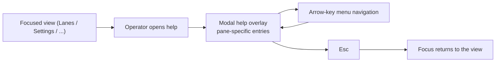

## Proposal: Pane-specific modal help overlay

### Target specification files

- SPECIFICATION/contracts.md
- SPECIFICATION/scenarios.md
- tests/heading-coverage.json

### Summary

The TUI's in-app help MUST be a pane-specific modal overlay — content scoped to the focused view, a menu navigated by arrow keys, and Esc as the only dismissal — not the current always-dismissible render_help_overlay. Adds a §"TUI Contract" clause, a new Scenario 18, and the tests/heading-coverage.json co-edit binding the clause to the scenario.

### Motivation

Maintainer-declared requirement (2026-07-18): the docs/help surface must be a proper modal — pane-specific, menu + arrow-key navigation, exit ONLY with Esc. The shipped console help overlay does not meet this (not menu-driven, not Esc-only-modal). Capturing it spec-first with a scenario and a declared impl commitment before implementation, per the livespec workflow.

### Proposed Changes

--- CHANGE 1: SPECIFICATION/contracts.md, §"TUI Contract" ---
ADD the following as a new paragraph, inserted immediately AFTER the existing paragraph that begins "The default view MUST be needs-attention. Navigation SHOULD use arrow-driven selection lists..." (currently around line 575-578) and BEFORE the paragraph beginning "The `Settings` view is the dispatcher-settings surface." Verbatim text to add:

"The TUI MUST present its in-app help as a pane-specific modal overlay. Help invoked from a view MUST open an overlay whose entries are scoped to the currently-focused view/pane — the help shown on `Lanes` differs from the help shown on `Settings` — and MUST expose those entries as a menu navigable by arrow keys. While the overlay is open it is modal: it holds input focus, the underlying view neither switches nor scrolls, and it MUST close ONLY on `Esc` — no other key, command, valve, or view-switch dismisses it. This pane-specific modal help is the console's primary help surface across all views; it is in addition to, and does not remove, the per-row inline help the `Settings` view carries."

--- CHANGE 2: SPECIFICATION/scenarios.md ---
APPEND a new scenario section after Scenario 17 (which ends around line 607). Verbatim:

## Scenario 18 -- Operator opens pane-specific modal help and exits only with Esc



```gherkin
Feature: Pane-specific modal help overlay
  As a LiveSpec operator
  I want help whose content is specific to the pane I am on, navigated by a menu and arrow keys and dismissed only by Esc
  So that I get contextual guidance without losing my place or leaving help by accident

Scenario: Help content is specific to the focused pane
  Given the operator is on the Lanes view
  When the operator opens the help overlay
  Then the overlay lists help entries scoped to the Lanes view
  And opening the help overlay on the Settings view lists different, Settings-scoped entries

Scenario: The help overlay is a menu navigated by arrow keys
  Given the help overlay is open
  When the operator presses the arrow keys
  Then the selection moves among the overlay's help entries
  And the selected entry's content is shown

Scenario: The help overlay is modal and exits only on Esc
  Given the help overlay is open
  When the operator presses any key other than Esc
  Then the overlay stays open and the underlying view neither switches nor scrolls
  When the operator presses Esc
  Then the overlay closes and focus returns to the view the operator was on
```

--- CHANGE 3: tests/heading-coverage.json (co-edit performed at REVISE time, described here) ---
At revise/accept time, add a coverage entry for the new heading "Scenario 18 -- Operator opens pane-specific modal help and exits only with Esc" following the file's existing pattern, and bind the new §"TUI Contract" modal-help clause to Scenario 18. This propose-change lists tests/heading-coverage.json in target_spec_files so the revise co-edit is not forgotten.
