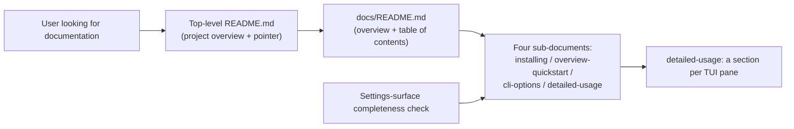

## Proposal: User-facing documentation lives in a docs/ tree with the README as a pointer

### Target specification files

- SPECIFICATION/contracts.md
- SPECIFICATION/non-functional-requirements.md
- SPECIFICATION/scenarios.md
- tests/heading-coverage.json

### Summary

The console's user-facing documentation MUST live under a `docs/` tree at the repository root — `docs/README.md` an overview plus table of contents only, with the substantive documentation in four named sub-documents covering installation, overview/quick start, environment variables + CLI options + sub-commands, and detailed usage with a section per TUI pane — and the top-level `README.md` MUST NOT carry user-facing documentation of its own beyond a project overview and a pointer into that tree. Because the console's settings doc is today PINNED to the top-level `README.md` by the Settings-surface completeness section (ratified as v024 'settings-doc-is-readme'), this change also RELOCATES that anchor: the settings doc MUST become `docs/detailed-usage.md`. Adds a new contracts.md 'User Documentation Contract' section (+3 normative clauses), re-words the Settings-surface completeness doc-anchor line, WIDENS the non-functional-requirements.md Boundary enumeration so contracts.md's declared scope admits documentation-surface contracts (making the placement rule-backed rather than ad hoc), amends Scenario 14's `README.md` references, adds Scenario 22, and co-edits tests/heading-coverage.json (a new Scenario 22 entry plus TWO clause re-links the re-worded lines force).

### Motivation

The console's user-facing documentation is today a single 297-line top-level `README.md` that interleaves the project overview, install instructions, a full TUI usage manual, the dispatcher-settings reference, and contributor-only build/development notes. That single file is the wrong shape for a shipped operator tool: a user looking for how to install the binary, how to launch the TUI, what each pane does, or what a given environment variable means has to scroll past contributor material to find it, and a maintainer updating one pane's documentation has to edit the same file that carries the release and development notes. Worse, that README has drifted badly from the shipped binary — a source-grounded audit found at least sixteen concrete contradictions, including a Help overlay described as a per-view toggle when it is a navigable eight-section modal, two focusable panes described when there are four, a drain invocation that no longer matches, six environment variables omitted entirely, and a `--repo` argument documented as carrying a repo id when it carries a filesystem path. The B1-B5 cockpit-UX behaviors have now landed (context-specific Status-line hints, a focusable horizontally-scrollable top pane, a navigable modal Help overlay, and panes that render operational content only), and the B5 change explicitly RELOCATED the explanatory prose stripped from the TUI panes into 'the user documentation' — a surface no ratified clause, scenario, or file in the spec tree defines. Authoring that tree now, with the TUI settled, is what makes the relocated explanation reachable and closes the normative pointer v028 left dangling. This proposal specifies the documentation SHAPE (a `docs/` tree, a pointer README, an overview-plus-TOC index, and four named sub-documents) so the layout is spec-anchored rather than convention, and so the mechanical settings-doc completeness gate has a concretely-named surface to read — the gate needs one path constant, so a contract that declined to name the file would leave it unanchored. It deliberately SUPERSEDES the earlier ratified decision that the settings doc IS the top-level `README.md` (v024, 'settings-doc-is-readme'): that decision's own ratifying proposal justified it on the grounds that 'there is no `docs/` directory in this repo', a premise this change removes. Placement note: the Boundary section of non-functional-requirements.md today enumerates contracts.md's scope as operator-facing WIRE contracts, which would not obviously admit a documentation-tree layout. Rather than leave the placement silently contradicting ratified spec text, this proposal WIDENS that enumeration to admit documentation-surface contracts, keeping all three new clauses cohesively beside the Settings-surface completeness machinery they re-anchor. The proposal specifies WHERE user documentation lives and WHAT each sub-document covers; the exact headings, wording, and authored prose are an implementation detail. The key-by-key lifecycle walkthrough (B7) and the de-gating of the download-install instructions (B8) are SEPARATE deliverables and are out of scope here. In-flight-survey note: no `spec/*` remote branches and no open spec-touching pull requests exist, so this proposal has no concurrent in-flight spec design to align with, accommodate, or supersede.

### Proposed Changes

NOTATION. Throughout this proposal, a block introduced as VERBATIM is delimited by surrounding double quotes that are FRAMING ONLY: they are stripped when the text lands in the spec file. Every character between them is literal, and no backslash-escape convention is in play — there are no escaped quotes anywhere in this proposal, and none may land in the spec.

--- CHANGE 1: SPECIFICATION/contracts.md, Settings-surface completeness section ---
REPLACE the section's first paragraph, which today reads VERBATIM (FIVE physical lines, contracts.md:561-565):

"Every key the orchestrator declares as API-configurable MUST appear, in
lockstep, in three places: a row under the console's Settings surface, the
TUI's inline / context help for that row, and the console's settings doc
(the repo `README.md`). A mechanical completeness check MUST fail when a
declared key is missing from the Settings surface or from the settings doc."

with VERBATIM (SIX physical lines):

"Every key the orchestrator declares as API-configurable MUST appear, in
lockstep, in three places: a row under the console's Settings surface, the
TUI's inline / context help for that row, and the console's settings doc
(`docs/detailed-usage.md`, per the User Documentation Contract section). A
mechanical completeness check MUST fail when a declared key is missing from
the Settings surface or from the settings doc."

This is a RE-ANCHOR, not a new obligation. The section keeps exactly its three normative clauses: the `MUST appear` line, the `MUST fail` line, and the `MUST NOT read into` / `MUST NOT be placed upstream` line in the following paragraph. The second paragraph (beginning "That check lives HERE, on the consumer side:") is UNCHANGED. Two notes for the revise step: (i) the first line is preserved BYTE-FOR-BYTE, so its gap-id gap-qjcrfd64 is stable; (ii) the `MUST fail` line's text DOES change, so its gap-id changes and MUST be re-linked (see CHANGE 6(b)). The house style for in-file cross-references is plain prose — contracts.md contains exactly one section-sign reference (line 340) and it cites an EXTERNAL file — so this text names the User Documentation Contract section in prose rather than with a section-sign-plus-quotes idiom.

--- CHANGE 2: SPECIFICATION/contracts.md, new section ---
ADD a new top-level section, inserted AFTER the Settings-surface completeness section (i.e. after its final line "placed upstream -- a foundational plane never reads into its consumer.", contracts.md:571) and BEFORE the existing `## TUI Contract` heading (contracts.md:573). Each of the three normative clauses below MUST land as ONE UNWRAPPED PHYSICAL LINE (see the ground-truth note in CHANGE 6(c)); the heading, blank lines, and the trailing non-normative paragraph are as shown:

## User Documentation Contract

"The console's user-facing documentation MUST live under a `docs/` tree at the repository root: the top-level `README.md` MUST NOT carry user-facing documentation of its own beyond a project overview and a pointer into that tree, and `docs/README.md` MUST be an overview plus a table of contents whose entries link each sub-document by a relative path, with the substantive documentation living in those linked sub-documents rather than in the index."

"The `docs/` tree MUST carry four sub-documents: `docs/installing.md` covering installation, including the download-install path and running the console against a repository other than its own; `docs/overview-quickstart.md` covering a general overview and quick start; `docs/cli-options.md` covering the console's environment variables, CLI options, and sub-commands; and `docs/detailed-usage.md` covering detailed usage with a section per TUI pane; the tree MAY carry further sub-documents, and what additional headings each one carries is an implementation detail."

"The console's settings doc -- the documentation surface the Settings-surface completeness check reads -- MUST be `docs/detailed-usage.md` and MUST NOT be the top-level `README.md`; this supersedes the earlier settings-doc-is-the-README anchor, which held only while the console had no `docs/` tree."

Contributor-facing material -- build, development, and quality-gate documentation -- is not user-facing documentation and is unconstrained by this contract; it MAY remain in the top-level `README.md`.

Note the deliberate interlock between clauses 2 and 3: clause 2 NAMES the four sub-documents (rather than leaving sub-document identity an implementation detail) precisely so clause 3's referent, and therefore the mechanical gate's read path, is pinned. Clause 2's implementation-detail carve-out is scoped to ADDITIONAL headings and ADDITIONAL sub-documents only.

--- CHANGE 3: SPECIFICATION/non-functional-requirements.md, Boundary section ---
The Boundary section today enumerates which operator-facing file each kind of content belongs in. Its contracts.md entry names only WIRE contracts, which would not admit a documentation-tree layout; CHANGE 2 therefore needs this enumeration widened, or its placement would silently contradict ratified spec text. REPLACE the entry, which today reads VERBATIM (TWO physical lines, non-functional-requirements.md:28-29):

"- Operator-facing wire contracts (event/command envelopes, persistence
  schemas, adapter and TUI contracts) MUST stay in `contracts.md`."

with VERBATIM (FOUR physical lines, preserving the two-space continuation indent):

"- Operator-facing wire contracts (event/command envelopes, persistence
  schemas, adapter and TUI contracts) and operator-facing
  documentation-surface contracts (the user-documentation tree and the
  settings doc the completeness check reads) MUST stay in `contracts.md`."

This is net-zero on clause count: `MUST` appears on exactly one physical line before (line 2) and after (line 4), so non-functional-requirements.md stays at 52. The clause's TEXT changes, so its gap-id changes and MUST be re-linked (see CHANGE 6(b)). The three sibling entries (`spec.md`, `constraints.md`, `scenarios.md`) are UNCHANGED, as is the trickiest-boundary paragraph that follows.

--- CHANGE 4: SPECIFICATION/scenarios.md, Scenario 14 ---
Amend Scenario 14 ("Settings surface stays in lockstep with the orchestrator's declared keys") so its settings-doc references name the relocated surface rather than the README. Two edits, both verbatim:

(a) In the mermaid block, REPLACE the line (scenarios.md:474, two-space indent)

  Doc["README.md"]

with

  Doc["settings doc (docs/detailed-usage.md)"]

(b) In the gherkin block, REPLACE the line (scenarios.md:496)

  Given the orchestrator declares a dispatcher key that `README.md` does not document

with

  Given the orchestrator declares a dispatcher key that the console's settings doc `docs/detailed-usage.md` does not document

The scenario's second-case heading ("A declared key missing from the settings doc fails the check", scenarios.md:495) already reads location-agnostically and is UNCHANGED, as are the scenario's other two cases. These two lines are the ONLY other `README.md` references in the operative spec files; a sweep confirms no further ones exist.

--- CHANGE 5: SPECIFICATION/scenarios.md, new Scenario 22 ---
APPEND a new scenario section AFTER Scenario 21 ("Operator sees panes render operational content only, no baked-in documentation prose", scenarios.md:781), which is the last section in the file and ends at end-of-file with the closing fence of its gherkin block. Verbatim:

## Scenario 22 -- User-facing documentation lives in the docs/ tree with the README as a pointer



```gherkin
Feature: User-facing documentation lives in the docs/ tree
  As a console user
  I want the user documentation in a browsable docs/ tree rather than one long README
  So that I can find installation, usage, options, and per-pane behavior without scrolling past contributor material

Scenario: The top-level README is a pointer, not the documentation
  Given the repository's top-level README.md
  When a user reads it
  Then it carries the project overview and a link to the docs/ tree's index document
  And it carries no user-facing documentation sections of its own
  And contributor-facing build, development, and quality-gate material may still appear there

Scenario: The docs index is an overview and a table of contents only
  Given the docs/ tree's index document
  When a user reads it
  Then it carries an overview and a table of contents
  And each table-of-contents entry links a sub-document by a relative path
  And the substantive user documentation lives in those linked sub-documents rather than in the index

Scenario: The docs tree carries the four required sub-documents
  Given the docs/ tree's index document
  When a user looks for how to install the console, a general overview and quick start, the environment variables and CLI options and sub-commands, or the detailed behavior of a TUI pane
  Then each of those four subjects is covered by its own linked sub-document
  And the installation sub-document covers both the download-install path and running the console against a repository other than its own
  And the detailed-usage sub-document carries a section per TUI pane

Scenario: The settings doc the completeness check reads is the detailed-usage sub-document
  Given the orchestrator declares an API-configurable dispatcher key
  When the settings-surface completeness check looks for that key in the console's settings doc
  Then it reads the detailed-usage sub-document of the docs/ tree
  And it does not read the top-level README.md
```

--- CHANGE 6: tests/heading-coverage.json + console-spec-check ground truth (co-edits performed at REVISE time, described here) ---
This repo's `check-behavior-coverage` and `console-spec-check` gates fail the MOMENT the new clauses land at revise time, NOT at impl time (the B2, B3, and B5 revisions established this precedent), so the revise step MUST perform all three co-edits below atomically with the spec edits. Every gap-id quoted below was computed against origin/master `390fd73` with a verified reimplementation of `extract_rules` / `derive_gap_id` (validated by reproducing the committed ground truth 15/73/22/52 = 162); the revise step MUST still derive over the FINAL landed text, which is the authority, but these are the expected values and a mismatch is a signal that the text drifted from this proposal.

(a) New Scenario 22 coverage entry. Append to tests/heading-coverage.json (spelled `../tests/heading-coverage.json` in the revise `resulting_files[]` so the wrapper's `spec_target / path` join resolves it to the project-root file), following the file's established `test: "TODO"` + `reason` pattern:

{
  "scenario": "Scenario 22 -- User-facing documentation lives in the docs/ tree with the README as a pointer",
  "scenario_file": "scenarios.md",
  "test": "TODO",
  "reason": "Pending top-of-pyramid structural test for the user-documentation tree: the top-level README.md carries the project overview and a link to docs/README.md and no user-facing documentation sections of its own; docs/README.md is an overview plus a table of contents whose entries link each sub-document by relative path; the tree carries the four required sub-documents (installing, overview-quickstart, cli-options, detailed-usage), with installing covering the download-install path and running the console against a repository other than its own and detailed-usage carrying a section per TUI pane; and the settings doc the completeness check reads is docs/detailed-usage.md, not the README. Tier: top-of-pyramid structural, under crates/console-cli/tests/. Owed by the user-docs-tree impl follow-up; the three new contracts.md User Documentation Contract clauses bind here.",
  "clauses": [
    {"gap_id": "gap-hnqielmg", "scenario": "Scenario 22 -- User-facing documentation lives in the docs/ tree with the README as a pointer"},
    {"gap_id": "gap-hbcwvf5e", "scenario": "Scenario 22 -- User-facing documentation lives in the docs/ tree with the README as a pointer"},
    {"gap_id": "gap-ynr73rzr", "scenario": "Scenario 22 -- User-facing documentation lives in the docs/ tree with the README as a pointer"}
  ]
}

Those three gap-ids are the expected derivations of CHANGE 2's clauses 1, 2, and 3 respectively, under heading path `contracts.md -- livespec-console-beads-fabro > User Documentation Contract`. This repo's ratification-time clause-link gate requires the entry to bind every newly-derived clause — the "clauses filled at impl time" assumption does NOT hold here (B2 hit exactly this).

(b) TWO clause RE-LINKS. Neither adds nor removes a clause; both re-word an existing one, changing its derived gap-id:

  (i) CHANGE 1 re-words the `MUST fail` line of the Settings-surface completeness section. The stale gap-id is `gap-3dyfo5pk`; its expected replacement is `gap-z3xisytt`. It is bound ONLY in the Scenario 14 entry, whose `clauses` array currently holds five gap-ids — `gap-u5dlygw2` (contracts.md:500), `gap-qgh3bive` (:501), `gap-qjcrfd64` (:561, the byte-preserved MUST-appear line), `gap-3dyfo5pk` (:564, the stale one), and `gap-di4d5msq` (:570). Replace ONLY `gap-3dyfo5pk`; the other four MUST be left alone. The revise step MUST also update that entry's `reason` prose, which today says "the README settings doc" and names the sibling test `evaluate_names_a_key_missing_from_the_readme_settings_doc`, to the location-agnostic settings-doc vocabulary; that sibling test's RENAME is impl-side work (the user-docs-tree follow-up), so the `reason` MUST describe the surface without asserting a test name that does not yet exist.

  (ii) CHANGE 3 re-words the Boundary section's contracts.md entry. The stale gap-id is `gap-cijpvz66`; its expected replacement is `gap-ahcqrwyu`. It is bound ONLY in the "Contributor Scenario A -- Functional / non-functional placement boundary" entry, which is the correct scenario for the widened clause and MUST keep binding it — only the id changes.

(c) Ground-truth clause-count bump. CHANGE 2 adds exactly THREE normative clauses to contracts.md; CHANGE 1 and CHANGE 3 are each net-zero. `console-spec-check`'s `extract_rules` emits exactly one `RuleMatch` per physical line carrying a whole-word `MUST` or `SHOULD` outside a code fence, so each of CHANGE 2's three clauses MUST land as ONE UNWRAPPED PHYSICAL LINE (framing quotes stripped) — hard-wrapping any of them across two keyword-bearing lines would inflate the count. House-style precedent for long unwrapped clause lines exists at contracts.md:641, :643, and :645 (859, 815, and 687 characters). The trailing non-normative paragraph in CHANGE 2 carries `MAY` but neither `MUST` nor `SHOULD`, and `has_rule_keyword` matches only the latter two, so it counts as ZERO clauses. The revise step MUST bump the ground-truth counts in `crates/console-spec-check/src/tests.rs` accordingly: `contracts.md` 73 -> 76 and the total 162 -> 165, leaving `spec.md` 15, `constraints.md` 22, and `non-functional-requirements.md` 52 unchanged. It MUST also extend the adjacent explanatory comment with a B6 paragraph naming the three new User-Documentation-Contract clauses, mirroring the existing B3 and B5 comment blocks. The current ground-truth at origin/master (`390fd73`) is verified as `("contracts.md", 73)` at tests.rs:124 and `total, 162` at tests.rs:136.

This propose-change lists tests/heading-coverage.json among its target files so the revise co-edits and the ground-truth bump are not forgotten.
