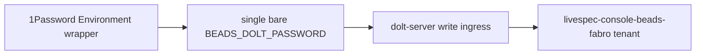

# Non-Functional Requirements (excerpt)

### Beads/Fabro Family Secret Convention

The console and its docs MUST use the current family secret convention:
the 1Password Environment wrapper exports one bare `BEADS_DOLT_PASSWORD`.
There is no per-tenant `BEADS_DOLT_PASSWORD_<tenant>` variable and no
per-tenant-to-bare mapping. Secrets MUST never be committed or echoed.
Every process IN THIS REPOSITORY that needs work-items access MUST
obtain `BEADS_DOLT_PASSWORD` through this convention. CI MUST NOT hold
it: CI writes to the work-items ledger only through the tailnet beads
write ingress, authenticating with an SSH key alone (see the nightly
clause above). How the ingress host in turn credentials its own `bd` is
NOT governed by this convention and MUST NOT be asserted here -- that
host is `dolt-server`, whose ratified credential-profile contract seals
a dedicated `ci-writer` credential outside the family wrapper.

## Contributor Scenario E -- Beads/Fabro family secret convention



```gherkin
Feature: One bare family secret for work-items access
  As the console and its CI
  I want a single uniform secret convention
  So that work-items access never depends on per-tenant secret variables

  Scenario: The console uses the single bare secret
    Given the 1Password Environment wrapper
    When the console or its docs reference the work-items secret
    Then they use one bare BEADS_DOLT_PASSWORD
    And there is no per-tenant BEADS_DOLT_PASSWORD_<tenant> variable
      and no per-tenant-to-bare mapping
    And the secret is never committed or echoed

  Scenario: CI writes to work-items without ever holding the secret
    Given a CI job that needs work-items access, such as nightly
      chore-opening
    When it files into the Beads tenant
    Then it authenticates to the tailnet write ingress with an SSH key
      alone
    And it never obtains BEADS_DOLT_PASSWORD
    And how the ingress host credentials its own bd is left to
      dolt-server's sealed credential profile, not asserted by this
      convention
```
