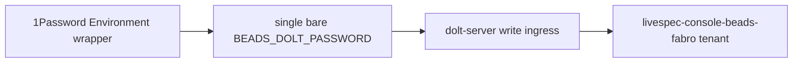

# Non-Functional Requirements (excerpt)

### Beads/Fabro Family Secret Convention

The console and its docs MUST use the current family secret convention:
the 1Password Environment wrapper exports one bare `BEADS_DOLT_PASSWORD`.
There is no per-tenant `BEADS_DOLT_PASSWORD_<tenant>` variable and no
per-tenant-to-bare mapping. Secrets MUST never be committed or echoed.
Any HOST-side process that needs work-items access MUST obtain
`BEADS_DOLT_PASSWORD` through the same convention -- the host-side `bd`
the ingress runs is what obtains the secret through this convention.

## Contributor Scenario E -- Beads/Fabro family secret convention



```gherkin
Feature: One bare family secret for work-items access
  As the console and its CI
  I want a single uniform secret convention
  So that work-items access never depends on per-tenant secret variables

  Scenario: The console uses the single bare secret
    Given the 1Password Environment wrapper
    When the console or its docs reference the work-items secret
    Then they use one bare BEADS_DOLT_PASSWORD
    And there is no per-tenant BEADS_DOLT_PASSWORD_<tenant> variable
      and no per-tenant-to-bare mapping
    And the secret is never committed or echoed

  Scenario: CI obtains the secret through the same convention
    Given a CI job that needs work-items access, such as nightly
      chore-opening
    When it authenticates to the Beads tenant
    Then it obtains BEADS_DOLT_PASSWORD through the same convention
```
