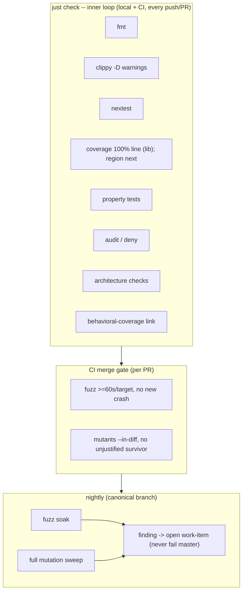

# Non-Functional Requirements (excerpt)

## Contributor Quality Gate

**Nightly -- scheduled run against the canonical branch.** It MUST
include a full fuzz soak (a longer per-target budget) and a full
`cargo mutants` sweep over the logic crates. A nightly finding (a new
crash, or a new surviving mutant not on the allow-list) MUST NOT fail
the canonical branch; it MUST instead file a chore work-item at the
**top of the rank order** in the project's work-items ledger (the
`livespec-console-beads-fabro` tenant), through the orchestrator's
capture surface, so the intake Definition-of-Ready checklist and the
item's effective `admission_policy` route its lifecycle state -- an
item is never filed directly into `ready` (approval IS the
`pending-approval -> ready` transition; the orchestrator's ratified
work-item state semantics govern -- repo
`thewoolleyman/livespec-orchestrator-beads-fabro`,
`SPECIFICATION/contracts.md`, its Work-item state semantics section).



## Contributor Scenario C -- Quality gate enforces the inner and merge loops

```mermaid
flowchart LR
  subgraph Inner["just check (inner loop, every push/PR)"]
    Fmt["fmt --check"]
    Clippy["clippy -D warnings"]
    Tests["cargo test + nextest"]
    Cov["100% line coverage, no carve-outs"]
    Props["property tests"]
    Audit["cargo deny + machete"]
    Arch["arch checks"]
  end
  subgraph Merge["merge gate (per PR)"]
    Fuzz["fuzz >=60s/target, no new crash"]
    Mut["mutants --in-diff, no unjustified survivor"]
  end
  subgraph Night["nightly (canonical branch)"]
    Soak["fuzz soak + full mutation sweep"]
    Chore["finding -> top-ranked chore work-item; never fail master"]
  end
  Inner --> Merge --> Night
```



```gherkin
Feature: Cost-and-determinism split of the contributor quality gate
  As the console CI and local inner loop
  I want fast deterministic checks separated from slow ones
  So that the implementation loop is never slowed or thrashed

  Scenario: The inner loop runs the fast deterministic checks
    Given a push or pull request
    When just check runs
    Then it includes fmt --check, clippy denying warnings,
      cargo test and cargo nextest, 100% line coverage over every
      workspace library with no per-crate carve-outs, property tests,
      cargo deny and cargo machete, and the architecture checks
    And it excludes fuzz and mutation runs

  Scenario: A nightly finding opens a chore instead of failing master
    Given the scheduled nightly fuzz soak and full mutation sweep
    When a new crash or a new un-allow-listed surviving mutant is found
    Then the canonical branch does not fail
    And a chore work-item is filed at the top of the rank order in the
      livespec-console-beads-fabro tenant through the orchestrator's
      capture surface
```
